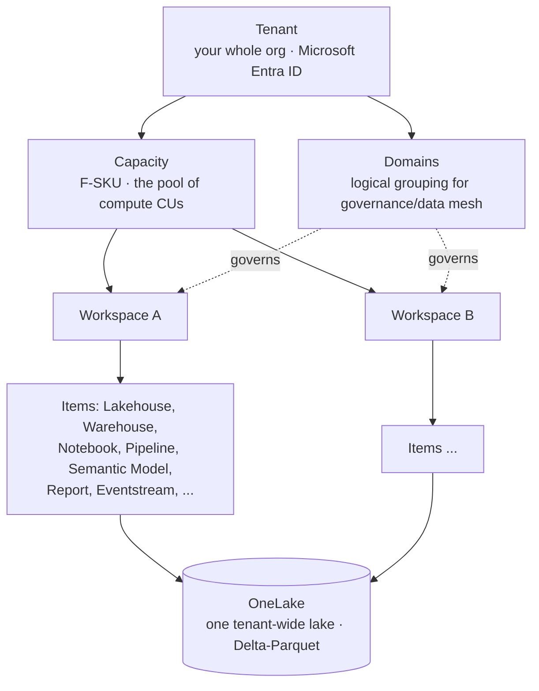
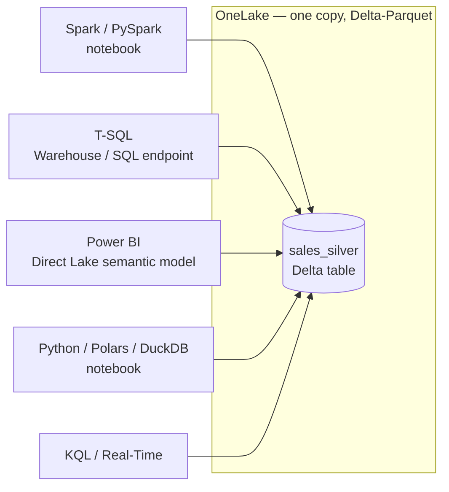
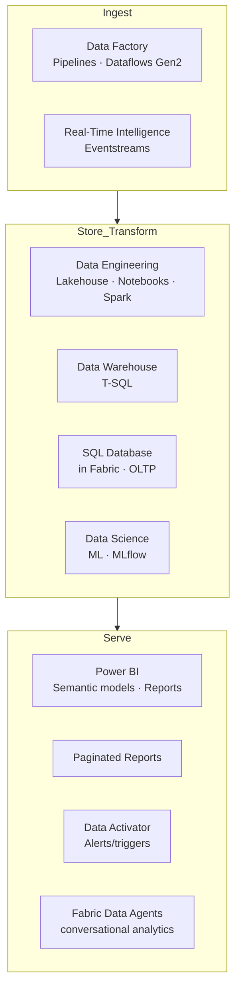
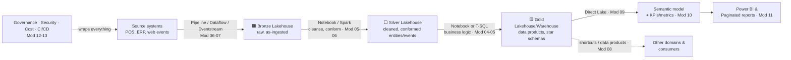
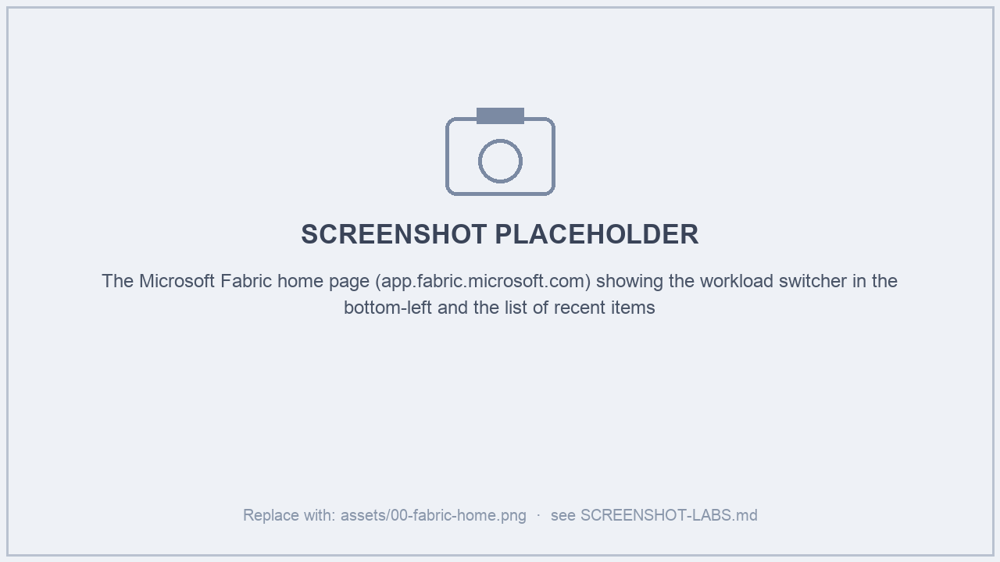

# Module 00 · Course Overview & the Fabric Mental Model

> 🎯 **Learning objectives**
> - Explain what Microsoft Fabric *is* in one paragraph and why it changes how you build a data platform.
> - Hold the right mental model: **one tenant → capacity → workspaces → items → OneLake**.
> - Understand the "compute is interchangeable, storage is shared" principle that drives every later decision.
> - Know the major **workloads** (experiences) and which persona uses each.
> - Frame the four big recurring decisions this course teaches you to make.

---

## 1. What Microsoft Fabric actually is

Microsoft Fabric is a **single, SaaS, end-to-end analytics platform** that unifies what used to be a stack of separate Azure products:

| The old separate product | Its Fabric workload |
|---|---|
| Azure Data Factory | **Data Factory** (pipelines, dataflows) |
| Azure Synapse Spark | **Data Engineering** (lakehouse, notebooks, Spark) |
| Azure Synapse SQL / dedicated pools | **Data Warehouse** (T-SQL warehouse) |
| Azure Synapse Data Science | **Data Science** (ML, MLflow) |
| Azure Stream Analytics / Data Explorer | **Real-Time Intelligence** (eventstreams, KQL, Activator) |
| Power BI | **Power BI** (semantic models, reports) |
| (new) | **Databases** (SQL database in Fabric), **Data Activator**, **Fabric Data Agents** |

The three things that make Fabric *different* from "Synapse + Power BI in one bill":

1. **SaaS, not PaaS.** You don't provision clusters, storage accounts, or integration runtimes. You buy *capacity* and everything else is managed. Less knobs, faster start, but a different cost model (see Module 12).
2. **OneLake — one logical data lake for the whole tenant.** Every workspace's data lands in OneLake (built on ADLS Gen2, stored as **Delta-Parquet**). "**One copy of data**": the warehouse, the lakehouse, the semantic model, and the Spark notebook can all read the *same* physical Delta tables. No copying data between engines.
3. **Open format at the core.** Tables are Delta Lake (Parquet). That means external engines (Databricks, Snowflake via Iceberg shortcuts, Spark anywhere) can read your data, and you're not locked into a proprietary store.

> **One-paragraph definition:** *Fabric is a SaaS analytics platform where you buy a pool of compute (capacity), organize work into workspaces, and every engine — Spark, T-SQL, Power BI, KQL — reads and writes the same open Delta tables in a single tenant-wide lake called OneLake.*

---

## 2. The mental model: the object hierarchy

Everything in Fabric fits into this hierarchy. Burn it into memory — every later module hangs off it.

| Concept | What it is | Mental hook |
|---|---|---|
| **Tenant** | Your organization in Microsoft Entra ID (one per org). | The whole universe. |
| **Capacity** | A purchased pool of compute, sized by SKU (F2…F2048). Measured in **Capacity Units (CU)**. | The "engine size" you pay for. Shared by all workspaces assigned to it. |
| **Domain** | A logical grouping of workspaces for governance and data-mesh ownership (e.g. *Finance*, *Supply Chain*). | Org chart for data. |
| **Workspace** | A container for items. The unit of **collaboration, security, Git, and deployment**. | A "project folder" / a room. |
| **Item** | Any artifact: lakehouse, warehouse, notebook, pipeline, semantic model, report, eventstream, etc. | The actual things you build. |
| **OneLake** | The single, tenant-wide data lake all items store data in. | The shared hard drive for the whole company. |

> ⚠️ The two most common beginner mistakes both come from misreading this hierarchy: (1) treating a **workspace like a folder** and dumping everything in one (Module 02 fixes this), and (2) not realizing all workspaces on a capacity **share the same CU budget**, so one runaway Spark job starves everyone (Module 12 fixes this).

---

## 3. The principle that drives everything: separation of storage and compute

This is the single idea that makes the rest of the course coherent.

> **Storage is shared and open (OneLake / Delta). Compute is interchangeable and ephemeral (Spark, T-SQL, Power BI Direct Lake all point at the same tables).**

Practical consequences you'll use again and again:

- You **rarely need to copy data between engines.** A Spark notebook writes `sales_silver`; the SQL analytics endpoint queries it as a table; Power BI builds a Direct Lake model on it — *zero copies*.
- **Choosing an engine is a choice about ergonomics and cost, not about where the data lives.** "Notebook vs. warehouse" (Module 05) is "which language/tool fits this transform?", not "which database do I load into?".
- **Shortcuts** let you point at data you don't own (another workspace, ADLS, S3, GCS, Iceberg) *without copying it*. This is the backbone of the medallion architecture (Module 04) and data mesh (Module 08).

---

## 4. The workloads (experiences) and who uses them

| Workload | Primary persona | You'll master it in |
|---|---|---|
| Data Factory (pipelines/dataflows) | Data engineer / integrator | Modules 05–07 |
| Data Engineering (lakehouse/Spark/notebooks) | Data engineer | Modules 03–06 |
| Data Warehouse (T-SQL) | Data / analytics engineer | Modules 03, 05 |
| Real-Time Intelligence | Streaming / platform engineer | Module 07 |
| Data Science | ML engineer / data scientist | (touched in 05–06) |
| Power BI (models & reports) | Analyst / BI developer | Modules 09–11 |
| Data Activator | Analyst / ops | Module 07 |
| Governance & Admin | Platform lead / admin | Module 12 |

---

## 5. The four big decisions this course is built around

Most of your effectiveness in Fabric comes down to making four recurring choices *deliberately* instead of by habit. Each gets a full module with a decision table.

| # | The decision | Default → | Covered in |
|---|---|---|---|
| 1 | **Lakehouse vs. Warehouse** (where does this data and transform live?) | Lakehouse for engineering/data-science; Warehouse when consumers need rich multi-table T-SQL, full ACID multi-statement transactions, or a SQL-first team owns it. | Module 03 |
| 2 | **Notebook vs. Spark Job Definition vs. Pipeline/Dataflow** (what runs the transform?) | Notebook for development & orchestrated batch logic; SJD for productionized non-interactive Spark jobs; Pipeline to orchestrate; Dataflow Gen2 for citizen/low-code ingestion. | Module 05 |
| 3 | **Import vs. Direct Lake vs. DirectQuery** (how does Power BI read the model?) | **Direct Lake** when your gold tables are in Fabric and well-modeled; Import for small/complex models needing every DAX feature; DirectQuery only when forced. | Module 09 |
| 4 | **Power BI report vs. Paginated report** (how do consumers see it?) | Interactive Power BI report for exploration/dashboards; Paginated (RDL) for pixel-perfect, printable, operational, or large-export documents. | Module 11 |

If you finish this course able to make these four calls with confidence — and to organize workspaces, layers, and data products so they survive change (Modules 02, 04, 08) — you can build essentially anything in Fabric.

---

## 6. How a real project flows through Fabric (the through-line)

We'll build a running example — a **retail analytics platform** — across the course. Here's the end-to-end shape so each module has a home:

> 🖼️ ****

---

## ✅ Module 00 checklist

- [ ] I can draw the **Tenant → Capacity → Workspace → Item → OneLake** hierarchy from memory.
- [ ] I can explain "**one copy of data**" and why choosing an engine ≠ choosing a storage location.
- [ ] I know the seven+ workloads and which persona owns each.
- [ ] I can name the **four big decisions** and where each is covered.
- [ ] I have a Fabric trial (or capacity) and a `Course-Demo` workspace ready (set up in Module 01).

---

## ⚠️ Anti-patterns introduced here (we'll keep returning to them)

- **"Lift-and-shift the old stack."** Re-creating Synapse-with-integration-runtimes thinking in a SaaS world; fighting the platform instead of using managed defaults.
- **One giant workspace.** Treating workspaces as folders rather than as security/Git/deployment boundaries.
- **Copying data between engines.** Re-loading the same data into a warehouse *and* a lakehouse *and* an import model when one Delta copy + Direct Lake would do.
- **Ignoring capacity as a shared, finite budget.** Building as if compute were free and isolated per project.

---

**Next:** [Module 01 · Platform Foundations →](01-platform-foundations.md)
