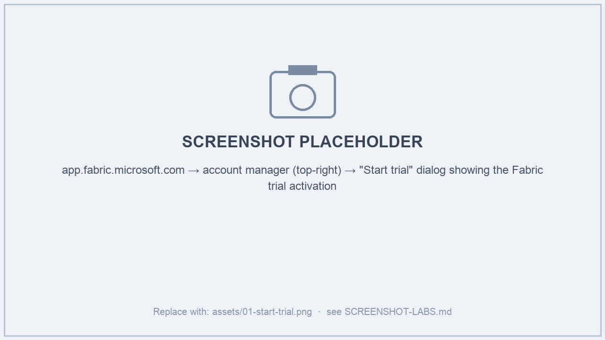
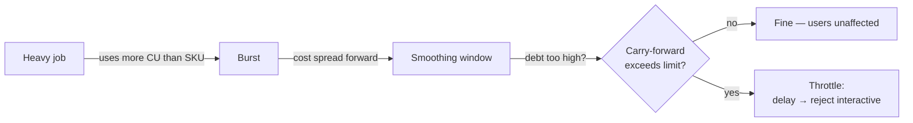
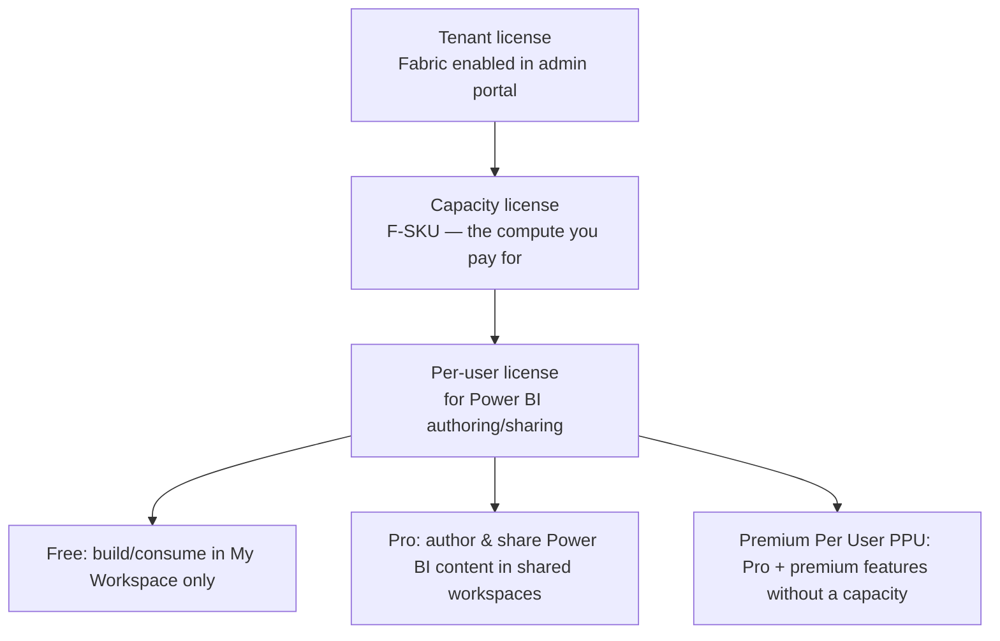
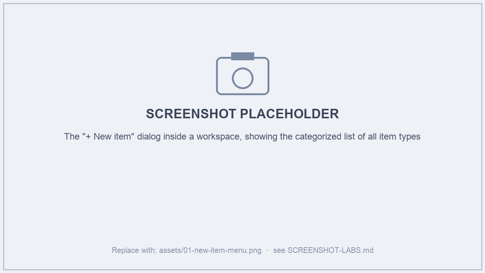
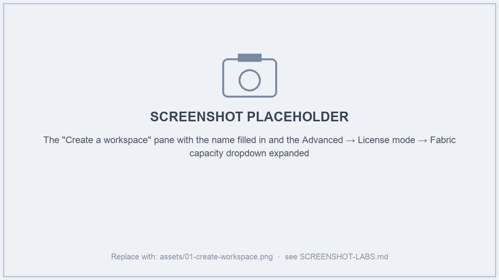
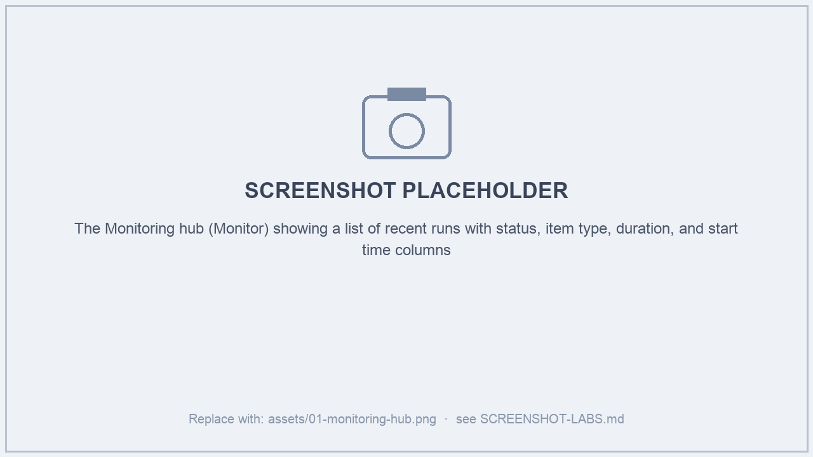

# Module 01 · Platform Foundations

> 🎯 **Learning objectives**
> - Get a working Fabric tenant/trial and create your first workspace correctly.
> - Understand **capacity, SKUs, and Capacity Units (CU)** — the unit you pay for and the unit you must not exhaust.
> - Know every **item type** and which workload it belongs to.
> - Understand **licensing**: tenant vs. capacity vs. per-user (Pro/PPU) and what each unlocks.
> - Set up the housekeeping that prevents pain later: a demo capacity, admin portal basics, the Monitoring hub.

---

## 1. Getting access: trial, capacity, or PAYG

You need three things to *do* anything in Fabric:

1. A **Microsoft Entra ID** (work/school account) — the tenant.
2. **Fabric enabled** for your tenant (an admin toggles it on in the Admin portal).
3. A **capacity** assigned to the workspace you work in.

Three ways to get a capacity:

| Path | What you get | Best for |
|---|---|---|
| **Fabric Trial** | A free **trial capacity** (~60 days, roughly F64-equivalent compute) attached to a trial workspace. | Learning, this course, POCs. **Use this.** |
| **Reserved capacity (F-SKU)** | A committed F2…F2048 capacity, billed hourly or reserved (1-yr). Pause/resume. | Production. |
| **Pay-as-you-go (Azure)** | Spin up an F-SKU in Azure, billed per second, pausable. | Bursty / dev / scale tests. |

> 🖼️ ****

> **Lab 1.0 — Get set up.** Go to [app.fabric.microsoft.com](https://app.fabric.microsoft.com), start a Fabric trial, and confirm you see "Trial" next to your name. You're ready.

---

## 2. Capacity, SKUs, and Capacity Units (CU)

This is the most important *commercial* concept in Fabric. Get it wrong and you either overspend or throttle your users.

### What a capacity is
A **capacity** is a pool of compute power shared by every workspace assigned to it. Its size is a **SKU**:

| SKU | Capacity Units (CU) | Rough equivalence |
|---|---|---|
| F2 | 2 | Smallest; light dev |
| F4 | 4 | |
| F8 | 8 | |
| F16 | 16 | Small team |
| F32 | 32 | |
| **F64** | 64 | **The key threshold** — unlocks free Power BI consumption for report viewers (no per-viewer Pro license needed); trial ≈ this. |
| F128…F2048 | 128…2048 | Enterprise scale |

**Capacity Units (CU)** are the abstract currency of compute. Every operation — a Spark job, a SQL query, a Power BI refresh, a dataflow — consumes CU-seconds. Your SKU gives you a fixed number of CUs *per second*; you can spend them on anything.

### Smoothing, bursting, and throttling — the part everyone misses
Fabric does **not** simply reject work when you hit your CU ceiling. It uses three mechanisms:

- **Bursting:** a job can temporarily use *more* CU than your SKU nominally provides, to finish faster.
- **Smoothing:** that burst cost is *spread out* over a future window (seconds for interactive ops, up to 24h for background ops like refreshes). So a heavy job "borrows" from the future.
- **Throttling:** if your smoothed future debt gets too high, Fabric throttles — first delaying interactive requests, eventually rejecting them. This is what users experience as "Fabric got slow."

> ⚠️ **The #1 platform-ops lesson:** every workspace on a capacity shares one CU budget. One badly-written Spark job or an over-eager hourly refresh can throttle *everyone* on that capacity. Module 12 covers monitoring (the **Fabric Capacity Metrics app**) and cost control in depth. For now: **don't put dev experiments and production on the same capacity.**

### Pause / resume / autoscale
- F-SKUs (reserved or PAYG) can be **paused** — billing stops, compute stops. Great for dev capacities overnight.
- **Autoscale billing** (for Spark) lets Spark burst onto serverless billing beyond the base capacity, billed separately, so analytics doesn't throttle the rest.

---

## 3. Licensing: the three layers

People conflate these constantly. There are **three independent layers**:

The rules that matter:

- **All Fabric non-Power-BI items** (lakehouse, warehouse, notebooks, pipelines…) run on **capacity** — no per-user license needed beyond a free Fabric account to author within a capacity workspace.
- **Power BI content** still follows Power BI licensing: to **author/share** in a shared workspace you need **Pro** (or PPU), *unless* the workspace is on an **F64+** capacity, in which case **viewers consume for free**.
- **Below F64**, report viewers each need a Pro license. This is why **F64 is the magic number** for broad BI rollout.

> **Rule of thumb:** *Engineers need a capacity. BI authors need Pro. BI viewers are free if you're on F64+.*

---

## 4. Item types — the full menu

Everything you create is an **item**, living in a workspace. Knowing the catalog helps you recognize what's possible.

| Workload | Items you create |
|---|---|
| **Data Engineering** | Lakehouse, Notebook, Spark Job Definition, Environment |
| **Data Warehouse** | Warehouse, (Mirrored databases), SQL analytics endpoint (auto), SQL database in Fabric |
| **Data Factory** | Data Pipeline, Dataflow Gen2, Copy job, Mount (ADF), Apache Airflow job |
| **Real-Time Intelligence** | Eventhouse, KQL Database, KQL Queryset, Eventstream, Real-Time Dashboard, Activator |
| **Data Science** | Notebook, Experiment, ML Model, Environment |
| **Power BI** | Semantic model, Report, Paginated report, Dashboard, Dataflow Gen1, Scorecard/Metrics, Datamart |
| **Cross-cutting** | Deployment pipeline, Variable library, User Data Functions, Data Agent (AI), GraphQL API |

> 🖼️ ****

You don't need to memorize this — but notice the pattern: **storage items** (lakehouse, warehouse, eventhouse) hold data in OneLake; **compute items** (notebook, pipeline, dataflow, SJD) act on it; **serving items** (semantic model, report) expose it.

---

## 5. Your first workspace (done right)

We go deep on workspace *strategy* in Module 02. For now, create one demo workspace correctly.

> **Lab 1.1 — Create the course workspace.**
> 1. Left nav → **Workspaces** → **+ New workspace**.
> 2. Name it `Course-Demo` (we'll discuss naming standards in Module 02).
> 3. Expand **Advanced** → **License mode** → assign your **Trial / Fabric capacity**. *(If you skip this, items that need capacity won't run.)*
> 4. Create it. You now have an empty workspace bound to a capacity.

> 🖼️ ****

### Workspace roles (preview of Module 02/12)
Every workspace has four roles. Memorize the ladder:

| Role | Can do | Give to |
|---|---|---|
| **Admin** | Everything incl. manage access, delete workspace | Workspace owners / platform team |
| **Member** | Edit all content, share, add others (not admin) | Core builders |
| **Contributor** | Create/edit content | Developers |
| **Viewer** | Read/consume only | Consumers |

---

## 6. Admin & monitoring basics

Two surfaces you'll return to constantly:

1. **Admin portal** (gear ⚙ → Admin portal) — tenant settings, capacity settings, domains, usage metrics. Most governance toggles live here (Module 12).
2. **Monitoring hub** (left nav → **Monitor**) — every run across the tenant: pipeline runs, notebook/Spark runs, SJD runs, dataflow refreshes, table-maintenance jobs. Your first stop when "did my job run?" or "why is it slow?".

> 🖼️ ****

> **Lab 1.2 — Find your way around.** Open the **Admin portal** and locate *Capacity settings*. Open the **Monitor** hub (it'll be empty until you run something in later modules).

---

## ✅ Module 01 checklist

- [ ] I have an active **Fabric trial** (or capacity) and a `Course-Demo` workspace bound to it.
- [ ] I can explain **CU, SKU, smoothing/bursting/throttling** and why one job can slow everyone.
- [ ] I know why **F64** is the magic licensing threshold.
- [ ] I can list the three licensing layers: **tenant → capacity → per-user**.
- [ ] I can find the **Admin portal** and the **Monitoring hub**.

## ⚠️ Anti-patterns

- **Mixing dev and prod on one capacity.** A dev runaway throttles production. Separate them (even a small paused dev F-SKU).
- **Forgetting to assign a capacity** to a workspace, then wondering why notebooks won't start.
- **Buying < F64 then being surprised** every report viewer needs a Pro license.
- **Never opening the Capacity Metrics app** until users complain about slowness.

---

**Next:** [Module 02 · Workspaces, Domains & Organization →](02-workspaces-domains.md)
