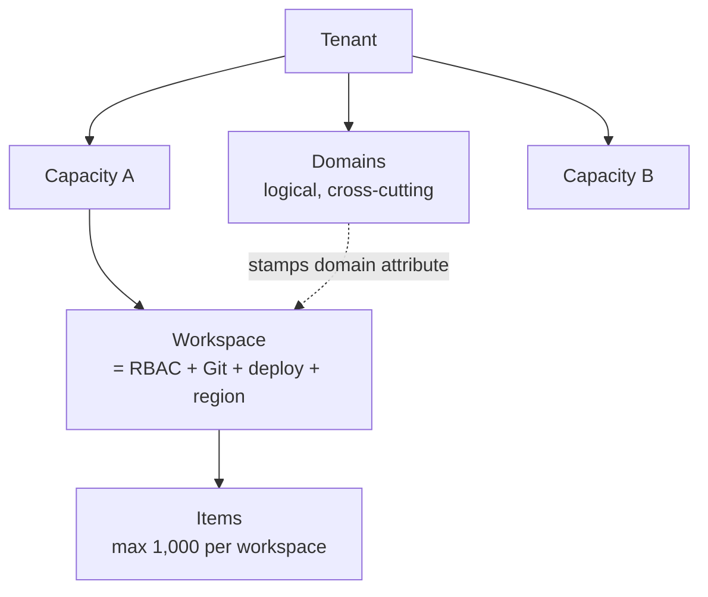
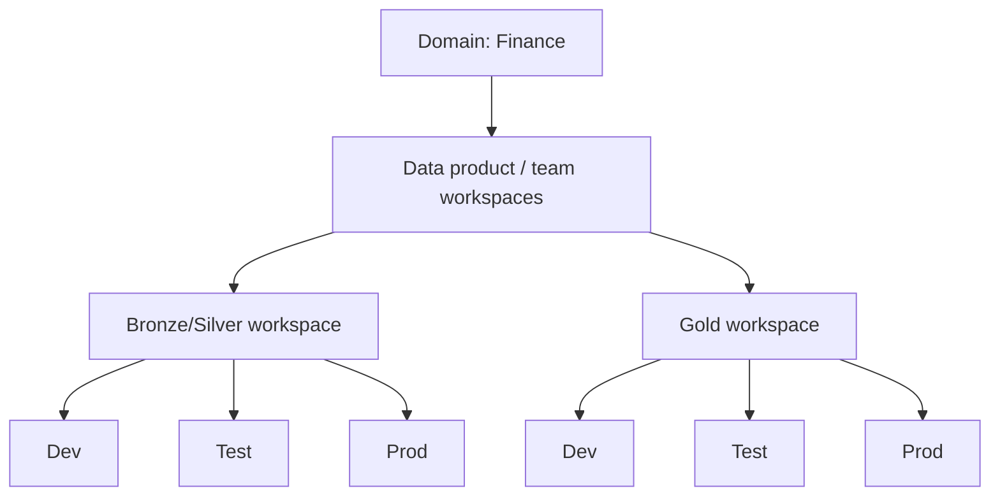

# Module 02 · Workspaces, Domains & Tenant Organization

> 🎯 **Learning objectives**
> - Choose a **workspace topology** using the four canonical deployment patterns.
> - Combine the organizing axes — **environment, medallion layer, domain, team** — into a sane default.
> - Assign **workspace roles** correctly (and understand the OneLake-security bypass nuance).
> - Use **domains & subdomains** for data-mesh governance — and avoid the #1 misconception about them.
> - Apply **naming conventions** that don't break deployment pipelines.

This is the module that prevents the most expensive mistake in Fabric: a sprawling, ungoverned, throttling mess of workspaces. Decide structure *before* you build.

---

## 1. Why the workspace is the center of gravity

A **workspace is the unit of**: RBAC (who can do what), **Git integration**, **deployment pipelines**, and **capacity assignment**. A workspace belongs to **exactly one capacity** at a time, which also fixes its **region**.



> ⚠️ **Hard limits to design around:** **1,000 items per workspace**; a user/SP can belong to max **1,000 workspaces**; **cross-region capacity migration is painful** (you re-create most items) — so **pick the region deliberately up front.**

---

## 2. The four canonical deployment patterns

From the Azure Architecture Center. Pick where you sit on governance vs. simplicity.

| Pattern | Shape | Governance | Perf isolation | Chargeback | Use when |
|---|---|---|---|---|---|
| **1. Monolithic** | 1 workspace, 1 capacity | Low | None | None | Small team, POC, fast start |
| **2. Multi-workspace, single capacity** | Many workspaces, shared CUs | Medium | **No** (throttle risk) | No | Hub-and-spoke, DTAP isolation, centralized cost; entry to data mesh |
| **3. Multi-workspace, separate capacities** | Workspaces across capacities | High | **Yes** | **Yes** | **Enterprise default** — data mesh, SLAs, per-BU chargeback |
| **4. Multiple tenants** | Fully separate tenants | Highest | Yes | Yes | M&A, subsidiaries, hard regulatory separation |

> **Default →** **Pattern 3 + Domains** for any real organization. Start at Pattern 1/2 for a POC, but plan the path to 3.

---

## 3. The organizing axes — combine, don't choose

Workspaces get split along four axes. They're **not mutually exclusive** — you layer them.

| Axis | Rule |
|---|---|
| **Per-environment (Dev/Test/Prod)** | **Effectively mandatory.** Deployment pipelines *require* separate workspaces per stage. The single biggest driver of multiple workspaces. |
| **Per-medallion-layer** | Microsoft recommends separating layers, ideally one workspace per layer (Module 04). |
| **Per-domain** | The recommended **top-level** organizing principle — each workspace maps to a domain + named owner. |
| **Per-team** | Usually converges with per-domain (the team owning a domain administers its workspaces). |

### The recommended composite (teach this as the default)



> **Default →** **one workspace per data product, per environment**, aligned to a domain and owner. Split *further* only when isolation, performance, regulatory, or ownership boundaries genuinely demand it. Don't pre-split into dozens of empty workspaces.

---

## 4. Workspace roles — assign to groups, not people

Four roles, a strict ladder. **Always assign Microsoft Entra security groups, never individuals.**

| Capability | Admin | Member | Contributor | Viewer |
|---|:--:|:--:|:--:|:--:|
| Delete/update workspace; manage all members | ✅ | | | |
| Connect Git; create workspace identity | ✅ | | | |
| Add members / lower roles; allow reshare | ✅ | ✅ | | |
| Create/modify items; run notebooks/pipelines/Spark | ✅ | ✅ | ✅ | |
| Read data via OneLake APIs & Spark (ReadAll) | ✅ | ✅ | ✅ | |
| View items; read via SQL endpoint / TDS (ReadData) | ✅ | ✅ | ✅ | ✅ |

- **Admin** → platform leads / data-product owners. Keep this set *small*.
- **Member** → senior engineers/leads (manage membership, not delete).
- **Contributor** → **the default developer role**. Build and run everything.
- **Viewer** → consumers/auditors. Reads **only** through the SQL endpoint (ReadData), *not* raw OneLake/Spark.

> ⚠️ **The OneLake-security bypass nuance (memorize this):** granular **OneLake security roles** (row/column/table) apply **only to Viewers**. **Admin/Member/Contributor bypass them.** So to enforce data-level security on a user, they must be a **Viewer** *plus* subject to OneLake security roles. You cannot data-restrict a Contributor.

> 🧭 **In the Fabric portal:** Workspace → **Manage access** → **+ Add people or groups**; the role dropdown offers **Admin / Member / Contributor / Viewer**.

---

## 5. Capacity assignment

- New workspaces default to **shared capacity**; reassign to a dedicated **F-SKU** to run non-Power-BI items and get production behavior.
- One workspace ↔ one capacity; the capacity sets the **region** and the **CU ceiling**.
- **Isolate performance-sensitive/prod workloads on their own capacity** — a heavy Spark job on a shared capacity throttles interactive users (Module 01 §2, Module 12).
- Capacity = the **billing meter**: a single capacity centralizes billing but blocks per-team chargeback; multiple capacities enable chargeback and independent right-sizing.
- **Pause non-prod capacities off-hours** (highest-ROI saving). **F64+** unlocks free Power BI viewing.

> **Lab 2.1 — Plan your topology.** For the running retail example, sketch: Domains (`Sales`, `Finance`, `Supply Chain`), and for `Sales` a Bronze/Silver workspace + a Gold workspace, each in Dev/Test/Prod. Decide which capacity each prod workspace lands on.

---

## 6. Domains & subdomains (data mesh)

A **domain** logically groups workspaces by business area; assigning a workspace stamps a domain attribute on **every item** in it. Domains power **discovery** (OneLake Catalog filter) and **federated governance** (delegated tenant settings per domain — e.g., default sensitivity label, certification policy). **Subdomains** inherit the parent's admins and support general settings only.

> ⚠️ **The #1 misconception:** **a domain is NOT an access boundary.** Domain assignment **does not grant or restrict access** — visibility and access still come from **workspace roles + item permissions**, and *all users can see all domain names*. Domains are for governance and discovery, not security.

### Domain roles

| Role | Scope | Can | Cannot |
|---|---|---|---|
| **Fabric admin** | All domains (Admin portal) | Create/edit/delete domains, assign domain admins, assign any workspace | — |
| **Domain admin** (business owner/SME) | Own domains | Edit description, define contributors, assign workspaces, override delegated settings, create subdomains | Delete/rename domain, add other domain admins |
| **Domain contributor** (a workspace Admin) | Workspace settings | Assign *their own* workspaces to the domain | Admin-portal/domain settings |

**Assignment methods:** by workspace **name** (needs naming conventions — see §7), by workspace **admin/owner**, or by **capacity** (when capacities are per-department).

**Best practice:** design domains with COE + business + security stakeholders; assign **business owners as domain admins**; **delegate** (don't centralize) certification and default labels; keep Fabric and Purview domain definitions **aligned**.

> 🧭 **In the Fabric portal:** Settings ⚙ → **Admin portal** → **Domains**. Create a domain, then **Assign workspaces** by name / owner / capacity.

---

## 7. Naming conventions

> No official Microsoft standard exists — this is consolidated community best practice. Universal rules: **lowercase**, separate tokens with `-`/`_`, encode **type + purpose + (layer) + env**.

### Workspaces — `[Domain/Team]-[Subject] - [Layer] [Env]`
**Production gets NO env suffix** (it's the name business users see); only tag non-prod.
```
FIN-Quarterly Financials              (Finance, prod — clean)
FIN-Sales Mart - Bronze [Dev]
FIN-Sales Mart - Gold                 (prod)
SLS-Customer Insights [Test]
Finance-Accounting-Reporting          (domain-aligned; self-assignable by name)
```

### Items — `[TypePrefix]_[Action]_[FreeText]`
> ⚠️ **CRITICAL: do NOT put environment in item names.** Deployment pipelines auto-pair items across stages **by name** — differing names break auto-pairing. Environment lives in the **workspace** name *only*. Also: **renaming a Lakehouse breaks references** — lock names early.

- **Type prefix:** `LH` lakehouse, `WH` warehouse, `SM` semantic model, `pl`/`DP` pipeline, `NB` notebook, `RP` report, `CJ` copy job, `DF` dataflow, `EH` eventhouse.
- **Action:** `INGST`, `TRNSF`, `STORE`, `ORCHS`, `ANLYZ`.
- Optional spaced medallion index for ordering: `100_bronze`, `200_silver`, `300_gold`.
```
LH_STORE_Bronze    LH_STORE_Silver    WH_STORE_Gold
DP_ORCHS_NightlyBatch   CJ_INGST_OracleDb   NB_TRNSF_BronzeToSilver
SM_ANLYZ_YoYSales   RP_SalesExecutive
```

### Schemas & tables (full conventions in Module 03 §6 and Module 08)
- **Schemas:** `bronze`/`silver`/`gold`, or domain-scoped `sales`/`marketing`/`hr`.
- **Tables:** Bronze `raw_<source>_<entity>` (`raw_crm_customers`); Silver `<entity>` (`customers`); Gold `dim_<entity>` / `fact_<event>` / `agg_<grain>`.

---

## ✅ Module 02 checklist

- [ ] I can place my org on the **four deployment patterns** and default to **Pattern 3 + Domains**.
- [ ] My default is **one workspace per data product, per environment**, domain-aligned.
- [ ] I assign **roles to security groups**, and I know **Viewers are the only role OneLake security restricts**.
- [ ] I understand a **domain is governance/discovery, not access**.
- [ ] My naming keeps **environment out of item names** so deployment pipelines auto-pair.

## ⚠️ Anti-patterns

- **One giant workspace** for everything (no Git/deploy/security boundaries).
- **Pre-splitting into dozens of empty workspaces** before there's work to put in them.
- **Putting env in item names** → broken deployment-pipeline pairing.
- **Assuming domains restrict access** → data exposure surprise.
- **Trying to data-restrict a Contributor** with OneLake security (it's bypassed — make them a Viewer).
- **Ignoring the 1,000-item/1,000-workspace limits** until you hit them.

---

**Next:** [Module 03 · OneLake, Lakehouse & Warehouse →](03-onelake-lakehouse-warehouse.md)
