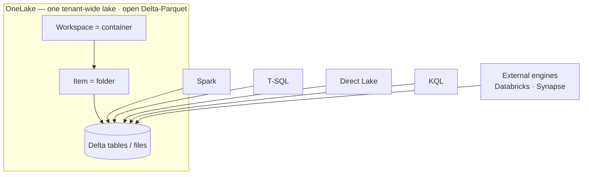
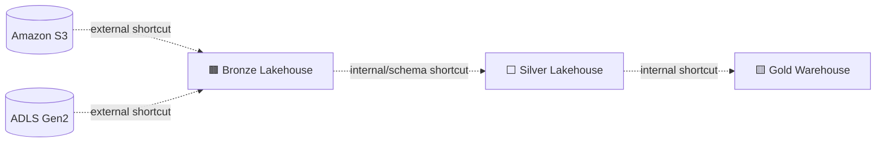
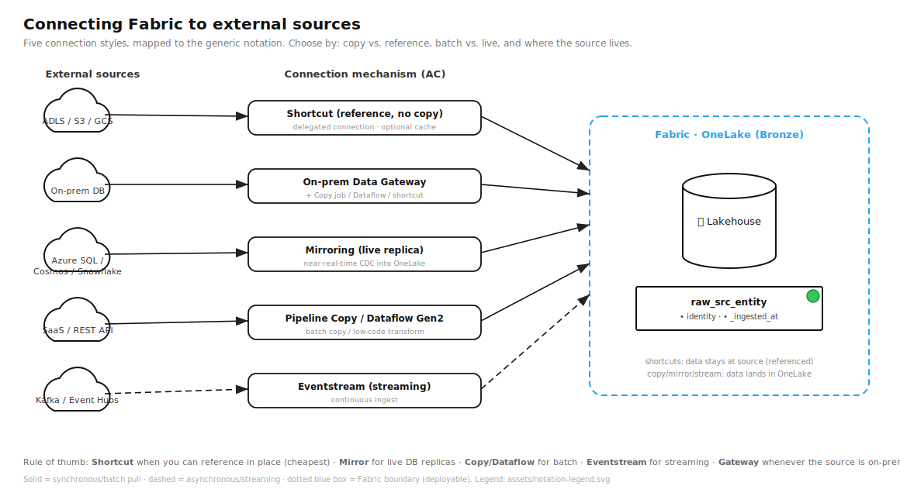
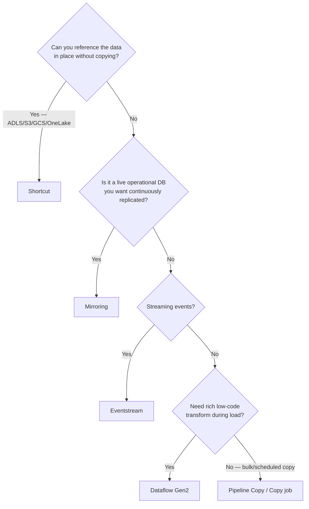
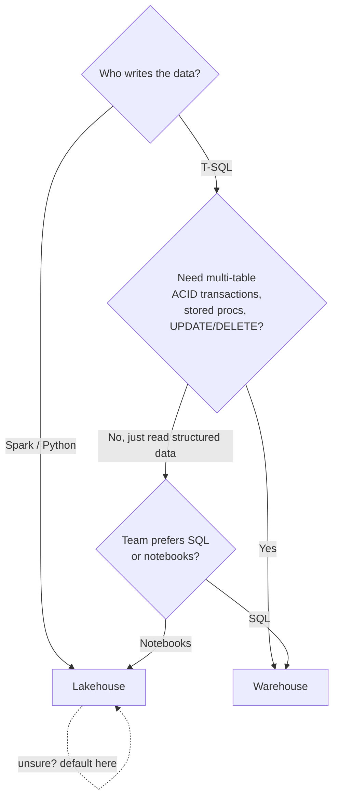
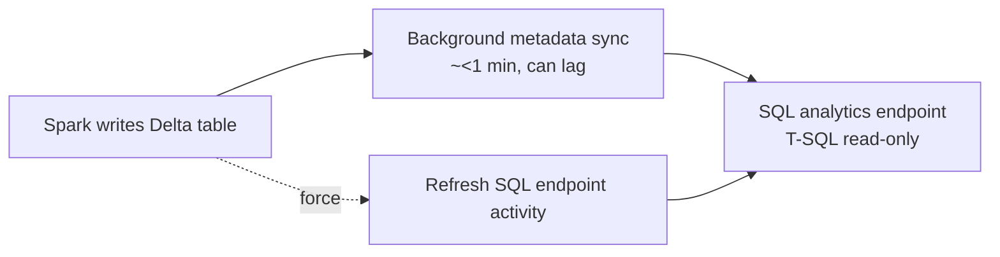

# Module 03 · OneLake, Lakehouse & Warehouse

> 🎯 **Learning objectives**
> - Explain **OneLake** and the **"one copy"** principle, and load data without duplicating it.
> - Use **shortcuts** (internal & external: ADLS, S3, GCS, Iceberg) and **mirroring**.
> - Make the **Lakehouse vs. Warehouse** decision confidently (the #1 of the four big decisions).
> - Understand the **SQL analytics endpoint**, its metadata sync, and how to force it.
> - Use **schema-enabled lakehouses**, managed vs. external tables, and **V-Order** correctly.

---

## 1. OneLake and "one copy"

**OneLake** is a single, tenant-wide logical data lake, auto-provisioned with your tenant — think *"OneDrive for data."* It's built on **ADLS Gen2** and stores all tabular data as **open Delta-Parquet** (Iceberg supported via virtualization). Because it exposes the same ADLS Gen2 APIs, external tools (Storage Explorer, Databricks, Synapse) read/write it unchanged.

> **The principle:** every Fabric engine — T-SQL, Spark, Direct Lake/Analysis Services, KQL — **reads and writes the same single physical copy.** You don't move data between engines; you point a different engine at it.

Three ways to get data into OneLake *without copying*:
- **Shortcuts** — symbolic links to data elsewhere (§2).
- **Mirroring** — near-real-time replication of an external DB (Azure SQL, Cosmos, PostgreSQL, Snowflake, Databricks) into OneLake.
- **Iceberg ↔ Delta virtualization** — metadata translation so Iceberg and Delta readers both work.

---

## 2. Shortcuts — the backbone of "one copy"

A **shortcut** makes data appear inside your lakehouse without physically copying it.

| Type | Targets | Auth |
|---|---|---|
| **Internal** (OneLake → OneLake) | Other lakehouses, warehouses, KQL/SQL DBs, mirrored DBs, across workspaces | Uses the **caller's identity** on the target |
| **External** | ADLS Gen2, Blob, **Amazon S3**, **Google Cloud Storage**, Dataverse (read-only), Iceberg, OneDrive/SharePoint, **on-prem (via gateway)** | **Delegated** through a stored connection — end users don't need source access |

Key rules and limits:
- **Placement:** `Tables/` = top level only (Delta auto-discovered as tables); `Files/` = any level/format.
- **Caching** (for GCS, S3, on-prem) cuts egress; retention 1–28 days; files > 1 GB aren't cached.
- **Limits:** 100,000 shortcuts/item; 10 per path; max 5 **chained**; **no spaces in names** (breaks Delta recognition); **no cascading deletes**; schema shortcuts require a schema-enabled lakehouse.
- ⚠️ **Identity passthrough gotcha:** internal shortcuts use the caller's identity, **but Direct Lake-over-SQL / T-SQL Delegated mode does *not* pass caller identity.** Use **Direct Lake over OneLake** or **T-SQL User-identity mode** when you need passthrough.

> 🧭 **In the Fabric portal:** In a Lakehouse, hover **Tables** or **Files** → **…** → **New shortcut**, then pick a source: OneLake, ADLS Gen2, Amazon S3, Google Cloud Storage, Dataverse, …

---

## 2.5 Connecting to external sources — the five mechanisms

Getting data from *outside* Fabric is one of the first things you'll do. There are **five mechanisms**; choose by **copy vs. reference**, **batch vs. live**, and **where the source lives**.

| Mechanism | Copies data? | Latency | Best for | Built with |
|---|---|---|---|---|
| **Shortcut** | **No** (references in place) | Live (cached optional) | Lake/object stores you can reference: **ADLS, S3, GCS, Iceberg, Dataverse**, other OneLake items | OneLake shortcut |
| **Mirroring** | Yes (managed live replica) | Near-real-time (CDC) | Operational DBs: **Azure SQL, Cosmos DB, PostgreSQL, Snowflake, Databricks** | Mirrored database item |
| **Pipeline Copy / Copy job** | Yes | Batch / scheduled incremental | **50+ sources**, high-scale loads, CDC replication | Data Factory (Module 06) |
| **Dataflow Gen2** | Yes | Batch | **150+ connectors**, low-code transform during load | Power Query (Module 05–06) |
| **Eventstream** | Yes | Streaming | **Kafka, Event Hubs, pub/sub, DB CDC** | Real-Time Intelligence (Module 07) |

> **Default →** **Shortcut** whenever you *can* reference in place (it's free and avoids duplication — the "one copy" principle). Use **Mirroring** for live DB replicas, **Copy/Dataflow** for batch, **Eventstream** for streaming.

### On-premises & VNet sources — the data gateway

If the source sits **on-premises or in a private VNet**, Fabric can't reach it directly. Install the **on-premises data gateway** (a lightweight relay you run on a server near the source), register it in Fabric, then use it from **Copy job, Dataflow Gen2, or an on-prem shortcut**. The gateway holds the encrypted connection so end users never see the credentials.

### Connections & credentials (do this once, reuse everywhere)

External access goes through a **connection** object that stores the endpoint + auth, created in **Manage connections and gateways**. Auth options include **service principal (recommended for automation — Module 12), OAuth/organizational account, key, or SAS**. Connections are **delegated**: a user querying a shortcut/mirror uses the *stored* connection's identity, so they don't need direct source access.

> ⚠️ Recall the **identity-passthrough gotcha** (§2): internal shortcuts pass the caller's identity, but **Direct Lake-over-SQL / T-SQL Delegated mode does not** — use Direct Lake over OneLake or T-SQL User-identity mode when passthrough matters.

> **Lab 3.0 — Connect something external.** Create an **external shortcut** to a public ADLS/S3 path (or a OneLake item in another workspace). Confirm the data appears under `Tables/` or `Files/` with **no copy**. Then create a **connection** with a service principal and note how it's reused across items.

> 🧭 **In the Fabric portal:** Settings ⚙ → **Manage connections and gateways** to create a connection (with its auth method) or register an **on-premises data gateway**.

---

## 3. The big decision: Lakehouse vs. Warehouse

Both store **open Delta in OneLake** and share the **same T-SQL engine** for reads — so you can always add the other later. The decision turns on **two questions**: *who writes the data (Spark vs. T-SQL)?* and *do you need multi-table transactions?*

| Criterion | **Lakehouse** (+ read-only SQL endpoint) | **Warehouse** |
|---|---|---|
| Persona | Data engineer, data scientist | DW/BI developer, SQL/citizen dev |
| Languages | PySpark, Spark SQL, Scala, R, notebooks | **Full T-SQL** + low-code |
| **Write engine** | **Spark** writes Delta | **T-SQL** writes (DML/DDL, procs, functions) |
| **Multi-table transactions** | ❌ (per-table ACID only) | ✅ |
| SQL surface | **Read-only** endpoint (DQL; views/TVFs; no DML) | Full read/write |
| Data shape | Structured + **semi/unstructured** | **Structured only** |
| Load methods | Spark, pipelines, dataflows, shortcuts, mirroring | T-SQL (COPY INTO/INSERT), pipelines, dataflows |
| Security | OneLake roles (object/folder/table) + RLS/CLS; schema grants | Native T-SQL: object, RLS, CLS, dynamic masking, GRANT/DENY |
| **Pick when** | Spark/Python team; mixed/unstructured data; ML/data-eng; **when unsure** | T-SQL team; multi-table transactions; structured BI/DW; migrating SQL Server code |

> **Default →** **Lakehouse** when unsure (it's the more flexible superset for engineering and data science). Move/serve gold in a **Warehouse** when a SQL-first team needs writeable T-SQL marts with transactions. **The most common production pattern: Lakehouse for Spark ELT (bronze/silver) + Warehouse for the T-SQL gold/serving layer**, both in one workspace, joined via shortcuts.

> 🧭 **In the Fabric portal:** Open a **Lakehouse** — its explorer shows **Tables / Files** (read-only SQL endpoint). Open a **Warehouse** — its object explorer shows **Schemas → Tables / Views / Stored procedures / Functions** (writeable T-SQL).

---

## 4. The SQL analytics endpoint (SAE)

Every lakehouse automatically gets a **read-only T-SQL surface** — the **SQL analytics endpoint** (DQL only; no DML; views/TVFs allowed). This is how T-SQL consumers and Power BI (Direct Lake on SQL) query Spark-written tables.

- A **background metadata sync** projects Spark-written Delta tables into the endpoint — usually **< 1 minute**, but it can lag.
- **Latency causes:** too many lakehouses in one workspace (prefer **~one lakehouse per workspace**), and **lack of table maintenance** (small-file proliferation).
- **Force a sync** when freshness matters: the editor **Refresh** button, the **Refresh-metadata REST API**, or the **"Refresh SQL endpoint" pipeline activity** — *chain this after your loads* (Module 05 §5).

---

## 5. Schemas, managed vs. external tables

**Schema-enabled lakehouses are GA and default-on in the portal.** They give:
- Named table collections (`bronze.customers`, `gold.fact_sales`).
- **Schema-level + RLS/CLS** security.
- **Four-part naming**: `workspace.lakehouse.schema.table`.
- A default `dbo` schema that can't be removed.

**Managed vs. external tables:**
- **Managed** (default) — Fabric owns metadata *and* files; `DROP` deletes the data.
- ⚠️ **External tables over ADLS are NOT supported directly in schema-enabled lakehouses** — use **OneLake shortcuts / schema shortcuts** instead.
- ⚠️ Schema-enabled lakehouses **can't be shared via workspace sharing** (workaround: shortcuts).

---

## 6. Delta/Parquet and V-Order

**V-Order** is a write-time Parquet optimization (sorting, row-group distribution, dictionary encoding) that speeds reads — especially Power BI **Direct Lake/VertiPaq**. Files remain open-Parquet-compliant.

| | Effect |
|---|---|
| ✅ Read-heavy wins | up to ~50% more compression, faster Direct Lake reads |
| ❌ Cost | ~15% slower writes; **no Spark-to-Spark read benefit** |

> ⚠️ **V-Order is now OFF by default for new workspaces** (a reversal of older guidance; the legacy `spark.sql.parquet.vorder.enable` setting was removed in Runtime 1.3+). **Turn it ON for gold / serving / Direct Lake tables; leave it OFF for Spark-only bronze/silver and Dataflow Gen2 staging.** Apply during `OPTIMIZE`.

**Table maintenance recap** (full detail in Module 06 §7):
- **OPTIMIZE** (compaction) — nightly/weekly or after big batches; the biggest lever for both query perf *and* SAE sync speed.
- **VACUUM** — monthly; **default 7-day retention**, portal blocks < 7 days (override risks breaking time travel).

> **Lab 3.1 — Build the storage spine.** In `Course-Demo`: create a schema-enabled Lakehouse `LH_STORE_Bronze`. Add an **external shortcut** to a public sample dataset (or upload sample CSVs to `Files/`). Confirm the table appears in the **SQL analytics endpoint**. Then create a Warehouse `WH_STORE_Gold` and note it shares the same workspace/OneLake.

---

## ✅ Module 03 checklist

- [ ] I can explain **OneLake "one copy"** and load data via **shortcuts/mirroring** without duplicating.
- [ ] I know the **shortcut limits** and the **Direct Lake-over-SQL identity-passthrough** gotcha.
- [ ] I can make the **Lakehouse vs. Warehouse** call from "who writes" + "transactions".
- [ ] I understand the **SAE metadata sync** and how to force it.
- [ ] I enable **V-Order on gold only** and keep ~one lakehouse per workspace.

## ⚠️ Anti-patterns

- **Copying data between a lakehouse and a warehouse** when a shortcut + shared OneLake would do.
- **Many lakehouses in one workspace** → slow SAE metadata sync.
- **Spaces in shortcut/table names** → Delta tables silently not recognized.
- **V-Order on everything** → 15% write tax with no benefit on Spark-only layers.
- **Expecting writeable T-SQL on a lakehouse** — the SAE is read-only; use a Warehouse for T-SQL DML.

---

**Next:** [Module 04 · Medallion Architecture in Fabric →](04-medallion-architecture.md)
