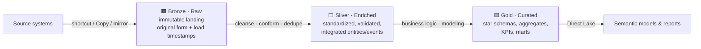
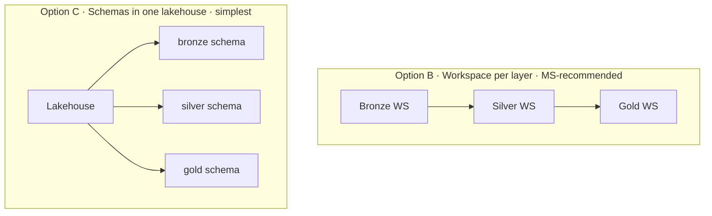
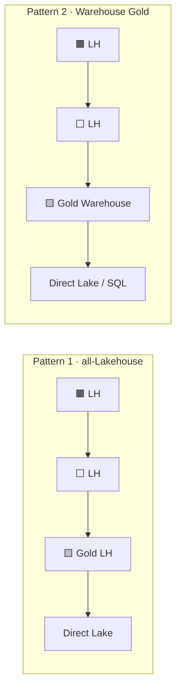
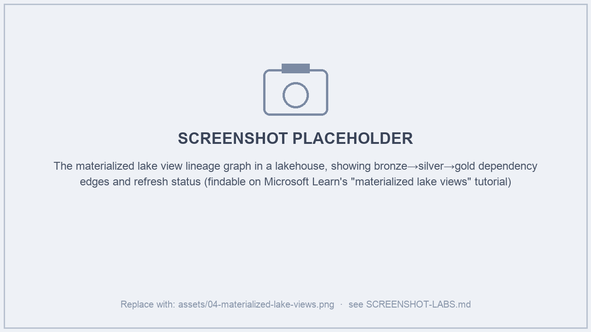

# Module 04 · Medallion Architecture in Fabric

> 🎯 **Learning objectives**
> - Define **Bronze / Silver / Gold** and what belongs in each.
> - Choose a **physical implementation** (separate lakehouses, workspace-per-layer, or schemas).
> - Connect layers with **shortcuts** (no copying) and decide **Lakehouse vs. Warehouse for Gold**.
> - Apply per-layer best practices (security, file sizing, clustering, V-Order, **materialized lake views**).

Medallion is a **design pattern**, not a Fabric feature. You assemble it from lakehouses/warehouses, schemas, workspaces, and shortcuts — so the choices in Modules 02–03 all converge here.

---

## 1. The three layers

| Layer | Purpose | Holds | Format | Consumers |
|---|---|---|---|---|
| **🟫 Bronze (Raw)** | Immutable landing / source of truth | Raw data in original form, append-only history, load timestamps | Original format, or a **shortcut** to source | Data engineers only |
| **⬜ Silver (Enriched)** | Cleansed, conformed, deduplicated, integrated | Standardized/validated Delta tables (3NF-ish or Data Vault) | **Delta** | Engineers, data scientists |
| **🟨 Gold (Curated)** | Business-ready serving | Star schemas (fact/dim), aggregates, KPIs, marts | **Delta (Lakehouse) or Warehouse tables** | BI, business users, semantic models |

**The discipline that makes it work:**
- **Bronze is append-only and never edited.** It's your replay buffer — if logic downstream is wrong, you reprocess from bronze.
- **Silver is where data becomes trustworthy.** Schema enforced, keys deduplicated, types coerced, sources integrated into conformed entities/events (this connects directly to the data-product thinking in Module 08).
- **Gold is shaped for consumption.** Star schemas and marts — *a rendering of the data, not the data itself* (Module 08 §6).

---

## 2. The three physical implementations

How do you *physically* lay out bronze/silver/gold? Three options, with real trade-offs.

| Factor | **A: Separate lakehouses, 1 workspace** | **B: Workspace per layer** (MS-recommended) | **C: Schemas in 1 lakehouse** |
|---|---|---|---|
| Security granularity | Per-lakehouse | **Per-workspace** (cleanest least-privilege) | Per-schema + RLS/CLS (but can't workspace-share) |
| Governance / lineage | Good | **Best** — auditable boundaries, separate ownership | Good logical grouping, weaker isolation |
| Admin overhead | Low | **High** (workspaces multiply) | **Lowest** |
| CI/CD | One pipeline, all layers move together | Pipeline per layer; **independent promotion** | Single item, no independent promotion |
| Capacity isolation | No | **Yes** | No |
| Cross-layer queries | Shortcuts / SQL endpoint | Shortcuts / 4-part namespace | Trivial (`bronze.x` → `gold.y`) |
| Best for | Small/medium, single domain | **Enterprise, multi-team, strict audit** | Small estates, single team, fast start |

> **What Microsoft recommends:** *"create each lakehouse in its own, separate workspace."* That's **Option B**.
>
> **Pragmatic path (teach this):** **start simple** — Option C (schemas, now that they're GA) or Option A for a single team — and **split out to Option B when real governance, ownership, or capacity-isolation needs appear.** What's **non-negotiable in every source: separate workspaces per environment (dev/test/prod)** — that's what enables deployment pipelines (Module 13).
>
> **Common enterprise compromise:** one **centralized Bronze landing** workspace + **domain-specific Silver/Gold** workspaces that read bronze via shortcuts.

---

## 3. Connecting layers with shortcuts ("one copy" again)

Higher layers reference lower-layer data **without copying it**:
- Source → Bronze via **external shortcut** (ADLS/S3/GCS).
- Silver/Gold reference lower layers via **table or schema shortcuts** (a **schema shortcut** mounts a whole schema and auto-reflects source changes).
- Cross-workspace joins via the **four-part namespace** (`ops_ws.hr_lakehouse.hrm.employees`).
- The SAE can expose shortcut-mounted data through T-SQL with **no duplication**.

---

## 4. Lakehouse vs. Warehouse for Gold

Microsoft describes **two canonical patterns**:

| Choose **Gold = Warehouse** when… | Choose **Gold = Lakehouse** when… |
|---|---|
| Team writes T-SQL | Team is Spark/Python |
| Need INSERT/UPDATE/DELETE + multi-table transactions | Schema flexibility, data-science access |
| Stored procedures, views, explicit typed star schema | Delta time travel, lower cost |
| SQL-centric serving | Direct Lake straight off gold tables |

> **Hybrid is common:** large facts/history in a **Gold Lakehouse**, high-concurrency BI + conformed dims in a **Warehouse**, connected via shortcuts.
>
> ⚠️ **For Direct Lake performance on a Gold Warehouse, serve *tables, not views*** — views force DirectQuery fallback (Module 09).

---

## 5. Materialized lake views — the low-code medallion builder

**Materialized lake views (MLV)** are the declarative, low-code way to build Bronze→Silver→Gold:
- SQL transformations with **automatic dependency ordering** and **incremental refresh**.
- Built-in **data-quality rules** and **lineage**.
- Requires **schema-enabled lakehouses**.

Use MLVs when your transforms are expressible in SQL and you want managed orchestration + DQ without hand-writing pipelines. Drop to notebooks (Module 05) when logic gets procedural or needs Python/ML.

> 🖼️ ****

---

## 6. Per-layer best practices

| Concern | 🟫 Bronze | ⬜ Silver | 🟨 Gold |
|---|---|---|---|
| **Security** | Engineers / service principals only | + Data scientists | Business read with **RLS/CLS**, semantic-model security, sensitivity labels |
| **File sizing** | Smaller files OK | ~1 GB target | ~1 GB target |
| **Layout** | **Partition** if huge & time-based | **Liquid clustering** (not partitioning) | **Liquid clustering** |
| **V-Order** | Off | Off | **On** (Direct Lake) |
| **Schema policy** | Permissive (capture anything) | **Enforced contract** | Locked (consumers depend on it) |
| **Mutability** | Append-only | Upsert (MERGE) | Rebuilt/merged from silver |

> **Lab 4.1 — Stand up the medallion.** Using `LH_STORE_Bronze` from Module 03: create `LH_STORE_Silver` and `WH_STORE_Gold`. Write a notebook that reads a bronze table, cleans/dedupes into a `silver.customers` Delta table (MERGE), then build a `gold.dim_customer` + `gold.fact_sales` star schema. Enable **V-Order on the gold tables**. Confirm everything is one copy (no data duplicated, just transformed forward).

---

## ✅ Module 04 checklist

- [ ] I can describe what belongs in **Bronze/Silver/Gold** and keep Bronze **append-only**.
- [ ] I can pick a **physical layout** (A/B/C) and know **per-environment separation is non-negotiable**.
- [ ] I connect layers with **shortcuts**, never copies.
- [ ] I can choose **Lakehouse vs. Warehouse for Gold** and serve **tables not views** for Direct Lake.
- [ ] I apply **per-layer** security, clustering, and V-Order correctly.

## ⚠️ Anti-patterns

- **Editing Bronze** — you lose your replay buffer.
- **Skipping Silver** (Bronze straight to Gold) — no place for conforming/quality; brittle marts.
- **Building business logic in the semantic model** instead of Gold — un-reusable, slow.
- **Views (not tables) in a Gold Warehouse** for Direct Lake — forces DirectQuery fallback.
- **One workspace for all environments** — you can't use deployment pipelines.

---

**Next:** [Module 05 · Compute — Notebooks vs SJD →](05-compute-notebooks-sjd.md) *(if you skipped ahead)* · or [Module 07 · Orchestration & Real-Time →](07-orchestration-realtime.md)
