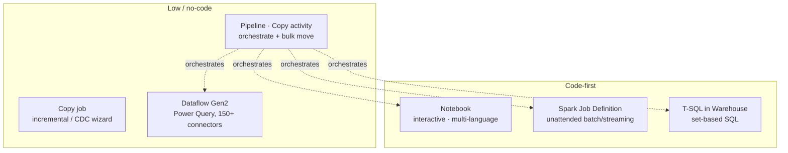
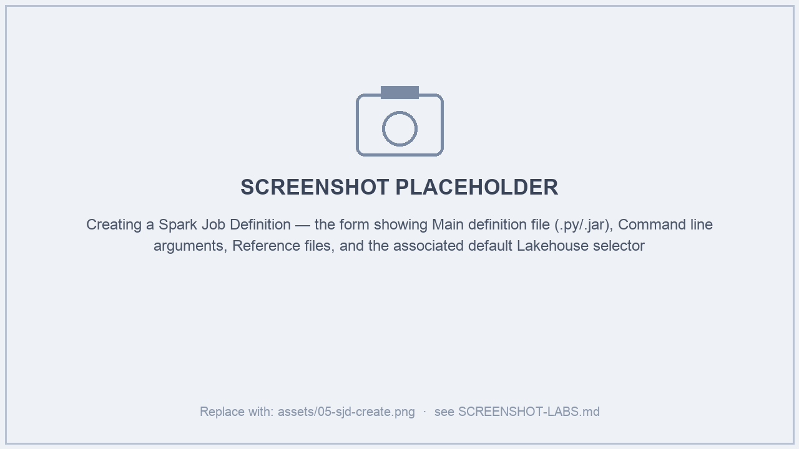
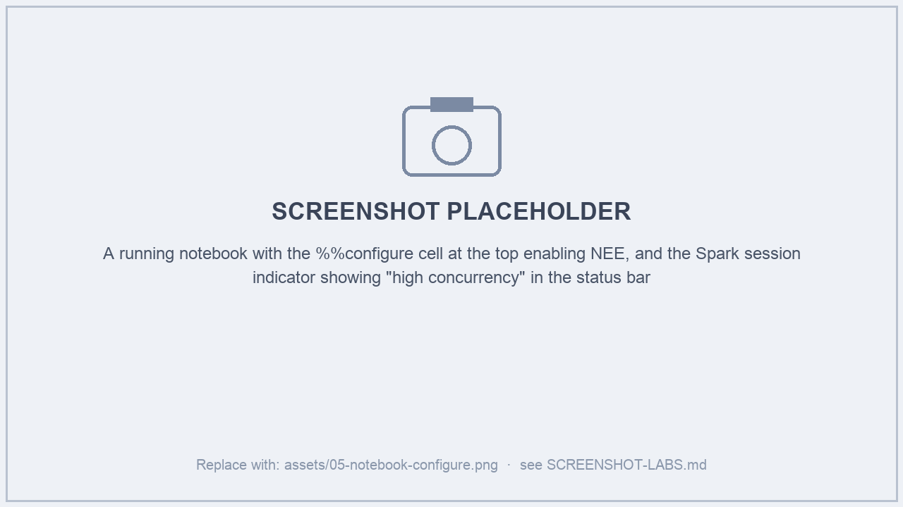

# Module 05 · Compute — Notebooks vs Spark Job Definitions vs Pipelines vs Dataflows

> 🎯 **Learning objectives**
> - Choose the right compute item for any task: **Notebook, Spark Job Definition (SJD), Pipeline (Copy), Dataflow Gen2, or T-SQL**.
> - Understand the **Python kernel vs. Spark kernel** trade-off and the data-size thresholds that decide it.
> - Configure Spark properly: **starter vs. custom pools, Environments, high-concurrency, the Native Execution Engine (NEE), V-Order**.
> - Orchestrate notebooks correctly with `notebookutils` (`run`, `runMultiple`, `exit`) and `%run`.
> - Avoid the cost and reliability traps that hit teams in production.

This is the **#2 of the four big decisions**. Get it right and your platform is cheap, fast, and maintainable.

---

## 1. The compute menu — what each item is *for*



| Item | One-line role | Persona |
|---|---|---|
| **Notebook** | Interactive dev, prep/transform, ML, and orchestrated batch logic. Languages: PySpark, Spark SQL, Scala, SparkR, pure Python, T-SQL. | Engineer / scientist |
| **Spark Job Definition (SJD)** | Submit a *pre-built* `.py`/`.jar`/`.R` job + arguments as unattended batch/streaming. | Engineer (productionizing) |
| **Pipeline (Data Factory)** | Orchestration backbone + high-scale Copy activity. | Engineer / integrator |
| **Copy job** | Wizard-driven incremental/CDC replication (full-then-incremental). | Analyst / integrator |
| **Dataflow Gen2** | Low-code Power Query transforms, 150+ connectors, multiple destinations. | Analyst / citizen engineer |
| **T-SQL (Warehouse)** | Set-based SQL transforms, stored procs, COPY INTO, CTAS. | SQL-first engineer |

---

## 2. The headline decision: Notebook vs. Spark Job Definition

Both run on the **same Spark compute**, support custom Environments, NEE, and the Monitoring hub. The difference is the **execution model**.

| Factor | **Notebook** | **Spark Job Definition (SJD)** |
|---|---|---|
| Primary use | Interactive dev, exploration, prep/transform, ML, orchestration glue | Unattended production batch / streaming |
| Code form | Cells (PySpark/SparkSQL/Scala/SparkR/Python/T-SQL) | Pre-built `.py`, `.jar` (Java/Scala), `.R` + reference files |
| Parameterization | Parameters cell; `notebookutils.notebook.run(...)` args; pipeline base params | **Command-line arguments** + reference files/libraries |
| Scheduling | Built-in schedule, pipeline Notebook activity, Activator | Built-in schedule, pipeline **SJD activity**, Activator |
| **Queueing + auto-retry** | Only when invoked via pipeline/scheduler (interactive/API runs are *not* queued) | **Yes — jobs are queued and retried automatically** |
| High-concurrency session sharing | **Yes** | No (own session) |
| Interactive output / viz | Yes | No |
| CI/CD fit | Good (Git, deployment pipelines) | **Best for compiled/tested artifacts** (build → test → upload binary) |
| **Choose when** | You want iteration, mixed languages, in-cell results, chaining, ML | You have a compiled/scripted job, want fire-and-forget batch with retry, **JVM `.jar` (Scala/Java)** jobs |

> **Default →** Use **notebooks** for almost everything — development, transformation, ML, and even scheduled production logic (they schedule and parameterize cleanly and share high-concurrency sessions). Reach for an **SJD** specifically when you have a **compiled JVM job**, need **automatic queue + retry semantics** for unattended batch, or your CI builds a tested binary artifact you want to "submit" rather than maintain as cells.

> 🖼️ ****

### Note: every SJD needs a default lakehouse
An SJD requires **at least one associated default lakehouse** — it becomes the default filesystem and resolves relative paths. Set it when you create the SJD.

---

## 3. The other headline: Python kernel vs. Spark kernel (notebooks)

A Fabric notebook can run a **pure Python kernel** (single-node, ~2 vCores/16 GB default, ~5 s start, with **DuckDB, Polars, delta-rs, scikit-learn** preinstalled) or a **Spark kernel** (distributed). They read/write Delta with *different stacks* — Python uses delta-rs/DuckDB/Polars; Spark uses the full Delta reader/writer.

### Pick by data size and Delta-feature needs

| Compressed data size | Recommended engine |
|---|---|
| Ultra-small (< ~140 MB) | **DuckDB / Polars** (Python kernel) — fastest |
| Small (~1–2 GB) | Python still competitive; Spark+NEE close (esp. write-heavy) |
| Small-medium (~10–13 GB) | **Spark+NEE** ≥ single-machine; Python risks **OOM** |
| Medium+ (~100 GB+) | **Spark+NEE** — fastest and most reliable |

| Use **Python kernel** when… | Use **Spark kernel** when… |
|---|---|
| Data < ~1 GB compressed | Data ≥ 1 GB or growing |
| Lightweight API orchestration, REST calls, control flow | Need full Delta compat (see warning below) |
| Rapid exploration of small data | High-concurrency, library mgmt, FAIR/FIFO scheduling, MLlib/Streaming/V-Order |
| You accept the Delta feature gaps | Want single→multi-node scale **without rewrites** |

> ⚠️ **Critical 2025–2026 trap — Python engines can't write modern Delta features.** delta-rs/DuckDB/Polars **cannot write** deletion vectors, column mapping, liquid clustering, identity/generated columns, Change Data Feed, or V-Order. **Deletion vectors are default-on in Spark Runtime 2.0**, so *writing to such a table from a Python-kernel notebook errors* — a common silent failure. Treat Python engines as a **complement** to Spark (lightweight reads, local dev, simple appends), not a general replacement.

> **Practical rule:** For anything ≥ 1 GB or anything you'll productionize, use a **single-node 8-vCore Spark *starter* pool** — near-instant start, full NEE, full Delta features, and you can scale out later *without rewriting*. You keep cost close to the Python kernel while keeping all your options.

---

## 4. Configuring Spark properly

### 4.1 Pools

| Pool | Start time | Use |
|---|---|---|
| **Starter pool** (default) | **~5 s** (prewarmed, autoscale) | **Default for everything.** Starts single-node, scales to dedicated workers in minutes. |
| **Custom pool** | ~3–5 min cold | When you need specific node sizes/limits, or **Managed Private Endpoint / Private Link** (required). |
| **Single-node** | ~5 s | Overprovisioned single-node (starter + Environment with `executors=1`) = Python-kernel-like cost, full Spark/NEE, seamless scale-out. |

### 4.2 Environments — the unit of reuse
An **Environment** item bundles: **Spark runtime version**, **pool selection**, **driver/executor cores & memory**, **public/custom libraries**, and **Spark config properties**. Attach it to notebooks/SJDs for consistent, governed compute.

> Workspace admins must enable **"Customize compute configurations for items"** for item-level overrides; otherwise everything uses the workspace default pool. Standardize an Environment per medallion layer or per team.

> 🖼️ ****

### 4.3 High-concurrency mode (a major cost lever)
One running Spark application hosts multiple notebooks, each isolated in its own **REPL core**, with FAIR scheduling. **Up to 36× faster session start** vs. a cold custom pool.

- **Session sharing requires:** same user, same default Lakehouse, same Spark compute/Environment.
- **Billing:** only the **initiating** notebook/activity is billed — shared sessions ride free. This is huge for **pipeline fan-outs**: dozens of parallel notebooks on one billed session.
- Default **5 notebooks per session**; raise via `spark.highConcurrency.max` (2–50) in the Environment's Spark properties.

### 4.4 Native Execution Engine (NEE)
A vectorized **C++** engine (Velox + Apache Gluten) that runs columnar/SIMD. **No code changes, no extra compute cost.**

- **Enable** at the Environment level (*Spark compute → Acceleration → Enable native execution engine*) or per item: `%%configure {"conf":{"spark.native.enabled":"true"}}`.
- Accelerates Parquet/Delta/CSV scans, joins, Z-Order/liquid-clustering layouts; preserves AQE, predicate pushdown, column pruning. **Falls back automatically** to JVM Spark for unsupported ops.
- **Does NOT accelerate:** structured streaming, ANSI mode, JSON/XML parsing. Verify offload in the Spark UI (`*Transformer`, `*NativeFileScan`, `VeloxColumnarToRowExec` nodes) or `df.explain()`.

### 4.5 V-Order
Fabric's write optimization (sort + encode + compress within Parquet). ~15% write cost for up to ~50% better compression and **much faster Direct Lake** reads (Module 09). Applied on write or during `OPTIMIZE`. **Only the Spark kernel can write V-Order.**

> 🖼️ ****

---

## 5. Orchestrating notebooks — the patterns

There are three distinct mechanisms; using the wrong one is a classic mistake.

| Mechanism | What it does | Use for |
|---|---|---|
| **`%run <notebook>`** | *Inline magic* — imports another notebook's variables/functions into the **current session** (shared scope). | Shared helper/util notebooks, common functions. **Not orchestration.** |
| **`notebookutils.notebook.run("nb", timeout, {params})`** | Runs **one child notebook** in its own session, returns an exit value. | Sequential calls, simple parent→child. |
| **`notebookutils.notebook.runMultiple([...])`** | Runs **many notebooks in parallel as a DAG** (dependencies, concurrency limits, cross-workspace). | Fan-out, parallel layer processing — far more efficient than sequential `run`. |

```python
# Parent orchestrator: run a DAG of notebooks in parallel
import notebookutils

dag = {
    "activities": [
        {"name": "load_customers", "path": "nb_silver_customers", "timeoutPerCellInSeconds": 600,
         "args": {"run_date": "2026-06-28"}},
        {"name": "load_orders",    "path": "nb_silver_orders",    "timeoutPerCellInSeconds": 600,
         "args": {"run_date": "2026-06-28"}},
        {"name": "build_gold",     "path": "nb_gold_sales",       "timeoutPerCellInSeconds": 1200,
         "args": {"run_date": "2026-06-28"},
         "dependencies": ["load_customers", "load_orders"]}   # waits for both
    ],
    "concurrency": 5
}
results = notebookutils.notebook.runMultiple(dag)
```

A child notebook returns a value with:
```python
notebookutils.notebook.exit("succeeded: 12345 rows")
```

> **`notebookutils`** (formerly `mssparkutils`, still backward-compatible) is your Swiss-army knife: `notebookutils.fs` (filesystem/mounts), `.notebook` (run/runMultiple/exit), `.credentials` (Key Vault secrets), `.lakehouse` (CRUD lakehouse tables), `.variableLibrary`, `.runtime`. Run `notebookutils.help()` to list everything.

### Pipeline-level orchestration
Wrap notebooks/SJDs in a **Data Factory pipeline** when you need control flow (ForEach, If, Until), cross-item dependencies (Copy → Notebook → Maintenance), per-activity **retry/timeout**, parameters, and scheduling/triggers. The pipeline is the production "conductor"; notebooks are the "musicians."


---

## 6. When to use Dataflow Gen2, Pipeline Copy, Copy job, or T-SQL instead

| Tool | Choose when |
|---|---|
| **Pipeline Copy activity** | No/low-code **high-scale raw movement** (petabyte-capable) into bronze; the orchestration backbone. |
| **Copy job** | Wizard-driven **incremental / CDC replication** (initial full load → auto-switch to incremental), minimal code. |
| **Dataflow Gen2** | **Low-code transforms** for analysts (Power Query, 150+ connectors, 300+ transforms), multiple destinations, incremental refresh. Microsoft is actively investing here for enterprise ingestion. |
| **T-SQL (Warehouse)** | SQL-first team doing **set-based transforms**, COPY INTO/CTAS/stored procs, building the serving layer. (See Module 06 §T-SQL.) |
| **Notebook / SJD** | Complex/large/unstructured transforms, full Delta features, ML — the engineer's default. |

> **Mixing is normal and good:** Copy activity lands raw, notebooks build silver/gold, a Warehouse stored proc shapes the final marts, a pipeline orchestrates the lot.

---

## ✅ Module 05 checklist

- [ ] I can state when to use a **Notebook vs. SJD** (and that SJD shines for JVM jobs + auto-retry batch).
- [ ] I know the **Python-kernel vs. Spark-kernel** thresholds and the **deletion-vector write trap**.
- [ ] I default to the **starter pool**, standardize compute with an **Environment**, and enable **NEE**.
- [ ] I exploit **high-concurrency** billing for pipeline fan-outs.
- [ ] I use `%run` for helpers, `notebook.run` for sequential, **`runMultiple` for parallel DAGs**.

## ⚠️ Anti-patterns

- **Using `%run` to "orchestrate"** — it shares scope, doesn't isolate or parallelize. Use `runMultiple`.
- **Sequential `notebook.run` loops** when `runMultiple` could fan out in parallel on one billed session.
- **Pure-Python notebooks for big or production data** — OOM and silent Delta-write failures.
- **Per-notebook custom pools** with cold 3–5 min starts when the starter pool starts in 5 s.
- **No Environment** — every notebook hand-configures libraries/Spark settings, drifting out of sync.

---

**Next:** [Module 06 · Ingestion & Transformation Patterns →](06-ingestion-transformation.md)
