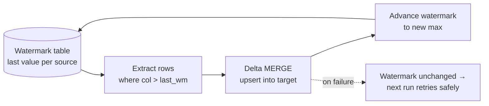

# Module 06 · Ingestion & Transformation Patterns

> 🎯 **Learning objectives**
> - Implement **incremental loading** with watermarking and Delta **MERGE/upsert**.
> - Choose between **CDC / Change Data Feed**, structured streaming, and batch.
> - Handle **schema evolution**, **partitioning vs. liquid clustering**, and **table maintenance** (OPTIMIZE/VACUUM).
> - Know when transformation belongs in **Spark** vs. **T-SQL (Warehouse)**.
> - Write idempotent, restartable loads that survive failures.

This module is the engineering heart of the course — the patterns you'll reuse on every table.

---

## 1. The golden rule: idempotent, incremental, restartable

Every production load should be:

- **Incremental** — process only what changed, not the whole source every run.
- **Idempotent** — re-running it produces the same result (no duplicates). MERGE gives you this.
- **Restartable** — a failure mid-run leaves the table in a good state and the next run recovers (watermark only advances on success).



---

## 2. Watermark-based incremental load + MERGE

The canonical PySpark pattern. Memorize its four steps.

```python
from delta.tables import DeltaTable
from pyspark.sql import functions as F

# 1. Read last watermark from a control table
last_wm = (spark.read.table("control.watermarks")
           .where("table_name = 'sales'")
           .select("watermark_value").first()["watermark_value"])

# 2. Pull only changed source rows (since last watermark)
incr = (spark.read.format("jdbc").option("url", JDBC_URL)
        .option("dbtable", "sales").load()
        .where(F.col("last_modified") > F.lit(last_wm)))

# 3. MERGE (upsert) into the target Delta table — idempotent
tgt = DeltaTable.forName(spark, "silver.sales")
(tgt.alias("t")
    .merge(incr.alias("s"), "t.order_id = s.order_id")
    .whenMatchedUpdateAll()
    .whenNotMatchedInsertAll()
    .execute())

# 4. Advance the watermark ONLY after a successful merge
new_wm = incr.agg(F.max("last_modified")).first()[0]
if new_wm:
    spark.sql(f"UPDATE control.watermarks SET watermark_value = '{new_wm}' "
              f"WHERE table_name = 'sales'")
```

**Why MERGE, not append/overwrite:**
- Append → duplicates on re-run.
- Overwrite → reloads everything (not incremental) and breaks time-travel intent.
- MERGE → upsert semantics; re-running with the same input is a no-op. **Idempotent by construction.**

> **Low-code alternative:** the **Copy job** wizard does watermark/CDC incremental replication (initial full load, then auto-switch to incremental) with almost no code — great for straightforward source→bronze replication. Use Spark MERGE when you need transformation logic alongside the upsert.

### Performance: deletion vectors & Low Shuffle Merge
- **Deletion vectors** (default-on in Runtime 2.0) make MERGE/UPDATE/DELETE fast via **merge-on-read** (mark rows deleted instead of rewriting files).
- **Low Shuffle Merge** preserves the existing file layout (including liquid clustering) for unmodified rows, so big merges don't reshuffle the whole table.

---

## 3. CDC and Change Data Feed (CDF)

Two different things people conflate:

| Concept | What it is | In Fabric |
|---|---|---|
| **Source CDC** | Capturing inserts/updates/deletes from an *operational source* (SQL Server, Postgres…). | Use the **Copy job** (CDC mode) or an **Eventstream** for streaming CDC. |
| **Delta Change Data Feed (CDF)** | Delta's own row-level change log for *downstream* incremental consumption between your lakehouse tables. | Enable on a Delta table; read `table_changes(...)`. **Only Fabric Spark can *write* CDF** (Python engines can read but not produce it). |

```python
# Enable CDF on a table, then read only the changes since a version
spark.sql("ALTER TABLE silver.sales SET TBLPROPERTIES (delta.enableChangeDataFeed = true)")

changes = (spark.read.format("delta")
           .option("readChangeFeed", "true")
           .option("startingVersion", 42)
           .table("silver.sales"))   # includes _change_type: insert/update/delete
```

CDF is the clean way to build **silver → gold** incrementals: gold consumes only the rows that changed in silver.

> ⚠️ **Row tracking / `_metadata.row_id`** is accessible **only in Spark**. Dedup/CDC pipelines that rely on it must read with the Spark kernel, not Python engines.

---

## 4. Structured streaming (continuous ingest)

For continuous micro-batch ingestion (e.g., files landing, or an Eventstream sink):

```python
(spark.readStream.format("cloudFiles")  # or delta/eventhub/kafka
   .option("cloudFiles.format", "json")
   .load(SOURCE_PATH)
   .writeStream
   .option("checkpointLocation", CHECKPOINT_PATH)
   .option("mergeSchema", "true")
   .trigger(availableNow=True)          # process all available, then stop (cost-friendly)
   .toTable("bronze.events"))
```

- Pair with `optimizeWrite` so micro-batches don't create file explosions.
- ⚠️ **NEE does not accelerate structured streaming** — it falls back to JVM Spark. That's fine; just don't expect the C++ speedup here.
- `trigger(availableNow=True)` is a cost-smart pattern: behaves like batch but uses streaming's checkpoint/exactly-once machinery.

---

## 5. Schema evolution

Sources change. Handle it explicitly.

```python
# Allow new columns to be added during write/merge
(df.write.format("delta").mode("append")
   .option("mergeSchema", "true")
   .saveAsTable("silver.sales"))

# For MERGE, enable auto-merge once per session
spark.conf.set("spark.databricks.delta.schema.autoMerge.enabled", "true")
```

- Spark, delta-rs, and Polars support write-time schema evolution; **DuckDB INSERT does not**.
- Decide a policy per layer: **bronze** is permissive (capture whatever arrives), **silver** enforces a contract (explicit schema, reject/quarantine surprises), **gold** is locked (consumers depend on it — see Module 08 on contracts).

---

## 6. Partitioning vs. Liquid Clustering

**Liquid clustering replaces Hive partitioning and Z-Order in Fabric.** It's the modern default for data skipping.

```sql
-- Create a clustered table
CREATE TABLE dbo.sales (...) CLUSTER BY (order_date, region);

-- Change clustering keys anytime — no rewrite needed
ALTER TABLE dbo.sales CLUSTER BY (region, product_category);
ALTER TABLE dbo.sales CLUSTER BY NONE;     -- remove clustering

OPTIMIZE sales;        -- applies clustering (keys read from metadata)
OPTIMIZE sales FULL;   -- one-time full rebuild after changing keys
```

Rules:
- Pick **1–4 columns** that match your frequent `WHERE` filters; column order doesn't matter.
- Z-Order curve for 1 column, **Hilbert curve for 2+** (handled automatically).
- **Compatible with V-Order**; **incompatible with Hive partitioning and Z-Order** (don't combine).

> ⚠️ **Runtime version matters a lot here.**
> - **Runtime 2.0+:** incremental clustering is the default (only reclusters new/unhealthy/small files; includes auto-reclustering). **Frequent cheap `OPTIMIZE` is fine.**
> - **Runtime 1.3:** every `OPTIMIZE` does a full Z-Cube rewrite (≤100 GB cubes) → severe write amplification. **Do not pair liquid clustering with auto-compaction on 1.3**; run `OPTIMIZE` infrequently and deliberately.

When *should* you still partition? Rarely — only for very large tables with a natural, low-cardinality, time-based access pattern where you also want physical file organization for lifecycle (e.g., dropping old partitions). For skipping, prefer liquid clustering.

---

## 7. Table maintenance — OPTIMIZE & VACUUM

Delta tables accumulate small files and obsolete versions. Maintain them or reads slow and storage bloats.

| Op | What it does | Notes |
|---|---|---|
| **OPTIMIZE** | Compacts small files (+ optional V-Order, + applies clustering). | NEE makes OPTIMIZE on clustered tables 30–50% faster in Runtime 2.0. |
| **VACUUM** | Deletes unreferenced files older than the retention window. | **Default retention 7 days.** Portal/API **block < 7 days** (overriding destroys time travel). |

How to run maintenance:
- **Lakehouse → Maintenance** action (ad-hoc, UI).
- **Pipeline → Lakehouse Maintenance activity (Preview)** — schedule OPTIMIZE + V-Order + VACUUM.
- **Notebook** (`OPTIMIZE`/`VACUUM` SQL) or REST.
- **Always follow with a "Refresh SQL endpoint" activity** so the SQL analytics endpoint metadata reflects the changes.

> **Cadence:** run maintenance **after major ingest/update activity** — e.g., the last step of your nightly pipeline (see the pipeline diagram in Module 05 §5).

> 🧭 **In the Fabric portal:** In a Lakehouse, **right-click a table** (or **…**) → **Maintenance** → tick **OPTIMIZE** (and *Apply V-Order*) and **VACUUM** (retention threshold).

---

## 8. Spark vs. T-SQL for transformations

Both write Delta to OneLake and interoperate freely. Choose by team and task.

| Choose **Spark** when… | Choose **Warehouse T-SQL** when… |
|---|---|
| Team codes Python/Scala | Team is SQL-first |
| Complex/iterative logic, unstructured/semi-structured data, ML | Set-based transforms, star schema/marts, stored procs |
| Need full Delta features (deletion vectors, CDF, liquid clustering) | Multi-table **ACID**, MERGE/views/procs in SQL |
| Streaming | Tabular ingestion via **COPY INTO** / **CTAS** |

T-SQL ingestion/transform building blocks:
```sql
-- High-throughput bulk ingest from OneLake/ADLS (CSV, JSONL, Parquet)
COPY INTO dbo.bronze_sales
FROM 'https://onelake.dfs.fabric.microsoft.com/.../sales/*.parquet'
WITH (FILE_TYPE = 'PARQUET');

-- Create + transform in one parallelized set-based op
CREATE TABLE dbo.gold_sales AS
SELECT s.order_id, s.amount, d.region
FROM   dbo.silver_sales s
JOIN   dbo.dim_store d ON s.store_id = d.store_id;
```

> **Common hybrid:** bronze/silver in **Spark** (flexibility, Delta features), gold/serving in the **Warehouse** with T-SQL (SQL-friendly marts, stored procs the BI team can own). Or the reverse — both are valid; pick by who owns the layer.

---

## ✅ Module 06 checklist

- [ ] My loads are **incremental, idempotent (MERGE), and restartable (watermark advances on success only)**.
- [ ] I know when to use **Copy job CDC**, **Delta CDF**, and **structured streaming**.
- [ ] I set a **schema-evolution policy per layer** (permissive bronze → contracted silver → locked gold).
- [ ] I use **liquid clustering** (not partitioning/Z-Order) and respect the **Runtime 1.3 vs 2.0** OPTIMIZE behavior.
- [ ] I schedule **OPTIMIZE + VACUUM** after ingest and **refresh the SQL endpoint**.

## ⚠️ Anti-patterns

- **Append-only loads that duplicate** on re-run. Use MERGE.
- **Advancing the watermark before the load succeeds** → data loss on failure.
- **VACUUM with < 7-day retention** → destroys time travel, breaks Direct Lake/streaming readers.
- **Liquid clustering + auto-compaction on Runtime 1.3** → write-amplification meltdown.
- **Never running OPTIMIZE** → millions of tiny files → slow reads and Direct Lake fallback.
- **Writing modern Delta features from a Python-kernel notebook** → errors (use Spark).

---

**Next:** [Module 07 · Orchestration, Scheduling & Real-Time →](07-orchestration-realtime.md)
