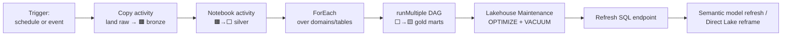
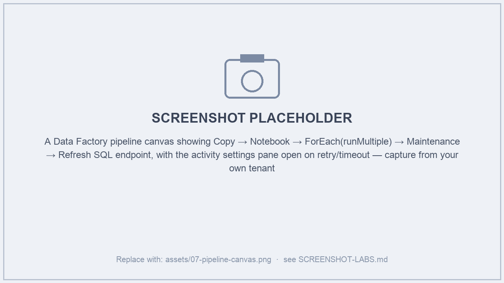
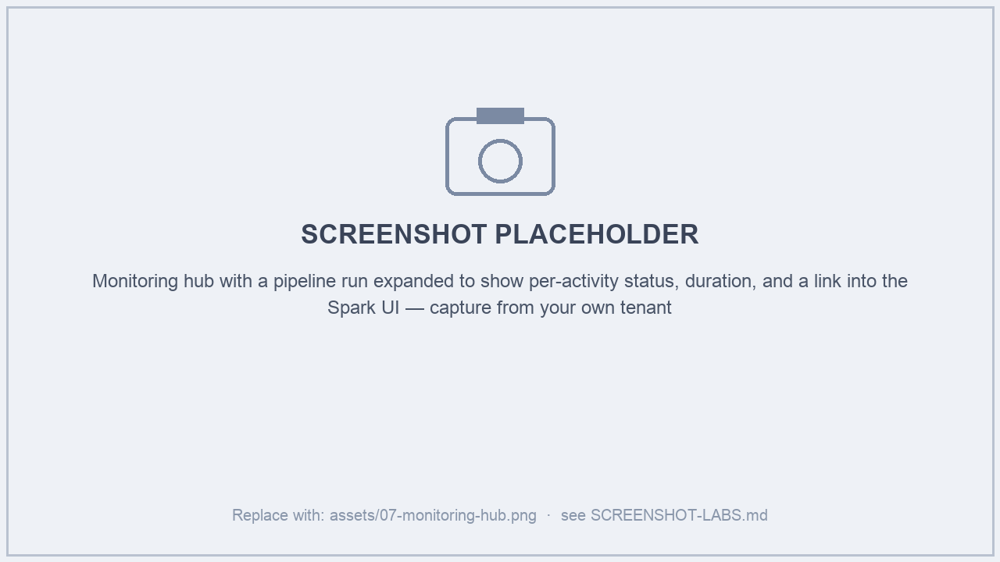
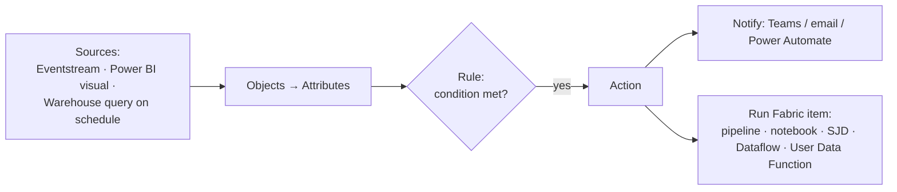
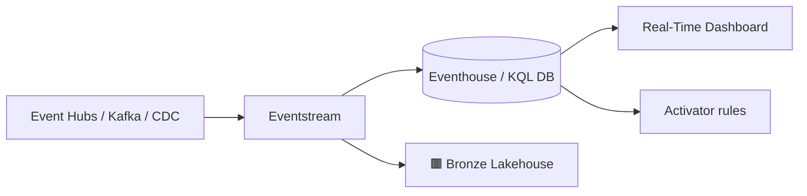

# Module 07 · Orchestration, Scheduling & Real-Time / Activator

> 🎯 **Learning objectives**
> - Build a production **pipeline** with control flow, parameters, retries, and dependencies.
> - Schedule with **time triggers** and **event triggers** (file lands → run).
> - Monitor everything in the **Monitoring hub**.
> - Use **Fabric Activator** for event-driven and alert-driven automation.
> - Know where **Real-Time Intelligence** (Eventstreams, Eventhouse/KQL) fits.

---

## 1. Pipelines are the conductor

A **Data Factory pipeline** orchestrates your data engineering. It's the production "conductor"; notebooks, SJDs, dataflows, and stored procs are the "musicians."

Activities you'll use constantly:

| Activity | Purpose |
|---|---|
| **Copy** | Bulk move (50+ sources / 40+ destinations, petabyte-capable). |
| **Notebook** / **Spark Job Definition** | Run transformation/ML logic with base parameters. |
| **Dataflow Gen2** | Run a low-code Power Query transform. |
| **Stored procedure** / **Script** | Run T-SQL in a Warehouse. |
| **Lakehouse Maintenance** (Preview) | OPTIMIZE + V-Order + VACUUM on schedule. |
| **Refresh SQL endpoint** | Force SAE metadata sync after loads. |
| **Semantic model refresh** | Refresh/reframe the BI model. |
| **Control flow** | ForEach, If, Until, Switch, Wait, Set variable. |

Every activity supports **retry count + retry interval + timeout**, and **dependency conditions** (on success / failure / completion / skip). Use **parameters** (pipeline-level) and **variables** (run-level) so one pipeline serves many tables.

> **Pattern — metadata-driven pipeline:** store a control table of `(source, target, watermark, load_type)`, **Lookup** it, **ForEach** the rows, and call a parameterized notebook per entity. One pipeline ingests *N* tables; adding a table is a row, not new code. (See the FMD Framework in the [tooling appendix](99-tooling-appendix.md).)

> 🖼️ ****

---

## 2. Scheduling: time vs. event triggers

| Trigger | How | Use for |
|---|---|---|
| **Time schedule** | Built-in scheduler on pipelines, notebooks, SJDs (cron-like). | Nightly/hourly batch. |
| **Event trigger** | **Fabric Activator + Eventstream** — e.g., *a file lands in Blob/OneLake → run a pipeline/notebook/SJD/Dataflow*. | Arrival-driven ingestion, low-latency reactions. |

> **Cost tip (recap Module 05):** background ops smooth over 24h, so firing many scheduled jobs at once is fine — but they all draw on the same capacity CU. Stagger heavy jobs or move bursty Spark to **Autoscale Billing** (Module 12).

---

## 3. The Monitoring hub

Left nav → **Monitor**: a unified view of **every run** across the tenant — pipelines, notebooks, SJDs, dataflow refreshes, table-maintenance jobs. Drill into any run for activity detail and the live **Spark UI**.

- First stop for *"did my job run?"* and *"why is it slow?"*.
- Filter by item type, status, time. Find `TableMaintenance` entries to confirm OPTIMIZE/VACUUM ran.

> 🖼️ ****

For **tenant-wide, near-real-time** capacity/activity monitoring beyond per-run detail, install **FUAM** (Fabric Unified Admin Monitoring) — covered in [Module 12 §5](12-governance-security-cost.md).

---

## 4. Fabric Activator — event-driven automation

**Fabric Activator** (formerly Data Activator / "Reflex") is a **no-code event-detection engine**. It watches data and, when a condition is met, **triggers an action**.

What it can monitor:
- **Streaming data** (Eventstream) — sub-second latency for stateless rules.
- **Power BI** data (a measure crossing a threshold on a visual).
- **Warehouse SQL query results on a schedule** (preview).

What it can do:
- **Alert** — Teams message, email, Power Automate flow.
- **Act** — execute a **pipeline, notebook, Spark Job Definition, Dataflow, or User Data Function**. This is what makes pipelines **event-driven**.

Concept model: **Containers → Data sources → Events → Objects → Attributes → Rules.** Discover/manage streams in the **Real-Time hub**.

> **Examples:** *"When a file lands in the landing zone, run the ingestion pipeline."* · *"When daily error-row count > 1000, alert the on-call channel."* · *"When inventory for a SKU < threshold, trigger a replenishment notebook."*

> **Lab 7.1 — Event-driven ingest.** Create an Activator rule: when a new file appears in your bronze `Files/landing/` folder (via an Eventstream/OneLake event), run `DP_ORCHS_NightlyBatch`. Verify the run in the Monitoring hub.

---

## 5. Where Real-Time Intelligence fits

For genuinely streaming/event data (IoT, logs, clickstream), use **Real-Time Intelligence**:

| Item | Role |
|---|---|
| **Eventstream** | Ingest & route events (Kafka, Event Hubs, CDC, pub/sub) — no/low code. |
| **Eventhouse / KQL Database** | Store and query high-volume time-series/event data with **KQL** (Kusto). |
| **KQL Queryset** | Saved KQL queries/analysis. |
| **Real-Time Dashboard** | Live dashboards over KQL data. |
| **Activator** | Detect conditions and act (see §4). |

Eventstreams can land data into a **lakehouse** (becoming part of your medallion) *and* an eventhouse simultaneously — bridging real-time and batch.

---

## ✅ Module 07 checklist

- [ ] I build pipelines with **parameters, retries/timeouts, and dependency conditions**.
- [ ] I use **metadata-driven** ForEach patterns instead of copy-pasting activities.
- [ ] I chain **Maintenance → Refresh SQL endpoint → model refresh** at the end of batch loads.
- [ ] I can set up **time and event triggers** and use **Activator** to alert and to run items.
- [ ] I know when to reach for **Real-Time Intelligence** vs. batch.

## ⚠️ Anti-patterns

- **Hand-built pipelines per table** instead of one metadata-driven pipeline.
- **No retry/timeout** on activities → transient failures become incidents.
- **Forgetting Refresh SQL endpoint** after loads → consumers see stale schema/data.
- **Polling for files on a schedule** when an **Activator event trigger** is cleaner and cheaper.
- **All heavy jobs at 02:00** on a shared capacity → self-inflicted throttling.

---

**Next:** [Module 08 · Data Products & the Data Mesh Operating Model →](08-data-products-mesh.md)
