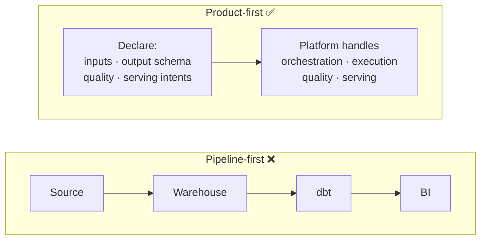
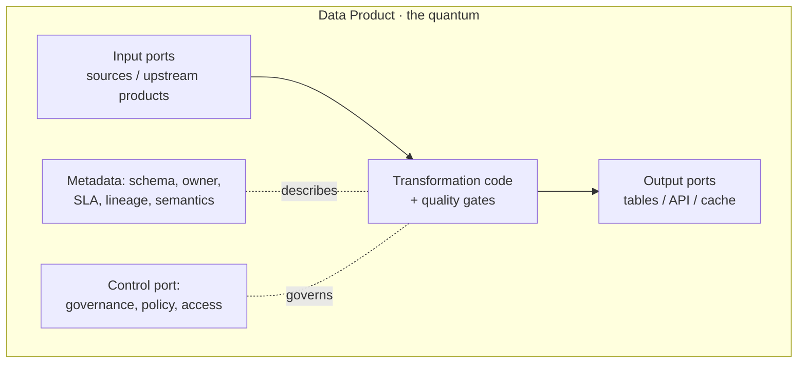
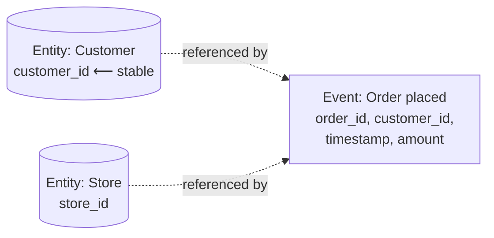
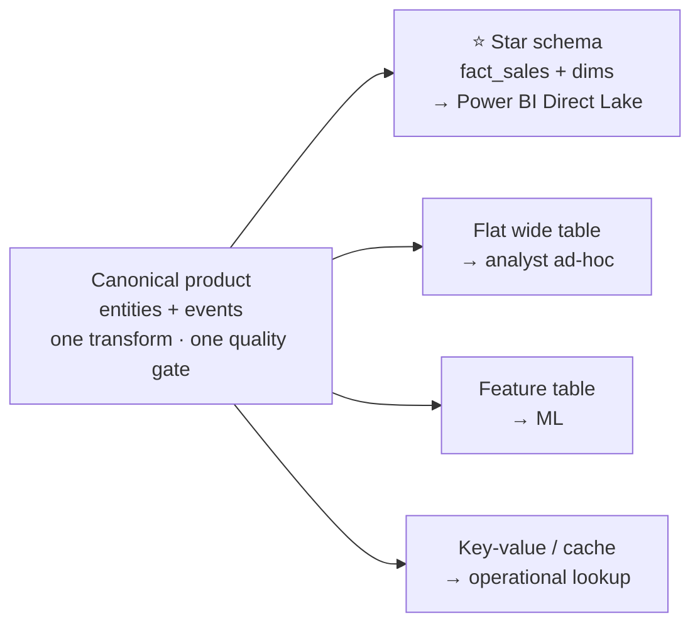
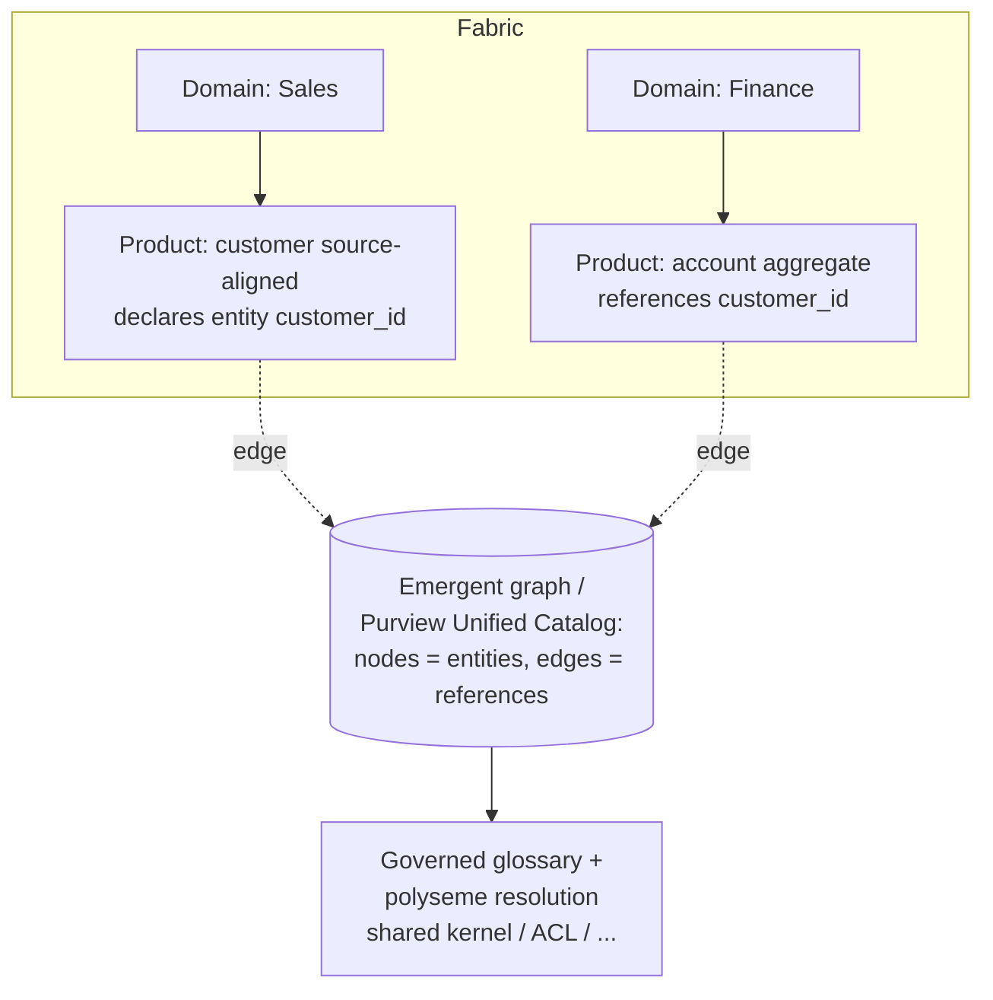
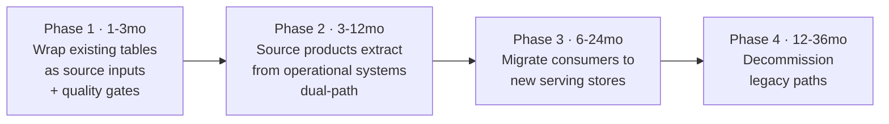

# Module 08 · Data Products, Ontology & the Data Mesh Operating Model

> 🎯 **Learning objectives**
> - Define a **data product** and its anatomy — and why it, not the pipeline, is the unit of architecture.
> - Model with the **two primitives: entities and events**, and enforce **identity separation**.
> - Capture **business ontology** as an emergent-but-governed property.
> - Use **data contracts / serving intents** so consumers don't couple to your internals.
> - Implement all of this concretely in Fabric (domains, lakehouses, schemas, shortcuts, endorsement, Purview).
> - Apply rigorous **schema & naming conventions** that survive business change.

This module is the intellectual spine of the course. Modules 02–07 taught you the Fabric *machinery*; this one teaches you **how to organize data so it survives the business changing underneath it** — synthesizing data-mesh thinking, the "*end of pipeline engineering*" argument, and Modern Data 101's product-led approach, then mapping every idea onto Fabric.

---

## 1. The mindset shift: from pipelines to products

> *"The pipeline metaphor assumes the hard problem in data is moving and transforming data. It isn't. The hard problem is surviving business change without losing institutional memory."* — *The End of Pipeline Engineering*

Traditional `Source → Warehouse → dbt → BI` chains fail in three ways:

1. **The pipeline chain is a liability masquerading as architecture** — every link is a failure point; state spread across stages becomes accidental complexity.
2. **Dimensional modeling solves the wrong problem at the wrong time** — Kimball star schemas bake in *one* perspective up front; classifications are "use-case dependent, not intrinsic," so business change forces brittle restructuring.
3. **Data mesh identified the problem but left a modeling gap** — it gives org structure and product thinking but *"doesn't prescribe how the data within a product should be modeled to survive business evolution."*

The fix is an **inversion**:

> **Modern Data 101's framing:** *"Data Products Are Not the Destination. They Are What Gets You There."* The data engineer stops being a **plumber** building pipes and becomes a **domain translator** who *declares* data products that capture what the business does.



---

## 2. What a data product *is*

> **Definition:** a data product is *"a declared unit that encapsulates what the data is, where it comes from, what quality it must meet, and how consumers can access it."*

The engineer **declares** four things; the platform handles the rest:

| You declare | Meaning |
|---|---|
| **Inputs** | Source connections or **upstream product references** |
| **Output schema** | With **explicit separation of identity columns from attribute columns** |
| **Quality constraints** | The bar the data must pass before anyone sees it |
| **Serving intents** | How different consumers need to access it (star schema, cache, API, feature store…) |

A data product is **not "one query."** It's a **self-contained unit of deployment with a single owner, single quality gate, and single version.** Internally it can be as well-structured as any software module — its intermediate models are **private methods, not public APIs**. No external product may reference its internals.

### The data-product anatomy (Modern Data 101 / data-mesh canon)
A data product bundles **code + data + metadata + infrastructure** and exposes **ports**:



It must satisfy the data-mesh product properties (often abbreviated **DATSIS**): **D**iscoverable, **A**ddressable, **T**rustworthy, **S**elf-describing, **I**nteroperable, **S**ecure.

---

## 3. The two primitives: entities and events

This is the modeling foundation that makes data survive change.

| Primitive | Definition | Examples | Invariant |
|---|---|---|---|
| **Entity** | A thing with **stable identity** that other things reference | customer, store, product | Identity *survives everything*; attributes evolve |
| **Event** | A thing that **happened**: immutable, timestamped, references entities, carries measures | order placed, payment processed | *"You can't un-place an order"* |

> **Critical rule:** entity/event classification is a **domain concern** — it describes *what the data is in the real world* — unlike fact/dimension, which is a *consumption* concern. You classify once, truthfully; you render to fact/dim later (§6).



---

## 4. Identity separation — the structural invariant

> **The rule that makes everything else possible:** *"identity columns are separated from attribute columns in the schema declaration."*

- **Identity columns are immutable** and governed by **global standards**. They can **never change in a version update** — changing an identity would break every downstream reference.
- **Attributes evolve freely.** When a KPI or segmentation retires, *"it's an attribute that disappears — the entity it described still exists, its identity still resolves, and every downstream product that referenced the entity continues working."*

### Schema convention: declare identity vs. attributes explicitly

```sql
-- Silver entity table: identity block first, attributes after, lineage/audit last
CREATE TABLE silver.customer (
    -- ── IDENTITY (immutable, globally governed, never versioned away) ──
    customer_id        STRING   NOT NULL,   -- stable business identity
    -- ── ATTRIBUTES (mutable, may be added/retired across versions) ──
    full_name          STRING,
    email              STRING,
    customer_segment   STRING,              -- may change methodology; downstream binds to entity, not this
    -- ── AUDIT / LINEAGE ──
    _source_system     STRING,
    _ingested_at       TIMESTAMP,
    _valid_from        TIMESTAMP,           -- enables Type-2 *at serving time*, not baked in
    _correction_of     TIMESTAMP            -- links a correction to the record it fixes
)
CLUSTER BY (customer_id);
```

> **Modern Data 101 echoes this** with *"The Identity Crisis: why entity resolution is the missing foundation of every data product stack."* Unified, resolved identity is **prerequisite infrastructure**, not an afterthought.

---

## 5. Append-only storage & version coexistence

Three "enemies of data integrity" and their structural solutions:

| Enemy | Solution |
|---|---|
| **Mutation** | **Append-only** storage with **snapshot isolation** — every materialization writes a new snapshot; the previous remains for time travel. Old and new values coexist historically. |
| **Tight coupling** | **Identity separation + semantic-intent contracts** (§4, §7) |
| **Big-bang schema changes** | **Version coexistence** — v1 and v2 run together during a deprecation window; each consumer migrates independently |

**Quality gate before visibility:** *"Quality gates run against the new snapshot before it becomes visible. If the data fails, the snapshot is expired… consumers keep reading the previous good snapshot."* Result: **stale-but-correct during failures, never fresh-but-wrong.**

**Corrections, not mutations:** legitimate fixes are emitted as **correction events** carrying `_correction_of` metadata pointing to the original record — they flow through the *same* quality gates, not a side channel.

### How this maps to Fabric (concretely)

| Principle | Fabric mechanism |
|---|---|
| Append-only + snapshots + time travel | **Delta Lake** versions; `VERSION AS OF` / `TIMESTAMP AS OF`; VACUUM retention ≥ 7 days (Module 06 §7) |
| Quality gate before promotion | Validate in a **staging table / notebook**, then **MERGE/swap into the published gold table** only on pass; or **materialized-lake-view DQ rules** (Module 04 §5) |
| Version coexistence | Keep `gold.fact_sales_v1` and `gold.fact_sales_v2` (or schema-versioned) during a deprecation window; consumers cut over independently |
| Correction events | A `_correction_of` column + MERGE logic, never an out-of-band UPDATE |

> The article notes a *"unified platform that takes declarative product manifests doesn't exist yet."* In Fabric you **approximate the manifest** with: a **lakehouse/warehouse per product**, **Delta** for append-only history, **materialized lake views** or **notebooks** for declared transforms + DQ, **endorsement** for trust, and **Purview** for the contract/metadata layer.

---

## 6. Dimensional modeling as *projection*, not architecture

> *"Star schemas are not wrong. The insight is that star schemas are a **rendering** of the data, not the data itself."*

One canonical entity/event product can serve **many simultaneous projections**:



- *"One transformation. One quality gate. Multiple projections. Each shaped for a different consumer. Each disposable and replaceable without touching the core product."*
- **SCD logic becomes a serving concern:** finance wants **Type 1** (latest)? the serving intent selects the most recent record per entity. Wants **Type 2** (history)? it generates `valid_from`/`valid_to` from the timestamp sequence. *"Same entity data, three different SCD implementations, no additional ETL logic."*

**In Fabric:** your **Silver** layer holds the canonical entity/event tables; your **Gold** layer holds projections (star schemas, flats, aggregates) built *from* silver. This is exactly the medallion split in Module 04 — now with a sharper rule: **model truthfully in silver, render per-consumer in gold.**

### The three data-product archetypes (where each lives)

| Archetype | What | Stability | Fabric home |
|---|---|---|---|
| **Source-aligned** | Capture entities/events from operational systems; minimal transform | Stable | 🟫 Bronze → ⬜ Silver |
| **Aggregate** | Combine entities/events around a **business capability** (not a report) | Stable if scoped to capability | ⬜ Silver / 🟨 Gold |
| **Consumer-aligned** | Shaped for a specific use case (ML store, API view, report dataset) | **Most volatile / disposable** | 🟨 Gold / serving |

> **Scope rule:** *"If the aggregate product were organized around the report, it would change whenever the report changed. Organized around the capability, it stays stable."* Different team, different evolution timeline, or different consumer base ⇒ **two products**.

---

## 7. Data contracts & semantic intents — decoupling consumers

> *"Instead of consuming a specific column `customer_segment` with values ['Gold','Silver','Bronze'], a downstream product declares a **semantic intent**: 'I need customer classification data refreshed daily.'"*

The contract binds to the **capability**, not the implementation — so when the upstream changes its segmentation methodology, *"the contract holds even as the implementation evolves."* This is Udi Dahan's service-autonomy principle: a service is the **technical authority for a business capability**; others bind to the **capability**, not internal details.

> Modern Data 101: *"Your LLM is only as smart as your data contract."* Contracts are the semantic guardrails — for BI *and* for AI agents.

### Governance of serving intents

- Each serving intent has an **owner** — typically the **consumer team**, not the product owner.
- **Assertion tests** run after every materialization (row counts in tolerance, value ranges, schema).
- **Semantic review on version bumps:** the platform notifies intent owners with a diff; they decide whether their projection needs updating.
- **Orphaned intents** (no consumers) are flagged for retirement.

### Testing strategy (lift into your CI — Module 13)

| Test | What it checks |
|---|---|
| **Unit** | Each transform: fixed input → expected output |
| **Contract** | Product B's declared dependency on A (schema, identity cols, freshness) — fails the build if A's version bump would break B |
| **Canary** | Synthetic products run end-to-end: one designed to **pass** (good data is served), one to **fail** (bad data is blocked) |

---

## 8. Business ontology — emergent, but governed at the boundaries

> *"Much of the ontology can emerge. Every source product that declares 'I capture the customer entity' adds a node to the graph. Every aggregate product referencing customer_id and store_id adds edges."*

But emergence works only **within a bounded context** (one team's shared understanding). Across contexts, the same word may mean different things — a **polyseme** (e.g., two teams' "customer"). Modern Data 101 calls the discipline of keeping the model aligned to reality the **Minimal Ontology Principle** — *"the challenge is not building the ontology, but mirroring the delta"* as the business changes.

When cross-domain entities collide, choose an **integration pattern** (Evans/Fowler) — *a political/organizational decision the platform can detect but not make for you*:

| Pattern | Use when |
|---|---|
| **Shared kernel** | Both domains agree it's the same entity; co-own one definition |
| **Customer-supplier** | One domain produces the definition; others consume; producer commits to stability |
| **Anticorruption layer** | They *look* similar but aren't; each keeps its own + a translation layer at the boundary |
| **Published language** | Agree a shared cross-domain vocabulary without merging internal models |

### How ontology lives in Fabric



- **Fabric domains** (Module 02) *are* your bounded contexts.
- **Purview Unified Catalog** (Module 12) holds the **business glossary, data products, lineage** — the governed ontology layer. Fabric's own **OneLake Catalog** surfaces lineage/endorsement natively.
- Modern Data 101's *"Semantic Medallion / knowledge-graph-powered catalog"* maps to **Purview + lineage + glossary** sitting over your medallion.
- The **semantic model / Metric sets** (Modules 09–10) are where ontology becomes *queryable business meaning* — and in 2026, the layer feeding **Fabric IQ and AI agents**.

---

## 9. Schema & naming conventions for durable products

Consolidated standard (community + the principles above). The throughline: **identity is sacred and stable; attributes and renderings are disposable.**

### Layer-by-layer table & column conventions

| Layer | Table naming | Column discipline |
|---|---|---|
| 🟫 **Bronze** | `raw_<source>_<entity>` (`raw_crm_customers`) | As-is + `_ingested_at`, `_source_file`. Permissive schema. |
| ⬜ **Silver** | `<entity>` (`customer`), `<event>` (`order`) | **Identity block first**, attributes next, `_audit` last. Enforced contract. `customer_id` immutable. |
| 🟨 **Gold** | `dim_<entity>`, `fact_<event>`, `agg_<grain>` | Surrogate keys for dims; conformed; rendered per consumer. |

- **Schemas:** `bronze`/`silver`/`gold`, or domain-scoped `sales`/`finance`/`hr`. Reference: `silver.customer`, `gold.fact_sales`.
- **Columns:** `snake_case`; identity `<entity>_id`; events carry `<event>_ts`; booleans `is_`/`has_`; money `_amount` + currency; never reuse a retired column name for a new meaning (that creates a polyseme).
- **Identity standard (global):** define the canonical key per entity **once**, document it in the glossary, and forbid changing it in version bumps. New attribute? add a column. Retire a KPI? drop the attribute — the entity and its identity persist.
- **Versioning:** when output schema breaks compatibility, **bump the product version and run both** (`gold.fact_sales` + `gold.fact_sales_v2`, or a `version` tag) through a deprecation window.

---

## 10. The operating model & adoption path

> **Modern Data 101:** *"Where Exactly Data Becomes Product"* — the transformation point is **Silver→Gold**, where conformed entities/events become governed, contracted, discoverable products.

Roles in this model:

| Role | Owns |
|---|---|
| **Domain / data-product owner** | The product, its contract, its SLA, its quality gate |
| **Data engineer (domain translator)** | Recognizes entities/events; declares source & aggregate products; declares serving intents |
| **Consumer team** | Owns its serving intents and their assertion tests |
| **Platform / COE team** | The Fabric estate, capacities, CI/CD, cross-domain governance |

**Adoption — the Strangler Fig pattern** (don't big-bang it):



Realistic timeline: **2–3 years** for a mid-size enterprise; longer at large scale. The point isn't speed — it's building data that **doesn't become a graveyard of orphaned tables** when the business reorganizes.

> **Lab 8.1 — Declare a data product.** For the retail example, write a one-page **product manifest** (markdown) for a `customer` source-aligned product: inputs (CRM), output schema (identity block + attributes), quality constraints (non-null `customer_id`, unique, email format), and two serving intents (a Type-1 `dim_customer` for BI; a feature table for churn ML). Then implement the silver entity table + both gold projections in Fabric and mark the BI model **Certified** (Module 12).

---

## ✅ Module 08 checklist

- [ ] I think in **products, not pipelines** — declare inputs/schema/quality/serving, let the platform run it.
- [ ] I model with **entities & events** and **separate identity columns from attributes**.
- [ ] I treat **star schemas as projections** rendered from canonical silver, with **SCD chosen at serving time**.
- [ ] I decouple consumers with **contracts / semantic intents** and test them (unit/contract/canary).
- [ ] I let **ontology emerge within domains** but govern **cross-domain polysemes** deliberately.
- [ ] My **schema/naming** keeps identity stable and renderings disposable; I version with coexistence.

## ⚠️ Anti-patterns

- **Organizing aggregate products around a report** → they churn every time the report changes. Organize around the **business capability**.
- **Letting consumers bind to internal columns** instead of a contract → every refactor breaks someone.
- **Mutating gold tables in place** → no history, no quality gate, fresh-but-wrong data reaches users.
- **Baking SCD type into ETL** → can't serve another consumer's need without new pipelines.
- **Assuming ontology auto-resolves across domains** → silent polyseme collisions (two "customers").
- **Reusing a retired column name** for a new meaning → poisons lineage and contracts.

---

**Next:** [Module 09 · Semantic Modeling & Direct Lake →](09-semantic-modeling-direct-lake.md)
