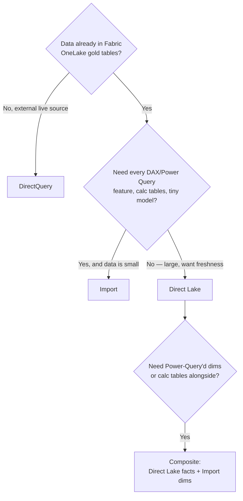
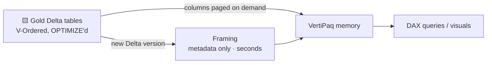
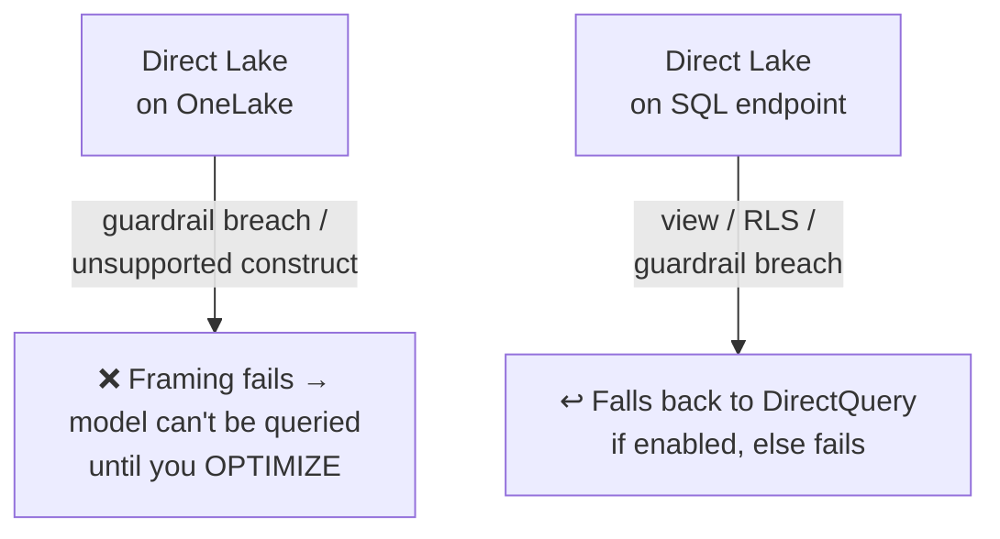
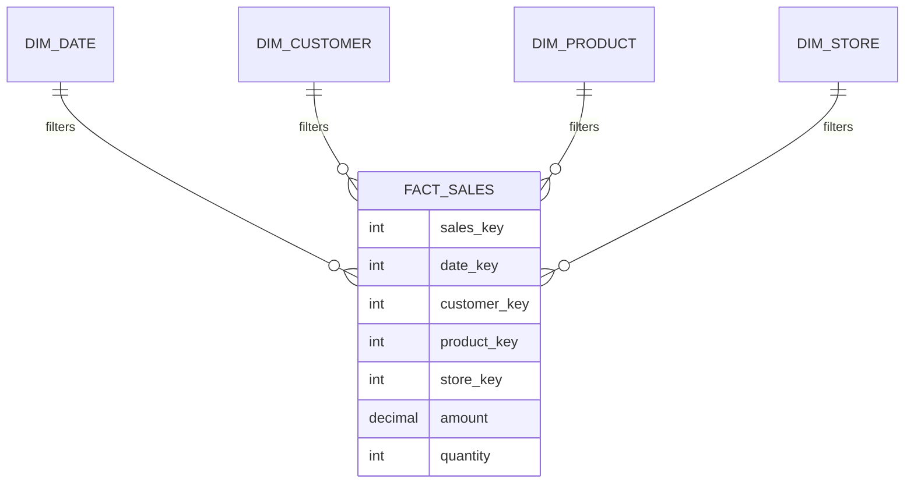

# Module 09 · Semantic Modeling & Direct Lake

> 🎯 **Learning objectives**
> - Choose a **storage mode** — Import, DirectQuery, Direct Lake, or composite (the #3 of the four big decisions).
> - Understand **Direct Lake** deeply: framing, transcoding, V-Order, fallback, guardrails.
> - Distinguish **Direct Lake on OneLake** vs. **on SQL endpoint** (the single most production-relevant nuance).
> - Build a proper **star schema** and relationships that don't break Direct Lake.

---

## 1. What a semantic model is

A **semantic model** (formerly "dataset") is the analytical layer DAX queries hit. **Storage mode is a per-table property**, so a model mixing modes is a **composite model**.

| Mode | Engine | What happens | "Refresh" |
|---|---|---|---|
| **Import** | VertiPaq (in-memory) | Full compressed copy cached in memory | Full data reload (minutes; CPU/mem heavy) |
| **DirectQuery** | Source DB | DAX → SQL, run on the source per query | None; live but slower |
| **Direct Lake** | VertiPaq | Reads Delta/Parquet columns from OneLake into memory on demand | **"Framing"** = metadata-only, seconds |
| **Dual** | Both | Acts as Import or DirectQuery per query | Like Import |

Import and Direct Lake both use **VertiPaq** and usually outperform DirectQuery for interactive visuals.

---

## 2. The decision: which storage mode?

| If you need… | Choose |
|---|---|
| Self-service agility, Power Query transforms, calc columns/tables, smallest data | **Import** |
| Large Fabric Delta data (gold), near-real-time freshness without refresh windows, VertiPaq speed | **Direct Lake** |
| Real-time source of truth, data too large/volatile to copy, no Fabric capacity | **DirectQuery** |
| Big facts + reshapeable dimensions in one model | **Composite: Direct Lake (facts) + Import (dims)** |

> **Default →** **Direct Lake** when your gold tables are in Fabric and well-modeled (V-Ordered, OPTIMIZE'd). It gives Import-class speed with seconds-long framing instead of long refreshes. **Marco Russo's guidance:** Direct Lake for **large fact tables (50M+ rows) with stable schemas**, **Import for dimensions** needing Power Query/iterative design — as a **single-model composite**, *not* two stitched-together models (classic composite on high-cardinality keys causes severe filter-list overhead).
>
> ⚠️ **Direct Lake requires an F SKU.** Import/DirectQuery work on any license including Free.

---

## 3. Direct Lake, deep

**How it works.** Direct Lake loads compressed columns from **V-Ordered Delta/Parquet** in OneLake **directly into VertiPaq memory on demand** — only the columns a query touches are paged in. First touch incurs a one-time **transcoding** cost (Parquet encoding → VertiPaq); subsequent queries hit the in-memory cache. Import-class speed, no Import-style copy.

**Framing / reframing.** A Direct Lake "refresh" is **framing** — a metadata-only operation (seconds) that points the model at the newest committed Delta version and invalidates the cache for changed columns. **Automatic updates** can reframe when source Delta tables change. No re-ingest, no recompression.

**V-Order is the performance lever.** Direct Lake performance *depends on well-tuned Delta tables.* V-Order + regular `OPTIMIZE`/compaction dramatically cut memory and fallback. Real data point: a **40% fallback rate dropped under 3%** after V-Order + OPTIMIZE; V-Order cuts memory ~30–50%. **If tables were written without V-Order, rewrite them** (Module 03 §6).

---

## 4. The critical nuance: Direct Lake on OneLake vs. on SQL endpoint

This is **the single most production- and exam-relevant distinction** in Fabric BI.

| | **Direct Lake on OneLake** | **Direct Lake on SQL endpoint** |
|---|---|---|
| Data access | Reads OneLake Delta tables directly | Via the **SQL analytics endpoint** of a lakehouse/warehouse |
| Sources per model | **Multiple** Fabric items in one model | **Single** Fabric item only |
| **DirectQuery fallback** | **None — Direct Lake or it errors** | **Yes — falls back to DirectQuery** |
| Composite (mix Import/DQ) | **Yes** | Mostly no (calc groups/what-if/field params only) |
| Authoring | Power BI Desktop | Created in Fabric web; editable in Desktop after |
| Security checks | **OneLake Security** (table/folder OLS, CLS, RLS) | **SQL endpoint** permissions (OLS/CLS/RLS) |
| SQL views | Non-materialized views **not supported** (use a materialized lake view → Delta table) | Supported but **force DirectQuery fallback** |

> ⚠️ **Remember:** **OneLake = no fallback (fail hard).** **SQL = DirectQuery fallback.** The model's **Direct Lake behavior** property (Automatic / DirectQueryOnly / DirectLakeOnly) controls SQL-flavor fallback. Plan capacity and compaction so OneLake-flavor models never breach guardrails.

### Capacity guardrails (Direct Lake needs F SKUs)

| SKU | Parquet files/table | Rows/table (M) | Max memory (GB) |
|---|---|---|---|
| F2–F8 | 1,000 | 300 | 3 |
| **F64/P1** | 5,000 | 1,500 | 25 |
| F256/P3 | 5,000 | 6,000 | 100 |
| F1024/P5 | 10,000 | 24,000 | 400 |

Exceeding ~10,000 Parquet files per table (or row/row-group limits) → framing fails (OneLake) or fallback (SQL). **OPTIMIZE/compact or scale up.**

---

## 5. Star schema & modeling best practices

Star schema is **strongly recommended** — it matches how VertiPaq, relationships, and the engine are built.

Rules:
- **Relationships:** single-direction **one-to-many** (dimension "one" side → fact "many"). The one-side key must be **unique** — ⚠️ in Direct Lake, **duplicate one-side values make queries *fail***.
- **Dimensions:** unique **surrogate integer** key (not the business key); flat descriptive attributes; **don't over-normalize** — flatten snowflakes into one table.
- **Date dimension is non-negotiable.** Mark your own date table; don't rely on auto date/time (unsupported in Direct Lake on SQL anyway).
- **Avoid high-cardinality columns** (GUIDs, raw timestamps, free text) — they kill compression. Direct Lake doesn't support Binary/GUID/complex Delta types or NaN; strings capped at 32,764 chars.
- **Do data prep upstream in OneLake** (Spark/T-SQL/dataflows) for reuse — *not* in the model. Direct Lake is *"ideal for the gold layer of a medallion architecture."* This is exactly the "render in gold, not in the model" rule from Module 08.

> **Lab 9.1 — Build a Direct Lake model.** On `WH_STORE_Gold` (or a Gold Lakehouse), create a Direct Lake semantic model over `fact_sales` + `dim_customer/product/store/date`. Set one-to-many single-direction relationships, mark the date table, confirm it's Direct Lake (not fallen back). Check memory/fallback behavior in the model's settings.

> 🧭 **In the Fabric portal:** From a Lakehouse/Warehouse toolbar → **New semantic model** → pick fact + dim tables. In **Model view**, drag dim→fact to create **1-to-many** relationships; the storage mode reads **Direct Lake**.

### Import vs. Direct Lake — the trade-off table

| | Direct Lake | Import |
|---|---|---|
| Refresh | Framing (seconds) | Full copy (minutes+) |
| Data prep | Upstream in OneLake | Power Query in model |
| Calc columns/tables | Limited/preview (OneLake) or none (SQL) | Full |
| Latency | Near-real-time | Bound by refresh schedule |
| First-query cost | Transcoding penalty | None |
| License | **F SKU only** | Any license |

---

## ✅ Module 09 checklist

- [ ] I can choose **Import / DirectQuery / Direct Lake / composite** from data location, size, and feature needs.
- [ ] I understand **framing, transcoding, and that V-Order + OPTIMIZE are mandatory** for good Direct Lake.
- [ ] I know **OneLake = no fallback; SQL = DirectQuery fallback** and design around guardrails.
- [ ] My **star schema** uses unique one-side keys, surrogate dim keys, a marked date table, and no high-cardinality junk.
- [ ] I prep data **upstream in gold**, not in the model.

## ⚠️ Anti-patterns

- **Duplicate keys on the one-side** of a relationship → Direct Lake query failures.
- **Views in a Gold Warehouse** for a Direct Lake-on-SQL model → silent DirectQuery fallback (slow).
- **Skipping V-Order/OPTIMIZE** → high fallback, memory blowups, framing failures.
- **Modeling business logic with calc columns** in Direct Lake → unsupported/limited; push to gold.
- **Classic composite** (two stitched models) on high-cardinality keys → severe perf overhead. Use single-model Direct Lake + Import.

---

**Next:** [Module 10 · KPIs, Metrics & the Metrics Layer →](10-kpis-metrics.md)
