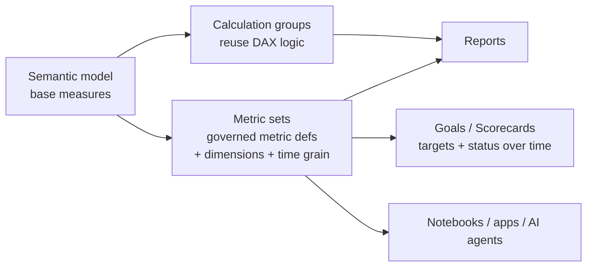
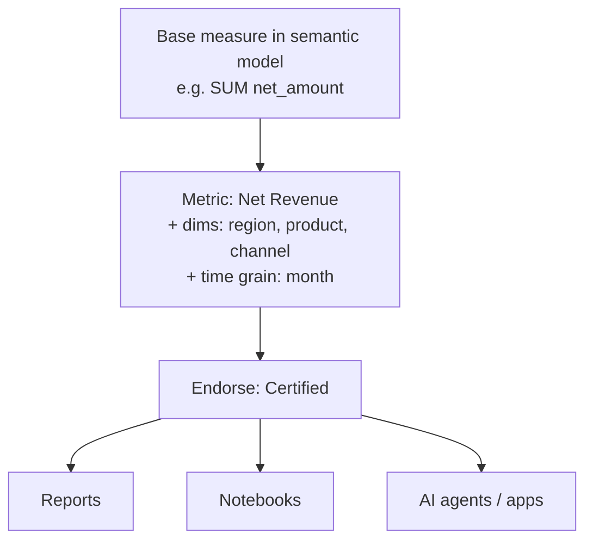
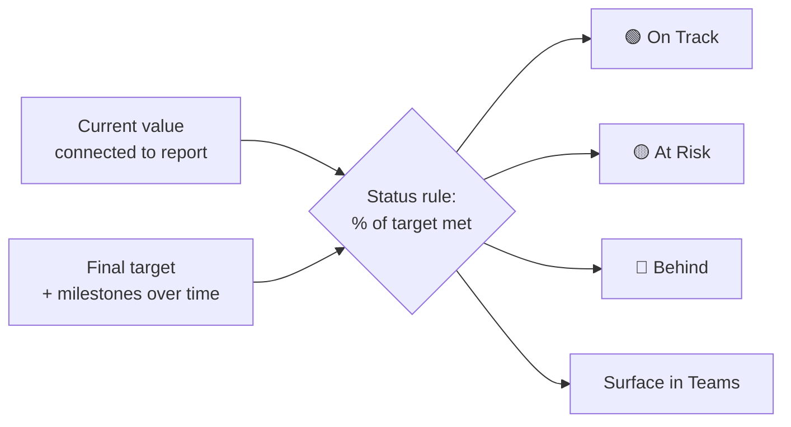

# Module 10 · KPIs, Metrics & the Metrics Layer

> 🎯 **Learning objectives**
> - Distinguish the **three KPI mechanisms** in Fabric and use each for its purpose.
> - Build reusable DAX with **calculation groups**.
> - Define governed, reusable metrics with **Metric sets** (the Metrics layer).
> - Track outcomes against targets with **Power BI Metrics (Goals/Scorecards)**.
> - Set up **external KPIs** and connect them to the broader org.

This module operationalizes the data-product idea (Module 08): a KPI is an **attribute** rendered from your entity/event data — defined once, governed, reused everywhere.

---

## 1. Three mechanisms — keep them straight

The most common confusion in Fabric BI. They are *different layers* and you'll often use all three.

| Mechanism | What it gives you | Analogy |
|---|---|---|
| **Calculation groups** | Reuse **DAX logic** (YoY, YTD, % of total) across many measures | A function applied to measures |
| **Metric sets** (Metrics layer) | Reuse **governed metric definitions** across reports, notebooks, apps | A shared, certified library of KPIs |
| **Goals / Scorecards** (Power BI Metrics) | **Track** metrics against targets with status over time | A tracker / OKR board |



> **Rule of thumb:** *Calculation groups* = reuse DAX logic; *Metric sets* = reuse governed metric definitions across artifacts; *Goals/Scorecards* = track those metrics against targets with status.

---

## 2. Calculation groups — DAX reuse inside the model

A **calculation group** applies reusable logic across *many* measures via **calculation items** + a dynamic format string — drastically cutting measure count.

```dax
-- Time Intelligence calculation group with items:
-- Current
SELECTEDMEASURE()
-- YoY
VAR _cur = SELECTEDMEASURE()
VAR _py  = CALCULATE(SELECTEDMEASURE(), SAMEPERIODLASTYEAR(dim_date[date]))
RETURN _cur - _py
-- YoY %
DIVIDE(
    SELECTEDMEASURE() - CALCULATE(SELECTEDMEASURE(), SAMEPERIODLASTYEAR(dim_date[date])),
    CALCULATE(SELECTEDMEASURE(), SAMEPERIODLASTYEAR(dim_date[date]))
)
-- YTD
CALCULATE(SELECTEDMEASURE(), DATESYTD(dim_date[date]))
```

Now **one** calc group gives *every* base measure (`Sales`, `Margin`, `Units`…) YoY/YoY%/YTD variants — instead of authoring dozens of measures.

- **Author natively in Power BI Desktop** (since mid-2024) or in **Tabular Editor** (preferred for power users/scripting — see [tooling appendix](99-tooling-appendix.md)).
- Use a **dynamic format string** so YoY% renders as a percentage automatically.

> 🧭 **In the Fabric portal:** In **Power BI Desktop → Model view**, right-click → **Calculation group** (or use **Tabular Editor**); add calculation items *Current / YoY / YoY% / YTD*.

---

## 3. Metric sets — the Metrics layer (the big 2025–2026 addition)

**Metric sets** are a Fabric item for defining **trusted, reusable business metrics once** and consuming them everywhere — killing the "every report redefines Revenue slightly differently" problem.

- **What it is:** a curated mini-model grouping related metrics. Each metric = a **base measure from a semantic model + associated dimensions + a time grain**, so consumers slice a *governed* metric without re-authoring DAX.
- **Discovery & reuse:** browse via the **Metrics hub** in the service (endorsed/favorite metrics). Reuse a metric in **new reports in the service**, in **notebooks** (copy the code), and surface to custom apps.
- **Prerequisites:** **Fabric enabled in tenant settings**; create the metric set in a **Fabric or PPU workspace**. *(Still rolling out regionally through 2025–2026 — flag that availability/UX is evolving.)*
- **Governance:** designed for **endorsement (Promoted / Certified)** so authors consistently use the most accurate KPIs.
- **Direction of travel:** in 2026 Microsoft positions semantic models / metrics as the governed layer feeding **Fabric IQ and AI agents** — one trusted metric definition becomes even more valuable.

> This is the Fabric realization of Module 08's **data contract**: a metric is the governed, reusable interface to a business concept. Define `Net Revenue` once, certify it, and every report/notebook/agent binds to *that*, not to a hand-rolled measure.



> 🧭 **In the Fabric portal:** In the Fabric service, open the **Metrics hub** (or **+ New item → Metric set**) to define a metric on a base measure + dimensions + time grain, and **Certify** it.

---

## 4. Goals & Scorecards — tracking against targets

**Power BI Metrics** (formerly "Goals") track KPIs against targets in a curated **scorecard**.

- A goal needs a **Current value** and a **Final target**. Values are **manual** (entered, updated via check-ins) or **connected** (wired to a report data point; refreshes with the model).
- **Status rules** automate status (On Track / At Risk / …) based on value, % of target met, date conditions, or combinations. Connected goals re-evaluate on each refresh.
- **Up to 4 subgoal levels**; goal-level permissions; **multiple targets/milestones increasing over time** (2025 enhancement); surfaced in **Microsoft Teams**.
- **Licensing:** authoring/check-ins = **Pro**; viewing = Pro or **F64+** for Free users.
- **Limits:** no RLS, no publish-to-web/embedded, no cross-tenant B2B, not in Multi-Geo.



> **Lab 10.1 — KPI end to end.** (1) Add a **calculation group** giving `Net Revenue` a YoY% variant. (2) Define a **metric set** with `Net Revenue` (dims: region, month) and **Certify** it. (3) Build a **scorecard** with a connected goal: Current = `Net Revenue`, Target = budget, status rule at 90%/100%. Pin it to Teams.

---

## 5. External KPIs & the broader picture

"External KPIs" usually means one of:
- **KPIs defined outside a single report** so many reports/teams reuse them → that's exactly **Metric sets** (§3).
- **Targets that live outside the data model** (entered by the business, or pulled from a planning tool) → **manual goals** or **connected goals** wired to an external-sourced table.
- **KPI visuals** (base value + target + status) on a report page — define in Desktop.

To bring external target data in: land it as a small table in **gold** (via a dataflow, pipeline, or even a manual upload), model it as a `target` table related to your date/entity dims, and connect goals to it. This keeps targets versioned and governed like any other data product (Module 08).

External tooling for KPI/measure management (see [tooling appendix](99-tooling-appendix.md)):
- **Tabular Editor** — Best Practice Analyzer to lint measures, scripting, calc-group authoring.
- **DAX Studio** — query plans, server timings, performance.
- **Measure Killer** — find unused measures/columns across the tenant.

---

## ✅ Module 10 checklist

- [ ] I can explain **calc groups vs. metric sets vs. goals** and pick the right one.
- [ ] I cut measure sprawl with a **time-intelligence calculation group**.
- [ ] I define and **Certify** governed KPIs as **Metric sets** for org-wide reuse.
- [ ] I track outcomes with **scorecards**, connected goals, and status rules.
- [ ] I land **external targets** as a governed gold table, not hardcoded.

## ⚠️ Anti-patterns

- **Re-defining the same KPI** slightly differently in every report → use a certified **Metric set**.
- **Dozens of near-duplicate measures** (`Sales YoY`, `Margin YoY`…) → use a **calculation group**.
- **Hardcoding targets** in DAX → make them a governed table connected to goals.
- **No endorsement** → consumers can't tell the trusted KPI from a stale copy.

---

**Next:** [Module 11 · Power BI Reports vs Paginated Reports →](11-reports-paginated.md)
