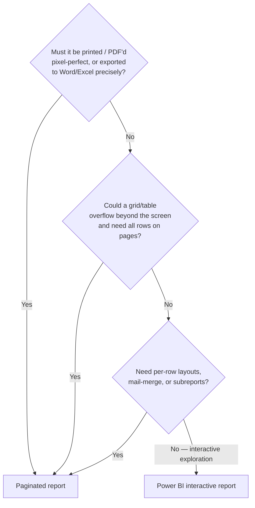
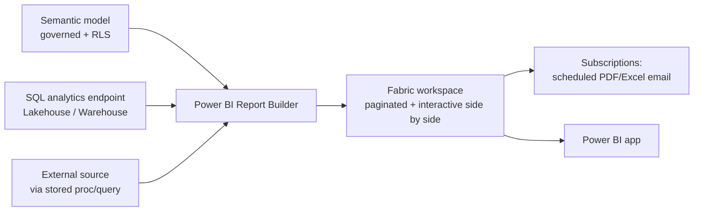
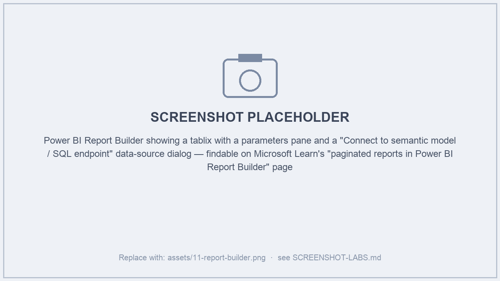

# Module 11 · Power BI Reports vs Paginated Reports

> 🎯 **Learning objectives**
> - Make the **interactive vs. paginated** decision (the #4 of the four big decisions).
> - Know paginated-only capabilities and when they're worth it.
> - Build paginated reports in Fabric with **Power BI Report Builder**, connecting to semantic models or the SQL endpoint.
> - Apply report performance and delivery (subscriptions) best practices.

---

## 1. The decision

| Factor | **Power BI interactive report** | **Paginated (RDL) report** |
|---|---|---|
| Optimized for | On-screen **exploration & interactivity** | **Printing / PDF**, pixel-perfect fixed layout |
| Best for | Dashboards, analytics, discovery | Invoices, statements, compliance filings, operational reports |
| Large tables | Tables scroll; can't print out-of-view rows | **Tablix expands/overflows across pages** with repeating headers |
| Layout control | Themed visuals, responsive | **Exact size/position** (inches/cm), margins, page headers/footers |
| Export | PDF/PPT/Excel (limited) | **PDF, Excel, Word, PowerPoint, CSV, XML, MHTML** |
| Data source | A published **semantic model** | **Native queries / stored procs** to many sources, *or* a semantic model |
| Per-row / mail-merge | No | **Yes** |
| Delivery | Apps, subscriptions | **Subscriptions with attachments** on a schedule |
| Authoring tool | Power BI Desktop | **Power BI Report Builder** |
| Licensing | Pro to share | **PPU or Fabric/Premium capacity** (not Pro) |

> **Microsoft's official trigger to choose paginated:** (1) it must be **printed/PDF'd**; (2) grid layouts could **overflow** (Power BI tables only scroll); or (3) you need **paginated-only features**.
>
> **Default →** Interactive Power BI report for dashboards and analysis; **Paginated** for anything operational, printable, regulatory, or large-table-export (invoices, statements, "give me all 50,000 rows as an Excel/PDF").

---

## 2. Paginated-only capabilities worth teaching

Print-ready multi-page overflow; precision/dynamic layout via **VB.NET expressions** (incl. render-format-specific layout); native **parameterized queries & stored procs**; **cascading / data-driven parameters**; **subreports**; **tablix** (nested/adjacent groups, repeating headers); spatial map data region; radial/linear **gauges**; HTML rendering; **mail merge**; **per-user layouts**; image-from-binary; custom VB.NET code blocks.

---

## 3. Building paginated reports in Fabric

- Author in **Power BI Report Builder** (free download). Publish into a Fabric/Power BI workspace where paginated and interactive reports sit **side by side** and distribute via **Power BI apps**.
- **Data sources:**
  - **Connect to a semantic model** (recommended — governed reuse of one model and its RLS), *or*
  - Connect directly to **Lakehouse/Warehouse/SQL endpoint** and external sources. For Direct Lake/warehouse data, point at the **SQL analytics endpoint**.
- **Migration:** existing **SSRS RDL** reports migrate to Power BI as paginated reports; redevelop as interactive only when the goal is analytic exploration.
- **Subscriptions:** schedule **email delivery with attachments** in any supported format; supports data-driven scenarios.

> 🖼️ ****

> **Lab 11.1 — A paginated operational report.** In Report Builder, connect to your `WH_STORE_Gold` SQL endpoint, build a parameterized "Orders by Region" tablix with repeating headers and a date-range parameter, publish to your workspace, and set up a weekly PDF **subscription**.

---

## 4. Report performance & delivery best practices

Benchmarks practitioners cite (apply to interactive reports):

| Target | Threshold |
|---|---|
| Landing page load | **< 2s** |
| Detail page load | **< 5s** |
| Any single visual | **< 8s** |
| Visuals per page | **≈ 8** (1 grid/page); each visual beyond ~10 can add up to 3s |

Tactics:
- Limit visuals/slicers per page; use **field parameters** and bookmarks to collapse alternatives.
- Push heavy logic **upstream to gold** (Module 04/08), not into the model or visuals.
- Use **Performance Analyzer** (Module 12 references DAX optimization) to find slow visuals.
- For paginated: parameterize queries, use stored procs, avoid pulling more rows than the layout needs.

---

## ✅ Module 11 checklist

- [ ] I apply Microsoft's **print / overflow / paginated-feature** triggers to choose report type.
- [ ] I build paginated reports in **Report Builder**, preferring a **governed semantic model** as the source.
- [ ] I use **subscriptions** for scheduled PDF/Excel delivery.
- [ ] I keep interactive pages within **performance budgets** and push logic upstream.

## ⚠️ Anti-patterns

- **Forcing a Power BI table to act like a printable report** — it scrolls, it won't paginate.
- **Building a dashboard as a paginated report** — you lose interactivity.
- **Pointing paginated reports at raw sources** when a governed semantic model (with RLS) exists.
- **20 visuals on a page** then blaming Direct Lake for slowness.

---

**Next:** [Module 12 · Governance, Security & Cost Management →](12-governance-security-cost.md)
