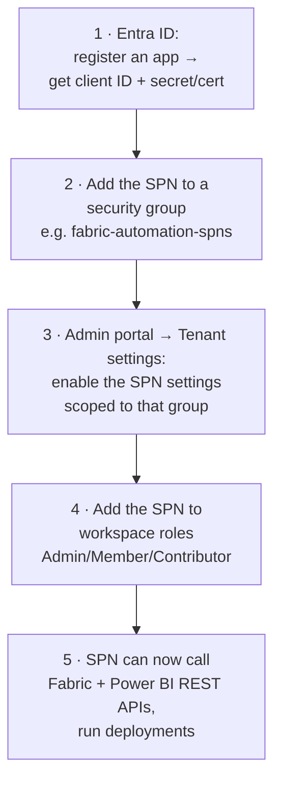
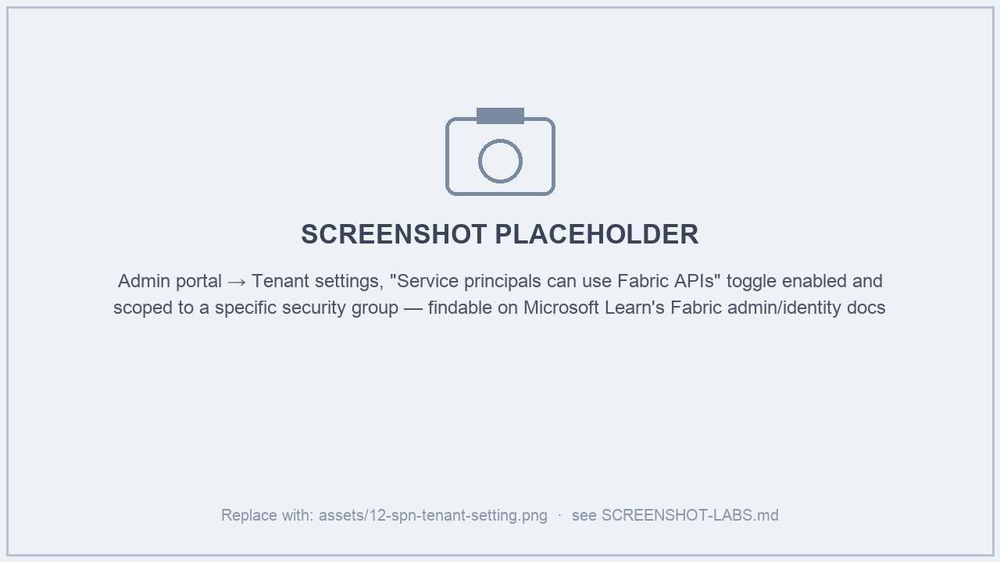
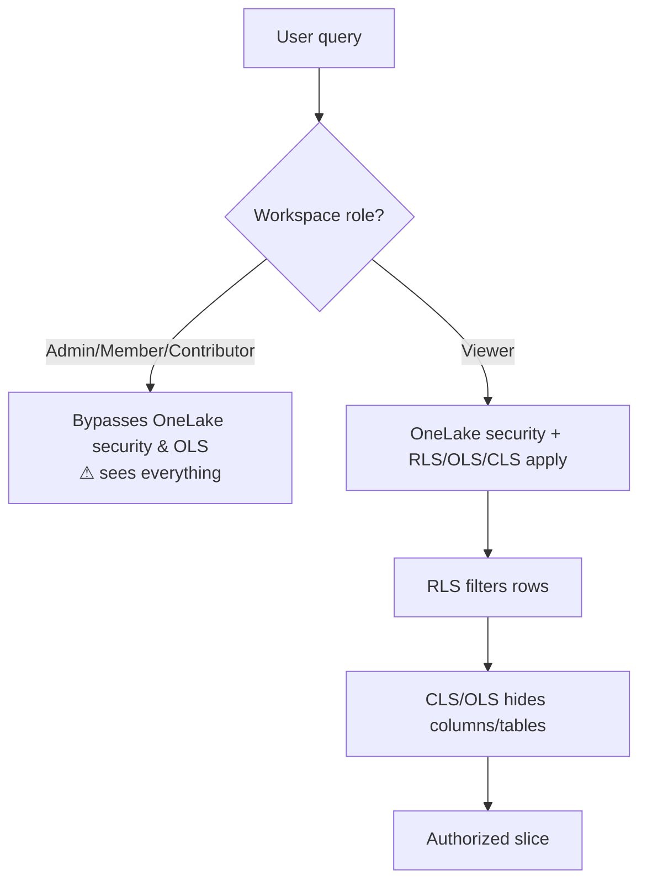
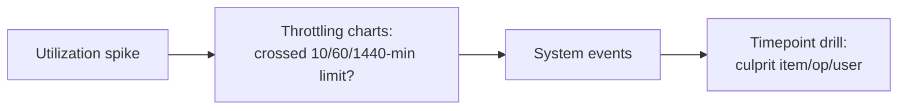
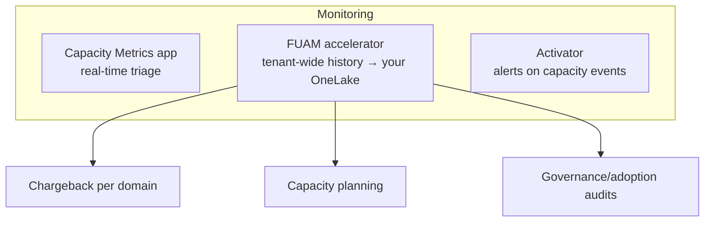
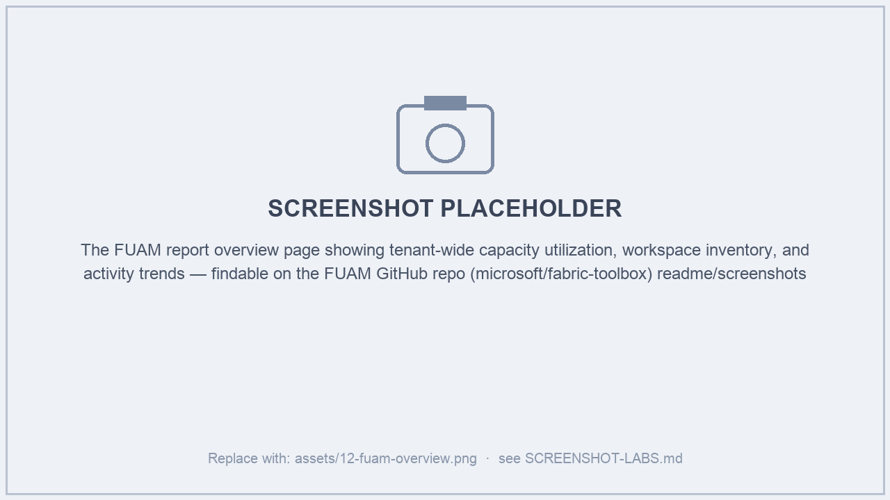

# Module 12 · Governance, Security & Cost Management

> 🎯 **Learning objectives**
> - Enable Fabric correctly at the **tenant** level: **GA workloads, service principal (SPN) access**, workspace-creation control.
> - Secure data with **RLS / OLS / CLS / OneLake Security** and **sensitivity labels** (Purview).
> - Use **domains + OneLake Catalog + Purview** for federated governance.
> - Master **capacity cost**: CU, smoothing/bursting/throttling, pause/resume, autoscale, reservations.
> - Monitor capacity with the **Capacity Metrics app** and **FUAM** (Fabric Unified Admin Monitoring).

This is the platform-lead module. Engineers and analysts should read §1–3 and §6; admins own all of it.

---

## 1. Tenant setup: GA workloads & service principals

Before teams build, an admin configures the **Admin portal → Tenant settings**. Three settings matter most.

### 1.1 Enable Fabric / GA workloads
Fabric must be **enabled for the tenant** (or for specific security groups). Individual **workloads** (Data Engineering, Data Warehouse, Data Science, Real-Time Intelligence, Data Factory…) are GA and on by default, but admins can scope who gets them via security groups during rollout.

> **Best practice:** enable Fabric for a **pilot security group** first, prove governance/cost controls, then widen. Don't flip it on tenant-wide on day one.

### 1.2 Service principal (SPN) access — the key to automation & CI/CD
A **service principal** is a non-human Microsoft Entra identity (an app registration) used by pipelines, CI/CD, and scripts. Enabling SPNs is what lets you automate deployments (Module 13), run unattended jobs, and call Fabric/Power BI REST APIs without a user.

**To activate SPN access (admin):**

Tenant settings to enable (scope each to your SPN security group, **not** the whole org):
- **"Service principals can use Fabric APIs"** — lets SPNs call the **Fabric** REST APIs (workspace/item/capacity management).
- **"Service principals can use Power BI APIs"** — lets SPNs call **Power BI** REST APIs (datasets, reports, refreshes).
- **"Allow service principals to create and use profiles"** — for multi-tenant/ISV embedding scenarios.
- (For OneLake/data-plane access) ensure the SPN is a **workspace member/contributor** so it can read/write items and OneLake.

> ✅ **2025–2026:** service principals can be **assigned to workspace roles** directly — the clean path for CI/CD. Prefer **SPN + workspace role** over user accounts for automation. Store secrets in **Azure Key Vault** and read them via `notebookutils.credentials` (Module 05).

> 🖼️ ****

### 1.3 Control workspace creation
Restrict who can create workspaces (a tenant setting) to a security group, and consider an **isolated dev workspace per developer**. Split **capacities by DTAP** (dev/test/prod).

---

## 2. Data security: RLS, OLS, CLS, OneLake Security

Four layers; know which applies where.

| Mechanism | Hides | Where defined | Notes |
|---|---|---|---|
| **RLS** (Row-Level Security) | **Rows** | Model **roles** (DAX rules; static or dynamic via `USERPRINCIPALNAME()`) | Authored in Desktop; dynamic RLS in DAX |
| **OLS** (Object-Level Security) | **Tables / columns** (existence hidden; query errors) | Model **roles** | ⚠️ **Can't be authored natively in Desktop — use Tabular Editor** |
| **CLS** (Column-Level Security) | **Columns** | Warehouse T-SQL, or **OneLake Security** | |
| **OneLake Security** (preview, late 2025) | Table/folder (OLS) + **column (CLS)** + rows (RLS) at the **lake** level | OneLake security roles | The **only path to CLS for Direct Lake**; applies **only to Viewers** |

> ⚠️ **Two critical nuances:**
> 1. **OLS is only enforced on Premium/Fabric capacity or AAS**, not shared capacity. **Workspace Admin/Member/Contributor bypass OLS** (build permission). Test with **"View as role."**
> 2. **OneLake security roles apply only to Viewers** — Admin/Member/Contributor bypass them (Module 02 §4). To data-restrict a user, make them a **Viewer** + assign OneLake security roles.

**For Direct Lake security:** use a **fixed-identity cloud connection**; no gateway (cloud connections only); source and model must be in the **same region**; embedding needs a **V2 embed token**.

---

## 3. Sensitivity labels & Purview

### Sensitivity labels (Microsoft Purview Information Protection)
- Labels classify and *protect* items (encryption that persists in exports). Need a **Purview IP license**; Power BI items also need **Pro/PPU**.
- **Downstream inheritance:** a label on a semantic model/report propagates to dependents — **never overwrites a manual label or applies a less-restrictive one**; capped at **80 downstream items**; *inheritance-on-creation is separate and always on*.
- **Inheritance from data sources** is **semantic models only** (Synapse, Azure SQL, Excel; Import mode).
- **Protection-policy labels** enforce access + encryption; not supported cross-tenant or for `.csv`/`.txt`.

### Purview vs. native governance
Fabric has **native** governance (domains, endorsement, lineage, OneLake Catalog, admin monitoring). **Purview extends** it across the whole estate (on-prem, multicloud, third-party) and adds enterprise compliance — **separate licensing**.

| Purview capability | For Fabric |
|---|---|
| **Unified Catalog** (Data Map, Data Products, glossary, DQ) | The governed **ontology/contract** layer (Module 08 §8) |
| **Information Protection** | Sensitivity labels across all items |
| **DLP** | Detect/restrict sensitive data in OneLake, Warehouse, KQL, SQL DB |
| **Audit / Insider Risk** | Activity logging; exfiltration detection |

### OneLake Catalog (Explore / Govern / Secure)
Replaced the old "data hub." **Govern** tab surfaces governance insights + recommended actions (label coverage, DLP, freshness, endorsement); admin insights come from the **Admin Monitoring workspace** (refreshed **once/day**). **Secure** tab = unified view of workspace + OneLake security roles.

### DLP for Fabric
Authored in the **Purview portal** (needs M365 E5 / E5 Compliance); location = "Fabric and Power BI workspaces"; **Custom policy** with conditions on sensitivity labels + sensitive-info types; actions = policy tips / alerts / restrict / override. **Start in monitor/policy-tip mode** to tune false positives before enforcing.

---

## 4. Capacity cost: the model

Recap from Module 01, now with the operating detail.

- **CU** = abstract compute unit; metered at **30-second timepoints** (2,880/day). **8 CUs = 1 Power BI v-core.** Buy **F-SKUs** (P-SKUs retiring).
- **F64 licensing cliff:** F64+ lets Free users view Power BI; below F64 every viewer needs Pro/PPU.

### Smoothing, bursting, throttling

| Mechanism | Behavior |
|---|---|
| **Bursting** | An op temporarily uses more CU/s than the SKU; extra cost **deferred via smoothing**, not lost. |
| **Smoothing** | Spreads CU cost forward. **Interactive: 5–64 min. Background (Spark, refreshes, pipelines): 24 h.** This is why many scheduled jobs can fire at once. |

**Throttling stages** (over 100% isn't instantly throttled):

| Future usage owed | Stage | Impact |
|---|---|---|
| ≤ 10 min | Overage protection | None |
| 10–60 min | Interactive Delay | New interactive requests delayed 20s |
| 60 min–24 h | Interactive Rejection | New interactive requests rejected; background still runs |
| > 24 h | All Rejected | Everything rejected until carryforward burns down |

In-flight ops are never throttled. **Fast un-throttle:** scale up the SKU, **pause→resume** (resets debt to zero), or enable Capacity Overage.

---

## 5. Monitoring capacity: Capacity Metrics app + FUAM

### 5.1 Fabric Capacity Metrics app (start here)
Install from AppSource (capacity admin). ~10–15 min latency; **no alerting**. Key pages:
- **Health** — which capacities throttle.
- **Compute** — 14-day utilization, item × operation matrix, throttling/overage/carryforward charts, system events.
- **Timepoint** — drill any **30-second window** to the exact most-expensive operations (including rejected ones).
- **Storage**, **Autoscale Spark**, **AI Functions**.

**Diagnose workflow:** utilization spike → throttling charts (did smoothed usage cross 10/60/1440-min limits?) → system events → drill to **Timepoint** to find the culprit item/operation/user.

### 5.2 FUAM — Fabric Unified Admin Monitoring (the advanced practice)
**FUAM** is a Microsoft solution accelerator (deployed from GitHub — see [tooling appendix](99-tooling-appendix.md)) for **holistic, near-real-time, tenant-wide monitoring** that goes well beyond the per-capacity Metrics app.

| | Capacity Metrics app | **FUAM** |
|---|---|---|
| Scope | One capacity at a time | **Whole tenant** — all capacities, workspaces, items, activities |
| Data | CU utilization/throttling | Capacity **+ inventory + activities + usage + tenant settings**, historized |
| Form | Prebuilt app | Deployable accelerator (lakehouse + pipelines + semantic model + report) you own & extend |
| History | ~14 days | **Long-term** (you control retention) |
| Use | Real-time throttling triage | **Trend analysis, chargeback, capacity planning, adoption, governance audits** |

**What FUAM gives a platform team:**
- A single pane across **every capacity and workspace** — capacity utilization trends, item inventory, activity logs, user adoption, and tenant-setting drift.
- The data lands in **your** OneLake, so you can build custom reports, **chargeback** models (per-domain CU consumption), and alerts (via Activator on the FUAM data).
- Historical depth the Metrics app lacks — essential for **capacity right-sizing** decisions (reserve baseline vs. PAYG variable) and **executive reporting**.

> **Recommended monitoring stack:** **Capacity Metrics app** for real-time throttling triage + **FUAM** for tenant-wide trends, chargeback, and capacity planning + **Activator** for alerting on capacity events (the Metrics app has none).

> 🖼️ ****

---

## 6. Cost-control best practices

- **Right-size, don't over-provision.** Use the Metrics app/FUAM baseline + SKU Estimator; **resize instantly** rather than oversize permanently. Mind the **F64 cliff**.
- **Pause non-prod capacities off-hours** — highest-ROI saving (automate via Azure Runbooks / REST `suspend`/`resume`; pause also clears throttling debt).
- **Separate workloads across capacities** by criticality; **move bursty/ad-hoc Spark to Autoscale Billing for Spark** (GA Aug 2025) so analytics can't throttle BI.
- **Surge Protection** (GA) — set background-op rejection thresholds to kill runaway jobs before interactive users feel it. **Workspace-level surge protection** (preview) caps per-workspace CU %.
- **Capacity Overage** (preview) — safety net auto-paying excess at **3× PAYG**; keep the limit below ~⅓ of daily CU-hours (past that, scaling up the SKU is cheaper). For rare spikes, not a substitute for right-sizing.
- **Reserve the steady prod baseline** (1/3-yr reservations discount compute); **run variable/dev PAYG** with pause/resize. Smoothing lets you reserve for **average, not peak**.

> **Lab 12.1 — Govern & monitor.** (1) Register an SPN, add it to a `fabric-automation` group, enable the **Fabric API** tenant setting for that group, and add it as a **Contributor** to `Course-Demo`. (2) Install the **Capacity Metrics app** and find your most expensive operation in a Timepoint. (3) Set RLS on `gold.fact_sales` by region and test with "View as role."

---

## ✅ Module 12 checklist

- [ ] I enable Fabric for a **pilot group**, control **workspace creation**, and split capacities by DTAP.
- [ ] I activate **SPN access** (Fabric + Power BI API tenant settings, scoped to a group; SPN in workspace roles; secrets in Key Vault).
- [ ] I apply **RLS/OLS/CLS/OneLake Security** and know **Contributors+ bypass** data-level security.
- [ ] I govern with **domains + OneLake Catalog + Purview** and **sensitivity labels**.
- [ ] I understand **smoothing/bursting/throttling** and can diagnose with the **Metrics app**.
- [ ] I run **FUAM** for tenant-wide trends, **chargeback**, and capacity planning, with **Activator** alerts.

## ⚠️ Anti-patterns

- **Flipping Fabric on tenant-wide** with no pilot, governance, or cost controls.
- **Automating with user accounts** instead of **SPNs** (breaks when the person leaves; no least-privilege).
- **Trying to data-restrict Contributors** with RLS/OneLake security (bypassed — use Viewer).
- **Authoring OLS in Desktop** (unsupported — use Tabular Editor).
- **Only installing the Metrics app** and never building **FUAM** → no history, no chargeback, blind capacity planning.
- **Never pausing dev capacities** → paying 24/7 for idle compute.

---

**Next:** [Module 13 · CI/CD, Git & Deployment Pipelines →](13-cicd-deployment.md)
