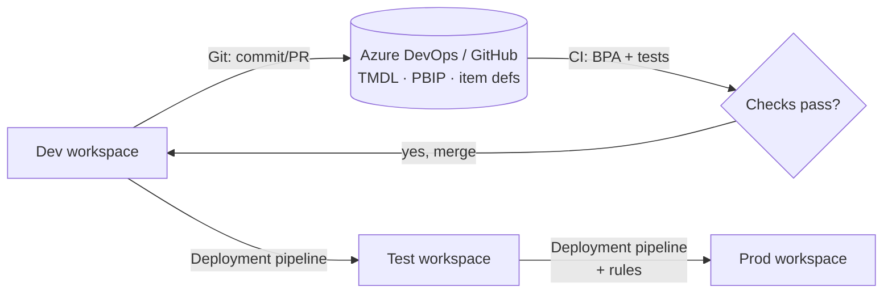
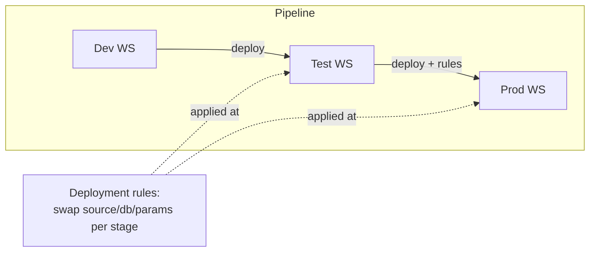

# Module 13 · CI/CD, Git & Deployment Pipelines

> 🎯 **Learning objectives**
> - Put Fabric items under **Git** (TMDL/PBIP) and review changes as PRs.
> - Promote Dev → Test → Prod with **deployment pipelines** and **deployment rules**.
> - Automate end to end with **service principals + `fabric-cicd` / Fabric CLI / Terraform**.
> - Apply CI validation (Best Practice Analyzer, contract/canary tests from Module 08).

---

## 1. Two complementary mechanisms — use both



| Mechanism | Purpose |
|---|---|
| **Git integration** | Source control + **PR review**. Items stored as text — **TMDL** (model) and **PBIP** (project) — which diff/merge far better than binary `.pbix`. |
| **Deployment pipelines** | UI-driven **Dev → Test → Prod** workspace promotion with **deployment rules** that swap data sources/parameters per stage. |

> **Most 2026 enterprise setups run both:** Git for version control/review + deployment pipelines for controlled promotion. (Caveat: concurrent edits to the *same* model still merge painfully — coordinate.)

---

## 2. Git integration

- Connect a workspace to an **Azure DevOps or GitHub** repo (workspace → **Workspace settings → Git integration**). Requires an **Admin** (or an SPN with the right role).
- Each item serializes to a folder of **text files**; semantic models use **TMDL**, reports use **PBIP/PBIR**.
- Workflow: branch per feature → edit in a **dev workspace** (or Desktop with PBIP) → commit → **PR** → CI checks → merge → the **main branch** maps to the integration workspace.

> **Best practice:** **one isolated dev workspace per developer** (branch-out), so people don't trample shared state. Map the shared/integration workspace to `main`.

> 🧭 **In the Fabric portal:** Workspace → **Workspace settings** → **Git integration**; connect an Azure DevOps/GitHub repo + branch, then items show source-control status (committed/uncommitted).

---

## 3. Deployment pipelines

A **deployment pipeline** has three stages (Dev/Test/Prod), each a **separate workspace** (this is why per-environment workspaces are non-negotiable — Module 02/04).

- **Auto-pairing by name:** items pair across stages **by name** — which is why **environment must NOT be in item names** (Module 02 §7).
- **Deployment rules** swap environment-specific values per stage (connection strings, parameters, data sources).
- **Parameterize all environment-specific values.** Hardcoded connections break rule swaps.
  - ⚠️ **Direct Lake on OneLake doesn't support rebind rules directly** — use a **parameter expression** in the connection string. **Direct Lake on SQL** supports rebind rules.



> 🧭 **In the Fabric portal:** Left nav → **Workspaces** → **+ New → Deployment pipeline**. Assign workspaces to **Development / Test / Production**; the compare view marks items changed/new/identical, and **Deployment rules** swap sources per stage.

---

## 4. Full automation with service principals

For real CI/CD (build server deploys, no human clicking), use a **service principal** (set up in Module 12 §1.2) with these tools:

| Tool | Role | From |
|---|---|---|
| **`fabric-cicd`** | Python library to **deploy Fabric items from source control** into workspaces — the core CI/CD engine. | Microsoft (GitHub/PyPI) |
| **Fabric CLI** | Script workspace/item/capacity management. | Microsoft |
| **Azure DevOps extension** (`FabricCLITask`) / **fabric-cicd ADO extension** | Provision the CLI / run deployments inside an ADO pipeline. | Marketplace |
| **Terraform Provider for Microsoft Fabric** | Declaratively manage workspaces, capacities, items as **infrastructure-as-code**. | Microsoft |
| **FabricTools** (PowerShell) | Admin automation across Fabric/Power BI. | Community |

(All catalogued in the [tooling appendix](99-tooling-appendix.md).)

### A reference pipeline (Azure DevOps, SPN-authenticated)

```yaml
# azure-pipelines.yml — deploy Fabric items on merge to main
trigger:
  branches: { include: [ main ] }

pool: { vmImage: 'ubuntu-latest' }

steps:
  - task: UsePythonVersion@0
    inputs: { versionSpec: '3.11' }

  - script: pip install fabric-cicd
    displayName: Install fabric-cicd

  - script: |
      python deploy.py
    displayName: Deploy to Fabric (Test)
    env:
      # SPN credentials from a secret variable group / Key Vault
      AZURE_CLIENT_ID:     $(FABRIC_SPN_CLIENT_ID)
      AZURE_CLIENT_SECRET: $(FABRIC_SPN_CLIENT_SECRET)
      AZURE_TENANT_ID:     $(AZURE_TENANT_ID)
      TARGET_WORKSPACE_ID: $(TEST_WORKSPACE_ID)
```

```python
# deploy.py — uses fabric-cicd to publish item definitions from the repo
from fabric_cicd import FabricWorkspace, publish_all_items
import os

ws = FabricWorkspace(
    workspace_id=os.environ["TARGET_WORKSPACE_ID"],
    repository_directory="./fabric-items",          # TMDL/PBIP/notebook/pipeline defs
    item_type_in_scope=["Notebook", "DataPipeline", "SemanticModel", "Report", "Lakehouse"],
)
publish_all_items(ws)   # authenticates as the SPN via env vars
```

> **Prereqs (from Module 12):** SPN registered, in the `fabric-automation` security group, the **"Service principals can use Fabric APIs"** tenant setting enabled for that group, and the SPN added as a **workspace Admin/Member** on the target workspaces. Secrets live in **Key Vault / a secret variable group** — never in the repo.

---

## 5. CI validation — gate quality before prod

Wire these into the PR/build (they realize the testing strategy from Module 08 §7):

| Check | Tool | Catches |
|---|---|---|
| **Best Practice Analyzer (BPA)** | **Tabular Editor CLI** | Inefficient DAX, bad data types, naming, model smells |
| **Contract tests** | Your test harness | A version bump that would break a downstream product's expected schema/identity/freshness |
| **Canary tests** | Synthetic data run end-to-end | One designed to pass (good data served), one to fail (bad data blocked) |
| **Unit tests** | pytest over notebook/transform logic | Fixed input → expected output |

```bash
# Run Tabular Editor BPA in CI against a model definition (fails build on violations)
TabularEditor.CLI ./fabric-items/SM_ANLYZ_Sales.SemanticModel \
  -A -B "Best Practice Rules.json" -V
```

> **Endorsement as a release gate:** mark prod semantic models **Promoted/Certified** (Module 10) so consumers can tell trusted from draft. Certification is admin-governed.

> **Lab 13.1 — Promote with rules.** Create a deployment pipeline for `Course-Demo` (Dev→Test→Prod workspaces). Parameterize the lakehouse/warehouse connection. Add a **deployment rule** that points Test at the Test gold store and Prod at the Prod store. Deploy Dev→Test and confirm the rule swapped the source.

---

## ✅ Module 13 checklist

- [ ] Items are in **Git** as **TMDL/PBIP**, reviewed via **PRs**, with a dev workspace per developer.
- [ ] I promote with **deployment pipelines** and **rules**, and keep **env out of item names** (auto-pairing).
- [ ] I **parameterize** all environment-specific values (and use parameter expressions for Direct Lake on OneLake).
- [ ] CI/CD runs as an **SPN** via **`fabric-cicd`/CLI/Terraform**, secrets in **Key Vault**.
- [ ] CI gates on **BPA + contract + canary + unit** tests; prod models are **Certified**.

## ⚠️ Anti-patterns

- **Editing prod directly** instead of promoting through stages.
- **Environment in item names** → broken deployment-pipeline pairing.
- **Hardcoded connections** → deployment rules can't swap them.
- **Secrets in the repo** instead of Key Vault / variable groups.
- **No CI checks** → DAX/model regressions reach prod.
- **One shared dev workspace** where everyone overwrites each other.

---

**Next:** [Module 14 · The Fabric Operating Model →](14-operating-model.md)
