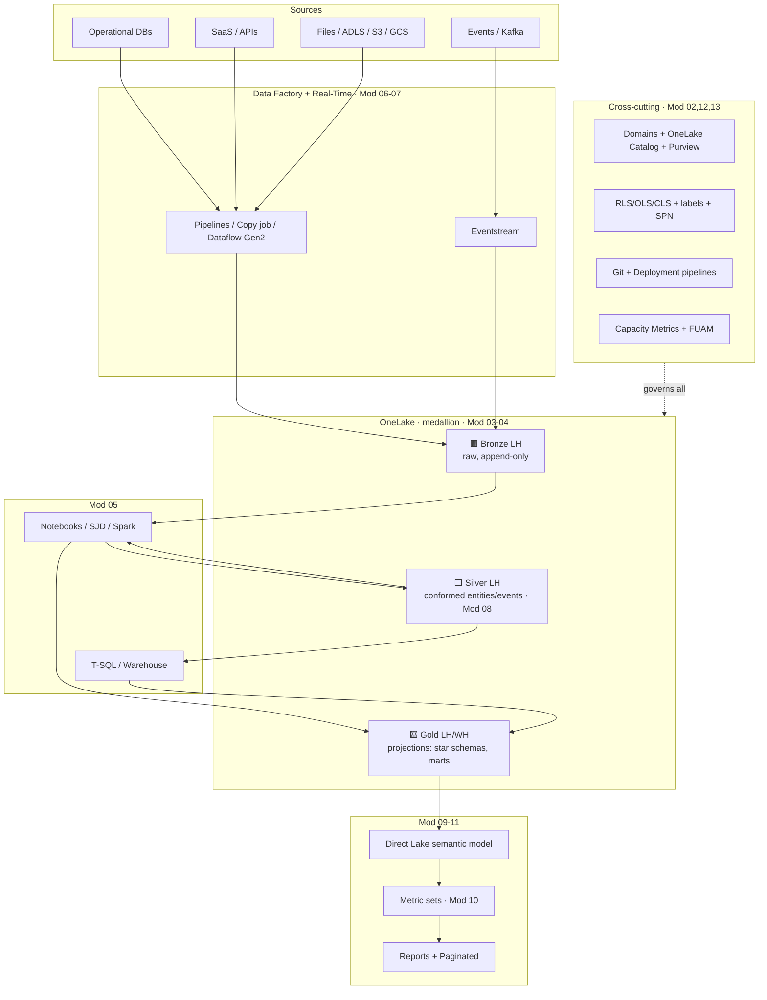
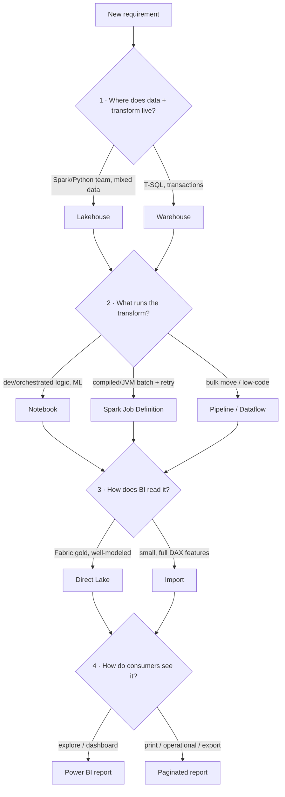
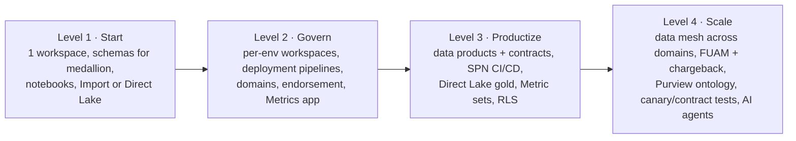

# Module 14 · The Fabric Operating Model — Putting It All Together

> 🎯 **Learning objectives**
> - Assemble every prior module into **one reference architecture**.
> - Apply the **four big decisions** as a single workflow.
> - Use the **end-to-end build checklist** for any new data product.
> - Run Fabric with a clear **RACI** and a **maturity path**.

This is the capstone. It doesn't add new features — it shows how the pieces compose into a platform you can actually operate.

---

## 1. The reference architecture (everything, one picture)

---

## 2. The four big decisions as one workflow

When you start any new piece of work, run this gauntlet:

| Decision | Default → | Module |
|---|---|---|
| 1 · Lakehouse vs Warehouse | **Lakehouse** unless SQL-first + transactions | 03 |
| 2 · Notebook vs SJD vs Pipeline | **Notebook**; SJD for compiled/retry batch; Pipeline to orchestrate | 05 |
| 3 · Import vs Direct Lake | **Direct Lake** on well-tuned gold; Import for small/feature-rich | 09 |
| 4 · Power BI vs Paginated | **Power BI** to explore; **Paginated** to print/export | 11 |

---

## 3. End-to-end build checklist for a new data product

Lift this into a template. It threads every module together.

**Design (Mod 02, 08)**
- [ ] Identify the **entities & events**; classify them (domain truth, not consumption).
- [ ] Write a one-page **product manifest**: inputs, output schema (**identity vs attributes**), quality constraints, serving intents.
- [ ] Assign a **domain + owner**; pick the **workspace topology** (per product, per env).

**Ingest (Mod 06–07)**
- [ ] Land raw into **🟫 Bronze** (append-only) via Pipeline/Copy job/Eventstream/shortcut.
- [ ] Build **incremental + idempotent (MERGE) + restartable** loads with watermarks.

**Transform (Mod 04–06)**
- [ ] Conform to **⬜ Silver** entity/event tables (identity block first; enforce schema).
- [ ] Render **🟨 Gold** projections (star schema / flats / aggregates); **V-Order on**.
- [ ] Schedule **OPTIMIZE + VACUUM → Refresh SQL endpoint**.

**Serve (Mod 09–11)**
- [ ] Build a **Direct Lake** star-schema model (unique one-side keys, marked date table).
- [ ] Define & **Certify** KPIs as **Metric sets**; add calc groups; build scorecards.
- [ ] Choose **Power BI vs paginated** per consumer.

**Govern & ship (Mod 12–13)**
- [ ] Apply **RLS/OLS/CLS**, sensitivity labels; restricted users are **Viewers**.
- [ ] Put items in **Git**; promote via **deployment pipelines + rules**.
- [ ] Automate with an **SPN** (`fabric-cicd`); gate on **BPA + contract + canary** tests.
- [ ] Wire **monitoring** (Capacity Metrics + FUAM) and **Activator** alerts.

---

## 4. Who does what — a starter RACI

| Activity | Platform/COE | Data-product owner | Data engineer | Analyst/BI | Consumer team |
|---|:--:|:--:|:--:|:--:|:--:|
| Tenant settings, capacities, SPNs | **R/A** | C | I | I | I |
| Domain & workspace topology | A | **R** | C | C | I |
| Product manifest & contract | C | **A** | R | C | C |
| Bronze→Silver→Gold build | I | A | **R** | C | I |
| Semantic model & KPIs | I | C | C | **R/A** | C |
| RLS/OLS & labels | A | R | R | C | I |
| CI/CD & deployment | **R/A** | C | R | C | I |
| Serving intents & their tests | I | C | C | C | **R/A** |
| Capacity monitoring & cost | **R/A** | C | I | I | I |

---

## 5. Maturity path — don't boil the ocean

- **Level 1 → 2** when more than one team builds, or anything goes to production.
- **Level 2 → 3** when KPIs diverge across reports and deployments need automation.
- **Level 3 → 4** when multiple domains publish to each other and you need federated governance + cost accountability.

> **The one rule that prevents the graveyard (Module 08):** model **entities and events truthfully in silver, render disposable projections in gold, and let consumers bind to contracts, not internals.** Everything else is mechanics.

---

## ✅ Course capstone checklist

- [ ] I can draw the **reference architecture** and place any feature on it.
- [ ] I run the **four big decisions** as one workflow with sensible defaults.
- [ ] I can take a requirement through the **end-to-end build checklist**.
- [ ] I know **who owns what** (RACI) and the **maturity level** my org is at + the next step.

---

**Appendix:** [Module 99 · Tooling Appendix (fabricstack.dev) →](99-tooling-appendix.md) · **Diagrams:** [DIAGRAM-CONVENTIONS.md](DIAGRAM-CONVENTIONS.md)
