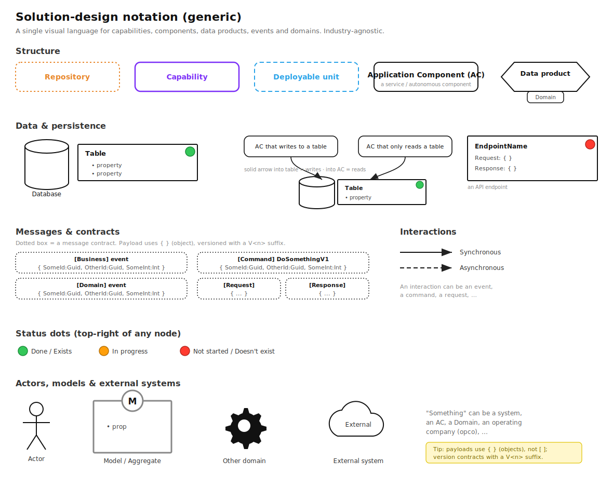
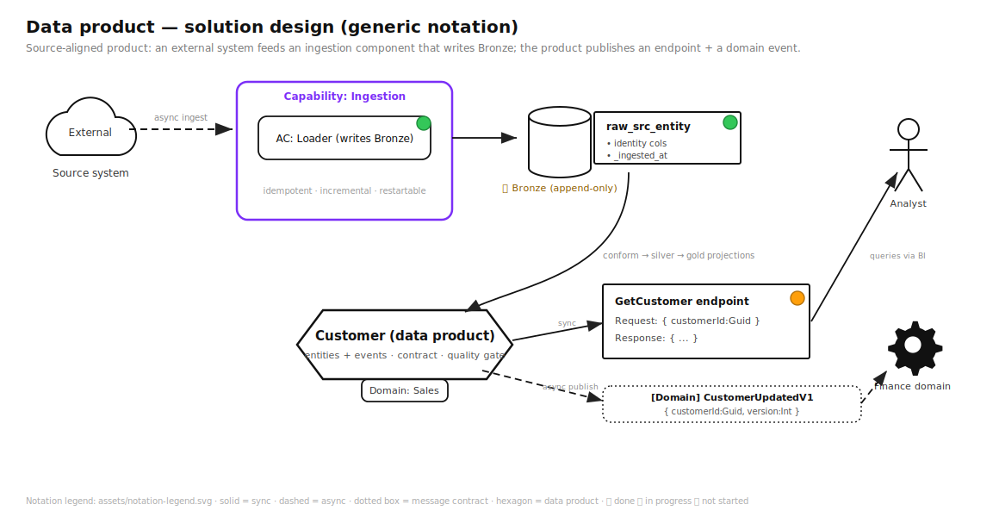

# Diagram Conventions

This course uses **one consistent visual language** so every diagram reads the same way. There are two complementary notations — use the right one for the job.

> 📐 **The full legend:** 
> *(open `assets/notation-legend.svg`)*

---

## 1. Two notations, two jobs

| Notation | Use for | Rendered as |
|---|---|---|
| **Mermaid** (inline ```` ```mermaid ````) | Flows, architectures, decision trees, sequences, ER diagrams — anything quick and inline. Renders on GitHub, VS Code, and the docs site automatically. | Fenced code blocks |
| **Solution-design notation** (SVG) | Precise *solution designs*: capabilities, application components, data products, message contracts, domain boundaries, sync/async interactions, build status. | `assets/*.svg` |

**Rule:** reach for Mermaid by default (it's inline and frictionless). Use the **solution-design SVG notation** when you're documenting an actual *design* — who owns what, what reads/writes which table, which events cross which domain boundary, and what's built vs. not.

---

## 2. The solution-design notation (generic)

Adapted from a real solution-design convention and made **industry-agnostic** (no domain-specific commands or private links). The example payloads use generic placeholders (`SomeId:Guid`, `DoSomethingV1`).

### Structure

| Symbol | Meaning |
|---|---|
| **Dotted orange rounded box** | **Repository** (a code repo) |
| **Solid purple rounded box** | **Capability** (a business capability grouping components) |
| **Dashed blue rounded box** | **Deployable unit** (here also: the Fabric/workspace boundary) |
| **Solid black rounded box** | **Application Component (AC)** — a service / autonomous component |
| **Hexagon (+ "Domain" tab)** | **Data product**, owned by a domain |

### Data & persistence

| Symbol | Meaning |
|---|---|
| **Cylinder + rectangle** | **Database** + a **Table** (with `• properties`) |
| **AC → arrow → Table** | The AC **writes** to the table |
| **Table → arrow → AC** | The AC **reads** from the table |
| **Rectangle with `Request:{}` / `Response:{}`** | An **API endpoint** |

### Messages & contracts

- **Dotted rounded box** = a **message contract**. Title in `[Brackets]` names the kind; payload uses **`{ }`** (an object), e.g. `{ SomeId:Guid, OtherId:Guid, SomeInt:Int }`.
- Kinds: `[Business] event`, `[Domain] event`, `[Command] DoSomethingV1`, `[Request]`, `[Response]`.
- **Version contracts** with a `V<n>` suffix (`DoSomethingV1`) so changes coexist (Module 08 §5).

### Interactions

| Line | Meaning |
|---|---|
| **Solid arrow** | **Synchronous** interaction |
| **Dashed arrow** | **Asynchronous** interaction (event/message) |

An interaction can be an event, a command, or a request.

### Actors, models & externals

| Symbol | Meaning |
|---|---|
| **Stick figure** | **Actor** (a human role) |
| **Square with circled "M" + `• prop`** | **Model / Aggregate** |
| **Gear** | **Another domain** (or system/AC/opco) |
| **Cloud** | **External system** |

### Status dots (top-right corner of any node)

| Dot | Meaning |
|---|---|
| 🟢 **Green** | Done / Exists |
| 🟠 **Orange** | In progress |
| 🔴 **Red** | Not started / Doesn't exist |

> Use status dots on solution designs to show, at a glance, what's already built vs. what this initiative still needs.

---

## 3. Worked examples in this notation

- **Data product design:**  — a source-aligned `Customer` product: external source → ingestion AC → Bronze table → data product (Sales domain) → endpoint + `[Domain] CustomerUpdatedV1` event consumed by the Finance domain and an analyst. *(See Module 08.)*
- **External-source connectivity:**  — five ways to connect Fabric to external sources, mapped to the notation. *(See Module 03 / Module 06.)*

---

## 4. How to extend the notation

- **Author SVGs** by copying `assets/notation-legend.svg` shapes, or draw in **draw.io / Excalidraw / Miro** using the same shape→meaning mapping, then export SVG into `assets/`.
- **Keep it generic.** Abstract anything industry-specific (replace concrete commands/entities with `DoSomethingV1`, `entity`, `source`). The point is a reusable language, not a single project's map.
- **One status convention.** Always 🟢/🟠/🔴 in the top-right; never invent new colors mid-deck.
- **Reference the legend** at the bottom of every solution-design SVG so a first-time reader can decode it.

---

## 5. Mermaid style rules (for the inline diagrams)

- Prefer **`flowchart TD/LR`** for architecture/flow, **`flowchart` with `{ }` nodes** for decisions, **`erDiagram`** for star schemas, **`sequenceDiagram`** for interactions.
- Use the medallion emoji consistently: **🟫 Bronze · ⬜ Silver · 🟨 Gold**.
- Keep labels short; put detail in the surrounding prose, not the node.
- Group with `subgraph` to show boundaries (workspace, capacity, domain).
