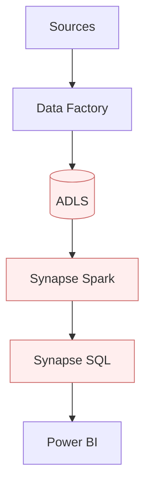
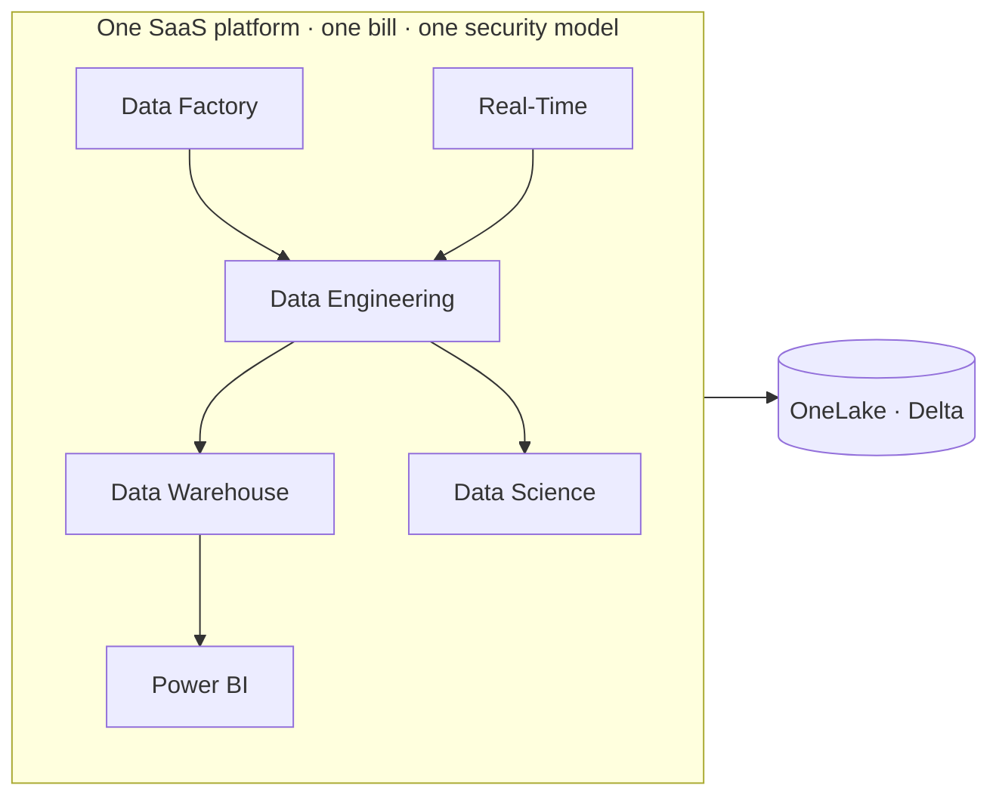
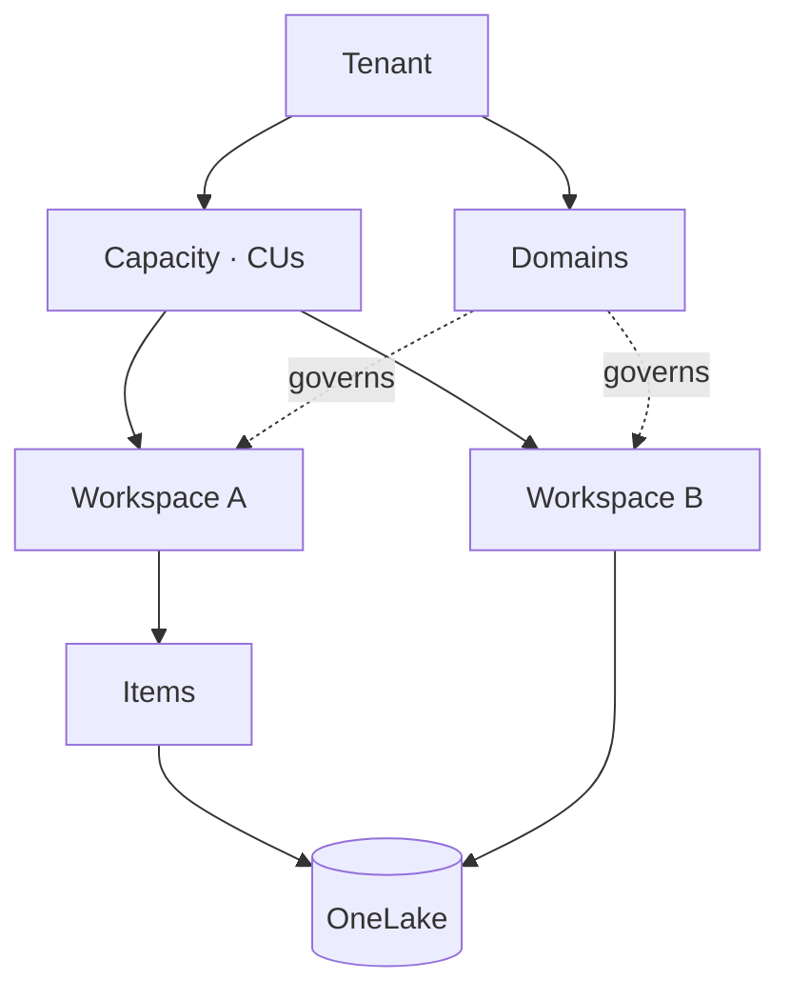
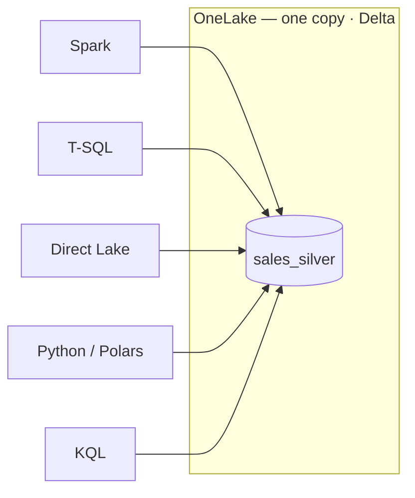
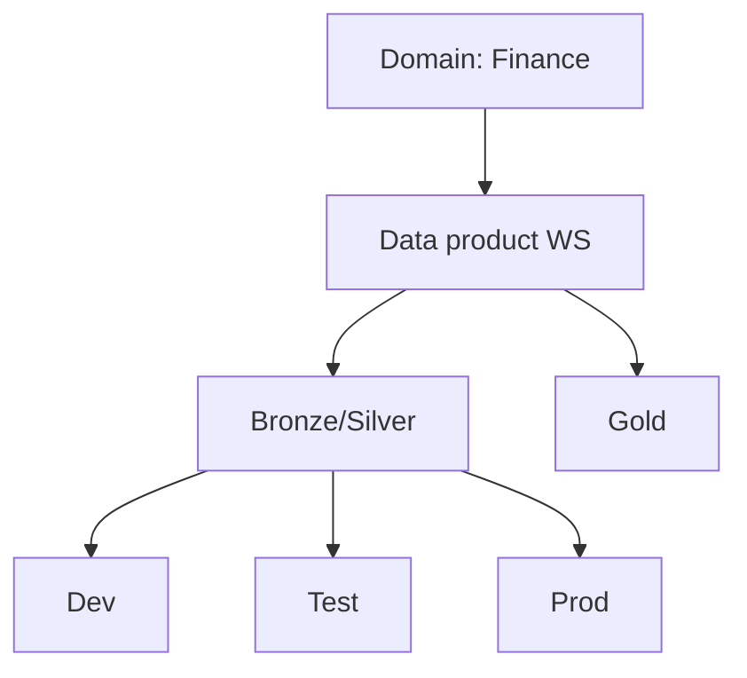
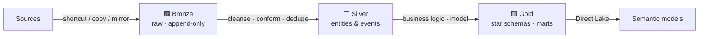
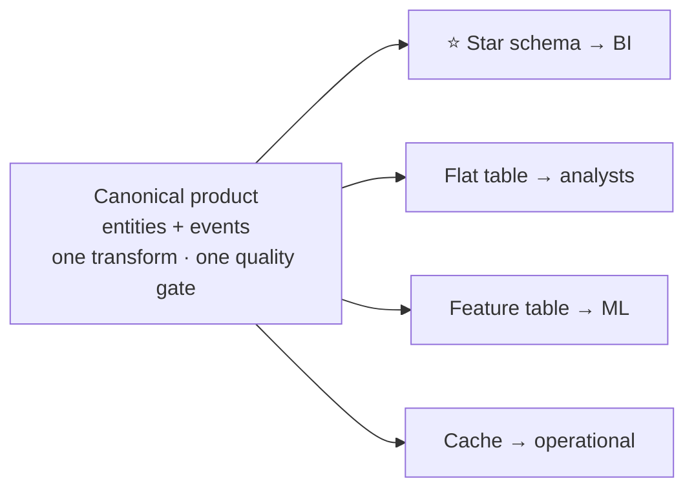
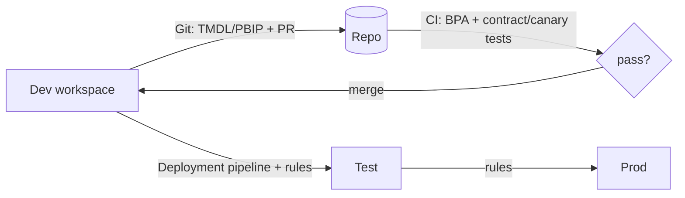
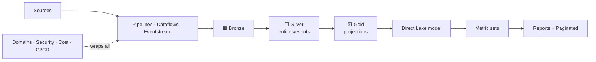
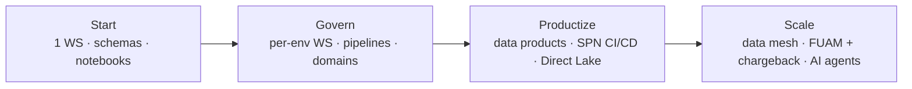

<div class="cover-title">Mastering<br/>Microsoft Fabric</div>

<div class="cover-sub">A practitioner's guide to building, organizing &amp; operating Fabric well</div>

<div class="pt-4 opacity-80">
For data engineers &amp; analysts · the four decisions that matter
</div>

<div class="abs-br m-6 text-sm opacity-60">
Overview session · ~45 min
</div>

<style>
.cover-slide { display: flex; flex-direction: column; justify-content: center; }
.cover-slide .cover-title {
  font-family: 'Inter', sans-serif;
  font-weight: 800;
  font-size: 3.4rem;
  line-height: 1.08;
  letter-spacing: -0.02em;
  margin-bottom: 1.2rem;
}
.cover-slide .cover-sub {
  font-size: 1.35rem;
  opacity: 0.92;
  max-width: 38ch;
  margin: 0 auto;
}
</style>

---
layout: section
---

# Why we're here

Most Fabric value comes from a handful of **deliberate decisions** — not from knowing every feature.

---

## The old world: a stack of separate products

<div class="grid grid-cols-2 gap-8 pt-4">
<div>

**Before — glue everything yourself**

- Azure Data Factory for movement
- Synapse Spark for engineering
- Synapse SQL for warehousing
- Stream Analytics / Data Explorer
- Power BI for BI
- …each with its own storage, security, billing

**The cost:** integration tax, copies everywhere, fragmented governance.

</div>
<div>



<div class="text-sm opacity-70 pt-2">
Each hop = a copy, a credential, a failure point.
</div>

</div>
</div>

---

## Microsoft Fabric: one unified, SaaS platform

<v-clicks>

- **SaaS, not PaaS** — buy *capacity*, not clusters & storage accounts
- **OneLake** — one tenant-wide lake; *one copy of data* for every engine
- **Open format** — everything is **Delta-Parquet**; no lock-in

</v-clicks>

<div class="pt-4">



</div>

---
layout: two-cols
class: gap-4
---

## The mental model

Burn this in — every later choice hangs off it.

- **Tenant** — your org
- **Capacity** — the compute you pay for (CUs)
- **Domain** — governance grouping
- **Workspace** — security · Git · deploy boundary
- **Item** — lakehouse, notebook, model, report…
- **OneLake** — the shared lake under it all

::right::

<div class="pt-16">



</div>

---

## The principle that drives everything

<div class="text-2xl pt-2 pb-4 text-center opacity-90">
Storage is <b>shared & open</b>. Compute is <b>interchangeable</b>.
</div>



<div class="pt-3 text-center opacity-75">
Choosing an engine ≠ choosing where data lives. You rarely copy data again.
</div>

---
layout: center
class: text-center
---

# The four big decisions

If you make these four deliberately, you can build **anything** in Fabric.

<div class="grid grid-cols-2 gap-4 pt-6 text-left text-sm">
<div class="p-3 rounded border">1 · <b>Lakehouse vs Warehouse</b><br/><span class="opacity-70">where data + transform live</span></div>
<div class="p-3 rounded border">2 · <b>Notebook vs SJD vs Pipeline</b><br/><span class="opacity-70">what runs the transform</span></div>
<div class="p-3 rounded border">3 · <b>Import vs Direct Lake</b><br/><span class="opacity-70">how BI reads the model</span></div>
<div class="p-3 rounded border">4 · <b>Power BI vs Paginated</b><br/><span class="opacity-70">how consumers see it</span></div>
</div>

---

## Decision 1 — Lakehouse vs Warehouse

| | **Lakehouse** | **Warehouse** |
|---|---|---|
| Persona | Data engineer / scientist | SQL / BI developer |
| Writes | **Spark** (Delta) | **T-SQL** (DML, procs) |
| Multi-table transactions | ❌ | ✅ |
| SQL surface | Read-only endpoint | Full read/write |
| Data shape | Structured + unstructured | Structured |

<div class="pt-3">

**Default →** Lakehouse when unsure. Common pattern: **Lakehouse (Spark bronze/silver) + Warehouse (T-SQL gold)** in one workspace.

</div>

---

## Decision 2 — Notebook vs Spark Job Definition vs Pipeline

| Tool | Choose when |
|---|---|
| **Notebook** | Dev, exploration, transforms, ML, orchestrated logic — *the default* |
| **Spark Job Definition** | Compiled/JVM batch, fire-and-forget with auto **queue + retry** |
| **Pipeline / Copy job** | Orchestrate + bulk move; metadata-driven ingestion |
| **Dataflow Gen2** | Low-code Power Query, 150+ connectors |
| **T-SQL (Warehouse)** | Set-based SQL, stored procs, COPY INTO / CTAS |

<div class="pt-2 text-sm opacity-75">
⚡ Tip: high-concurrency sessions bill only the initiator — huge for parallel pipeline fan-outs.
</div>

---

## Decision 3 — Import vs Direct Lake

<div class="grid grid-cols-2 gap-6 pt-2">
<div>

- **Import** — full copy in memory; every DAX feature; long refreshes
- **Direct Lake** — reads V-Ordered Delta straight into VertiPaq; **framing** in *seconds*
- **DirectQuery** — live on source; slowest

**Default →** Direct Lake on well-tuned gold (V-Order + OPTIMIZE).

</div>
<div>

**The nuance that bites people:**

- **Direct Lake on OneLake** → *no fallback* (fails hard)
- **Direct Lake on SQL** → *falls back to DirectQuery*

<div class="text-sm opacity-75 pt-2">
Marco Russo: Direct Lake for big facts, Import for dimensions — as one composite model.
</div>

</div>
</div>

---

## Decision 4 — Power BI report vs Paginated report

| | **Power BI (interactive)** | **Paginated (RDL)** |
|---|---|---|
| For | Dashboards, exploration | Print / PDF, operational, pixel-perfect |
| Large tables | Scroll | **Overflow across pages** |
| Export | PDF/PPT/Excel (limited) | PDF, **Excel, Word**, CSV… |
| Tool | Power BI Desktop | Power BI Report Builder |

<div class="pt-3">

**Trigger for paginated:** must be printed/PDF'd · grids could overflow · paginated-only features (mail-merge, subreports).

</div>

---
layout: section
---

# Organize

Workspaces, domains & naming — get this right *before* you build.

---

## Workspace topology

<div class="grid grid-cols-2 gap-6">
<div>

**Four deployment patterns**

1. Monolithic — 1 workspace
2. Multi-workspace, shared capacity
3. **Multi-workspace, separate capacities** ← enterprise default
4. Multiple tenants

**Per-environment (Dev/Test/Prod) is mandatory** — deployment pipelines require it.

</div>
<div>



<div class="text-sm opacity-75 pt-2">
Default: <b>one workspace per data product, per environment</b>, domain-aligned.
</div>

</div>
</div>

---

## Domains, roles & naming

<div class="grid grid-cols-2 gap-6 text-sm">
<div>

**Roles** (assign to security *groups*)
Admin · Member · Contributor · Viewer

⚠️ OneLake data-security applies **only to Viewers** — Admin/Member/Contributor **bypass** it.

⚠️ A **domain is not an access boundary** — it's for governance & discovery.

</div>
<div>

**Naming (community standard)**
- Workspaces: `FIN-Sales Mart - Gold` *(no env on prod)*
- Items: `LH_STORE_Bronze`, `NB_TRNSF_BronzeToSilver`
- ⚠️ **No env in item names** — deployment pipelines pair *by name*
- Tables: `raw_crm_customers` → `customer` → `dim_customer` / `fact_sales`

</div>
</div>

---
layout: section
---

# Build

Medallion architecture — assembled from lakehouses, schemas & shortcuts.

---

## Bronze · Silver · Gold



<div class="grid grid-cols-3 gap-4 pt-3 text-sm">
<div class="p-2 rounded border">🟫 <b>Bronze</b><br/>Never edited — your replay buffer</div>
<div class="p-2 rounded border">⬜ <b>Silver</b><br/>Where data becomes trustworthy</div>
<div class="p-2 rounded border">🟨 <b>Gold</b><br/>Shaped for consumption</div>
</div>

<div class="pt-2 text-sm opacity-75">
Physical layout: schemas (simple) → separate lakehouses → workspace-per-layer (MS-recommended). Per-environment split is non-negotiable.
</div>

---
layout: section
---

# The differentiator: Data Products

Stop engineering pipelines. Start declaring products that **survive business change**.

---

## From pipelines to products

<div class="text-lg pt-1 pb-3 opacity-90">
"The hard problem isn't moving data — it's surviving business change without losing institutional memory."
</div>

<div class="grid grid-cols-2 gap-6">
<div>

**Pipeline-first ❌**
`Source → Warehouse → dbt → BI`
Every link a liability; one perspective baked in.

</div>
<div>

**Product-first ✅**
*Declare* inputs · output schema · quality · serving intents.
The platform runs it. The engineer is a **domain translator**, not a plumber.

</div>
</div>

---

## Two primitives + identity separation

<div class="grid grid-cols-2 gap-6">
<div>

- **Entities** — stable identity others reference (`customer_id` survives everything)
- **Events** — immutable, timestamped facts (you can't un-place an order)

**The structural invariant:**
*identity columns are separated from attributes.* Identity is immutable & globally governed; attributes evolve and retire freely.

</div>
<div>

```sql
CREATE TABLE silver.customer (
  -- IDENTITY (immutable)
  customer_id      STRING NOT NULL,
  -- ATTRIBUTES (mutable)
  full_name        STRING,
  customer_segment STRING,
  -- AUDIT
  _ingested_at     TIMESTAMP,
  _valid_from      TIMESTAMP
) CLUSTER BY (customer_id);
```

</div>
</div>

---

## Star schemas are a *projection*, not the architecture



<v-clicks>

- One transformation, one quality gate → **many disposable projections**
- **SCD type chosen at serving time** — Type 1 or Type 2 from the same data, no new ETL
- Consumers bind to a **contract / semantic intent**, never to your internal columns

</v-clicks>

---

## Ontology — emergent, governed at the boundaries

<div class="grid grid-cols-2 gap-6">
<div>

- Every product declaring `customer` adds a **node**; every reference adds an **edge** → the ontology *emerges*
- It only self-corrects **within a bounded context** (a domain)
- Across domains, the same word may differ — a **polyseme** needing deliberate governance

</div>
<div>

**In Fabric:**
- **Domains** = bounded contexts
- **Purview Unified Catalog** = glossary, lineage, data products
- **Semantic model / Metric sets** = ontology made *queryable* (and, in 2026, fed to AI agents)

</div>
</div>

---
layout: section
---

# Serve

Semantic models, KPIs & reports.

---

## Direct Lake & the Metrics layer

<div class="grid grid-cols-2 gap-6 text-sm">
<div>

**Direct Lake**
- V-Order + OPTIMIZE are *mandatory* for good performance
- "Refresh" = **framing** (metadata, seconds)
- Star schema: unique one-side keys, marked date table, no GUIDs/free-text

</div>
<div>

**Three KPI mechanisms**
- **Calculation groups** — reuse DAX logic (YoY, YTD)
- **Metric sets** — governed, reusable metric *definitions* (the contract for a KPI)
- **Goals / Scorecards** — track vs targets with status

</div>
</div>

<div class="pt-3 text-center opacity-80">
Prep data <b>upstream in gold</b> — not in the model.
</div>

---
layout: section
---

# Operate

Governance, security, cost & CI/CD.

---

## Security & cost in one slide

<div class="grid grid-cols-2 gap-6 text-sm">
<div>

**Security layers**
- **RLS** rows · **OLS** tables/cols · **CLS** columns
- **OneLake Security** brings CLS to Direct Lake (Viewers only)
- **Sensitivity labels** + **Purview** DLP across the estate
- **Service principals** (SPN) for automation — enable in Tenant settings, add to workspace roles

</div>
<div>

**Capacity & cost**
- CUs · **smoothing / bursting / throttling**
- One bad job can throttle *everyone* on a capacity
- **Pause non-prod** off-hours (highest ROI)
- Monitor: **Capacity Metrics app** + **FUAM** (tenant-wide, chargeback)
- Move bursty Spark to **Autoscale Billing**

</div>
</div>

---

## Ship it — CI/CD



<div class="pt-2 text-sm opacity-80">
Automate as a <b>service principal</b> with <code>fabric-cicd</code> / Fabric CLI / Terraform. Keep env <b>out of item names</b> so stages auto-pair. Certify prod models.
</div>

---

## The reference architecture



---
layout: center
class: text-center
---

## The one rule that prevents the graveyard

<div class="text-2xl pt-4 px-10 opacity-90">
Model <b>entities & events truthfully in silver</b>,<br/>
render <b>disposable projections in gold</b>,<br/>
and let consumers bind to <b>contracts, not internals</b>.
</div>

<div class="pt-6 opacity-70">Everything else is mechanics.</div>

---

## Maturity path — don't boil the ocean



<div class="pt-3 text-sm opacity-75">
Move up a level when more than one team builds · KPIs diverge · domains publish to each other.
</div>

---
layout: center
class: text-center
---

# The full course

15 modules · decision tables · hands-on labs · diagrams · the tooling ecosystem

<div class="grid grid-cols-3 gap-3 pt-6 text-sm text-left">
<div class="p-2 rounded border">Foundations<br/><span class="opacity-70">00–04</span></div>
<div class="p-2 rounded border">Engineering<br/><span class="opacity-70">05–08</span></div>
<div class="p-2 rounded border">Analytics & BI<br/><span class="opacity-70">09–11</span></div>
<div class="p-2 rounded border">Operate<br/><span class="opacity-70">12–13</span></div>
<div class="p-2 rounded border">Operating model<br/><span class="opacity-70">14</span></div>
<div class="p-2 rounded border">Tooling appendix<br/><span class="opacity-70">99 · fabricstack.dev</span></div>
</div>

<div class="pt-8 opacity-80">
📖 Read the full course · 🌐 morse2580.github.io/fabric-course
</div>

---
layout: center
class: text-center
---

# Thank you

### Now go make the four decisions deliberately.

<div class="pt-4 opacity-70">
Questions? Start with Module 00 — the mental model.
</div>
